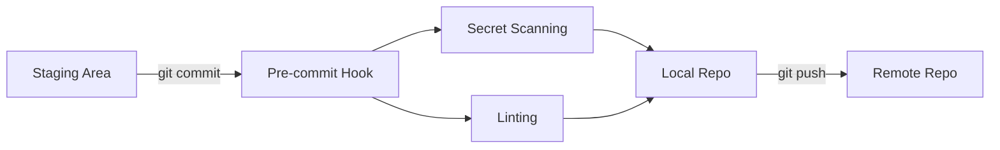

# DevSecOps SANS 540
```
 ______   _______  __   __  _______  _______  _______  _______  _______  _______ 
|      | |       ||  | |  ||       ||       ||       ||       ||       ||       |
|  _    ||    ___||  |_|  ||  _____||    ___||       ||   _   ||    _  ||  _____|
| | |   ||   |___ |       || |_____ |   |___ |       ||  | |  ||   |_| || |_____ 
| |_|   ||    ___||       ||_____  ||    ___||      _||  |_|  ||    ___||_____  |
|       ||   |___  |     |  _____| ||   |___ |     |_ |       ||   |     _____| |
|______| |_______|  |___|  |_______||_______||_______||_______||___|    |_______|
```

## Table of contents

## Cool Tools
- ` scc ` --> is a tool that shows what code languages are being used inside a code repo
- ` semgrep ` --> a tool for SAST

## Introduction
- SAST: Static Appication Security Testing
- DAST: Dynamic Appication Security Testing

## Secret Management
- Pre-commit security control



- For storing public/private keys

## Version Control Threats
- inside CI
- threat actor add malisouce code to source code
- It is best practice to use 2FA so prevents this

## SAST Scan
- we use semgrep for scanning
- for manually scanning:
```
$ docker run -v $(pwd)/src:src dmtools/builder_semgrep:stable semgrep scan -f /opt/semgrep/rules/java /src
```


# acknowledgment
## Contributors

APA 🖖🏻

## Links

```                                                                                
  aaaaaaaaaaaaa  ppppp   ppppppppp     aaaaaaaaaaaaa   
  a::::::::::::a p::::ppp:::::::::p    a::::::::::::a  
  aaaaaaaaa:::::ap:::::::::::::::::p   aaaaaaaaa:::::a 
           a::::app::::::ppppp::::::p           a::::a 
    aaaaaaa:::::a p:::::p     p:::::p    aaaaaaa:::::a 
  aa::::::::::::a p:::::p     p:::::p  aa::::::::::::a 
 a::::aaaa::::::a p:::::p     p:::::p a::::aaaa::::::a 
a::::a    a:::::a p:::::p    p::::::pa::::a    a:::::a 
a::::a    a:::::a p:::::ppppp:::::::pa::::a    a:::::a 
a:::::aaaa::::::a p::::::::::::::::p a:::::aaaa::::::a 
 a::::::::::aa:::ap::::::::::::::pp   a::::::::::aa:::a
  aaaaaaaaaa  aaaap::::::pppppppp      aaaaaaaaaa  aaaa
                  p:::::p                              
                  p:::::p                              
                 p:::::::p                             
                 p:::::::p                             
                 p:::::::p                             
                 ppppppppp                                                        
```