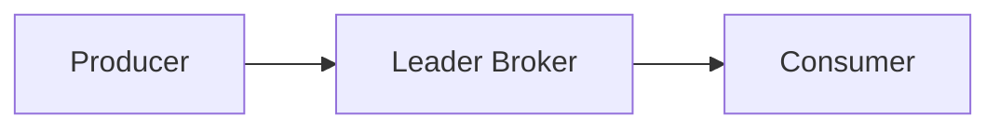

# kafka
```
 ___   _  _______  _______  ___   _  _______ 
|   | | ||   _   ||       ||   | | ||   _   |
|   |_| ||  |_|  ||    ___||   |_| ||  |_|  |
|      _||       ||   |___ |      _||       |
|     |_ |       ||    ___||     |_ |       |
|    _  ||   _   ||   |    |    _  ||   _   |
|___| |_||__| |__||___|    |___| |_||__| |__|
```

```
ls > names.txt
sed -i "/\b\(vtt\)\b/d" names.txt
cat names.txt | sed 's/^/### /' | sed 's/.\{4\}$//'
```

# Table of Contents

- Theoritical
  - Apache Kafka
  - Components
  - policies
  - Tips & Tricks
- Hands On
  - Directories
  - configs
  - commands
- Contents of course
- acknowledgment

# Theoritical

## Components
### Apache Kafka 
- Apache Kafka is distributed publish-subscribe messaging system

### Broker

- If there are multiple brokers on 1 server, it must have:
1. Unique port
2. Unique broker ID
3. Unique log directory

### Controller
- One of the brokers serves as the controller, which is responsible for managing the states of partitionins and replicas and for performing administrative tasks like reassigning partitions.
- Zookeeper's job is only to select controller. Nothing else.

### Zookeeper
- main responsibilities of zookeeper
  - Maintain list of active brokers
  - elects controller
  - Manages configuration of the topics and partitions
- A cluster of zookepers are called ensemble
- in every zookeeper cluster you should set up quorum. Qourum is the minimum quantity of the servers that should be up and running in order to be operational.
- It is recommended to have odd number of servers in the zookeeper enemble and set qourum to *(n+1)/2* where n is quantity of servers

### Topics & Partitions
- If topic "cities" is created with default configuration (single partition), broker will create a folder *cities-0* for single partition
- A partition is simply a seperate folder with differtn files
- Producers decide to write on which partition
- Partition Leader handles partition read/write operation. Producers and consumers only communicate with Leader broker of a specific partition, other replicated brokers are for active/passive backup plans
- It is best practice to set replication to 3. so there is 1 active and 2 passive partition available


### Consumer / Producers
- Producer: send messages to Kafka Cluster
- Consumer: receive messages from kafka cluster
- Kafka has a built-in producer called kafka-console-producer
- Kafka cluster stores messages even if they were already consumed by one of the consumers. Same messages may be read multiple times by different consumers
- Multiple consumers and multiple producers could exchange messages via *single centralized storage point* - kafka cluster
- Producers and Consumers don't know about each other
- Producers and Consumers may appear and disappear. but Kafka doesn't care about that. It's job is to store messages and recive or send them on demand
- Every consumer must be part of a consumer group
- *__consumer_offsets* is a topic which stores location of every consumer in messaging consumption process
- Every consumer has to be part of a consumer group. By default it is going to be created automatically, a unique & random number.
- Why consumer groups exist? Let's imagine tere is some topic with multiple producers who send messages to it at the very high rate, single consumer may not be able to consume all produced messages at the same high rates, That's why consumers may be organized into consumer groups to share consumption of the messages
- Consumer group is automatically deleted when the last committed offset for the group expires (offset.retention.minutes - default 24 hours)
- If there is 1 consumer inside consumer group, all of partitions are being read by that one consumer
- Each message is consumed once only by single consumer in the group

### Messages
- New messages will append at the end. You can not insert any messages before previous messages.
- Every message inside of the topic has unique number called "Offset". First message in each topic has offset 0. Consumers start reading messages starting from specific offset. For example:
```
Topic Cities:
> Paris [offset 0]
> London [offset 1]
> Sydney [offset 2]
> Delhi  [offset 3]
> Madrid [offset 4]
```
- Messages are Immutable
- It is best practice to keep messages as small as possible
- Message Structure
  - Timestamp --> Can configure to be assigned via broker or producer.
  - Offset Number (unique across partition)
  - Key (Optional)
  - Value (sequence of bytes) 


## policies
- Kafka doesn't store all messages forever and after specific amount of time (or when size of the log exceeds configured max size) messages are deleted.
- Default log retention period is *7 Days (168 hours)*
- Segment.bytes in topic is maximum size of log file of a specific partition in a topic, it is 1 GB. After a log file reaches 1 GB, another log file will be created.

## Tips & Tricks
- ReplicationFactor of Topics means how many times a topic should be replicated on different kafka servers/brokers.
- If Brokers should be publicly accessible you need to adjust "advertised.listeners" property in Broker config
- If you consume messages from a certain partition, order of messages won't change. But if you consume messages from all partitions, order of messages might change, This is because messages are being written in different partitions.
- If you are running producer and consumer, then the order of messages won't change

# Hands On
## Directories
- /tmp/kafka-logs --> Logs

## Configs
### configs/server.properties
- by default number of partitions for topics is 1.

### Default Ports
|     Service     | Port |
|:---------------:|:----:|
| Server / Broker | 9092 |
|    Zookeeper    | 2182 |

## Commands
### Broker / Zookeeper

- START ZOOKEEPER
```
$ bin/zookeeper-server-start.sh config/zookeeper.properties
```

- START KAFKA BROKER
``` 
$ bin/kafka-server-start.sh config/server.properties
```

- GET INFORMATION FROM ZOOKEEPER ABOUT ACTIVE BROKER IDS
```
$ bin/zookeeper-shell.sh localhost:2181 ls /brokers/ids
```

- GET INFORMATION FROM ZOOKEEPER ABOUT SPECIFIC BROKER BY ID
```
$ bin/zookeeper-shell.sh localhost:2181 get /brokers/ids/0
```

### Topics
- CREATE TOPIC
``` $ bin/kafka-topics.sh \
--bootstrap-server localhost:9092 \
--create \
--replication-factor 1 \
--partitions 3 \
--topic test
 ```

- LIST TOPICS
``` $ bin/kafka-topics.sh \
--bootstrap-server localhost:9092 \
--list
```

- TOPIC DETAILS
```
$ bin/kafka-topics.sh \
--bootstrap-server localhost:9092 \
--describe \
--topic test
```

### Consumer / Producer
- START CONSOLE PRODUCER
```
$ bin/kafka-console-producer.sh \
--broker-list localhost:9092 \
--topic test
```

- START CONSOLE CONSUMER
```
$ bin/kafka-console-consumer.sh \
--bootstrap-server localhost:9092 \
--topic test
```

- START CONSOLE CONSUMER AND READ MESSAGES *FROM BEGINNING*
```
$ bin/kafka-console-consumer.sh \
--bootstrap-server localhost:9092 \
--topic test \
--from-beginning
```

- START CONSOLE CONSUMER AND READ MESSAGES FROM BEGINNING FROM *SPECIFIC PARTITION*
```
$ bin/kafka-console-consumer.sh \
--bootstrap-server localhost:9092 \
--partition 1 \
--topic test \
--from-beginning
```

- START CONSOLE CONSUMER AND READ MESSAGES *FROM SPECIFIC OFFSET* FROM SPECIFIC PARTITION
```
$ bin/kafka-console-consumer.sh \
--bootstrap-server localhost:9092 \
--partition 1 \
--topic test \
--offset 0
```

- START CONSOLE CONSUMER WITH *SPECIFIC CONSUMER GROUP*
``` $
bin/kafka-console-consumer.sh \
--bootstrap-server localhost:9092 \
--topic test \
--group test \
--from-beginning
```

- LIST CONSUMER GROUPS
```
$ bin/kafka-consumer-groups.sh \
--bootstrap-server localhost:9092 \
--list
```

- CONSUMER GROUP DETAILS
```
$ bin/kafka-consumer-groups.sh \
--bootstrap-server localhost:9092 \
--group test \
--describe
```
Output for 2 consumers in a group:
| Group |  Topic  | Partition | Current-Offset | Log-End_Offset | LAG |             Consumer-ID            |    Host    |    Client-ID    |
|:-----:|:-------:|:---------:|:--------------:|:--------------:|:---:|:----------------------------------:|:----------:|:---------------:|
|  nums | numbers |     0     |        0       |        0       |  0  | consumer-nums-1-234123-14321-21313 | /127.0.0.1 | consumer-nums-1 |
|  nums | numbers |     1     |        0       |        0       |  0  | consumer-nums-1-234123-14321-21313 | /127.0.0.1 | consumer-nums-1 |
|  nums | numbers |     2     |        0       |        0       |  0  | consumer-nums-1-234123-14321-21313 | /127.0.0.1 | consumer-nums-1 |
|  nums | numbers |     3     |        4       |        4       |  0  |   consumer-nums-1-54675-6556-5464  | /127.0.0.1 | consumer-nums-1 |
|  nums | numbers |     4     |        1       |        1       |  0  |   consumer-nums-1-54675-6556-5464  | /127.0.0.1 | consumer-nums-1 |

  - Current-offset: committed offsets (last offset recieved by consumer)
  - Log-End-Offset: Last offset of the messages in the partition
  - LAG: Lag will be non-zero if Current-offset is less than Log-End-Offset. It means consumer has not yet consumed all messages in the partition.
  - Client-ID: same for all consumers in specific consumer group

### Performance Testing

- PRODUCER PERFORMANCE TEST
```
$ bin/kafka-producer-perf-test.sh \
--topic perf2 \
--num-records 1000 \
--throughput 100 \
--record-size 1000 \
--producer-props bootstrap.servers=localhost:9092
```
 
  - num-records: how many messages in totall will be produced
  - throughput: how many messages per second
  - record-size: size of each message in bytes


- CONSUMER PERFORMANCE TEST
```
$ bin/kafka-consumer-perf-test.sh \
--broker-list localhost:9092 \
--topic perf \
--messages 1000000
```

# Contents of course


## 15 - PROJECT 1 Java
### 98 - SECTION 14 Introduction
### 99 - If you use remote Kafka brokers.
### 100 - Project Files for the Java section
### 101 - Installing IntelliJ editor
### 102 - Creating and configuring Maven project
### 103 - Starting Kafka Cluster
### 104 - Creating Java Producer
### 105 - Continue Creating Java Producer
### 106 - Launching Java Producer
### 107 - Explaining most common Producer parameters
### 108 - Modifying Serializer type
### 109 - Producing meaningful messages with delay
### 110 - Refactoring Producer by adding previous example
### 111 - Creating consumer with autocommitting PART 1
### 112 - Creating consumer with autocommitting PART 2
### 113 - Consumer parameters overview
### 114 - Consumer with Manual Committing
### 115 - Consumer with Partitions Assignment
### 116 - Launching multipile consumers in the same consumer group
### 117 - CHALLENGE Subscribe vs Assign with consumer groups


## 16 - PROJECT 2 Nodejs

## 17 - PROJECT 3 Python

## 18 - Course Summary

# acknowledgment

## Contributors

APA 🖖🏻

## Links
- Course: https://www.udemy.com/course/apache_kafka/?couponCode=2021PM20

```
  aaaaaaaaaaaaa  ppppp   ppppppppp     aaaaaaaaaaaaa
  a::::::::::::a p::::ppp:::::::::p    a::::::::::::a
  aaaaaaaaa:::::ap:::::::::::::::::p   aaaaaaaaa:::::a
           a::::app::::::ppppp::::::p           a::::a
    aaaaaaa:::::a p:::::p     p:::::p    aaaaaaa:::::a
  aa::::::::::::a p:::::p     p:::::p  aa::::::::::::a
 a::::aaaa::::::a p:::::p     p:::::p a::::aaaa::::::a
a::::a    a:::::a p:::::p    p::::::pa::::a    a:::::a
a::::a    a:::::a p:::::ppppp:::::::pa::::a    a:::::a
a:::::aaaa::::::a p::::::::::::::::p a:::::aaaa::::::a
 a::::::::::aa:::ap::::::::::::::pp   a::::::::::aa:::a
  aaaaaaaaaa  aaaap::::::pppppppp      aaaaaaaaaa  aaaa
                  p:::::p
                  p:::::p
                 p:::::::p
                 p:::::::p
                 p:::::::p
                 ppppppppp


```
