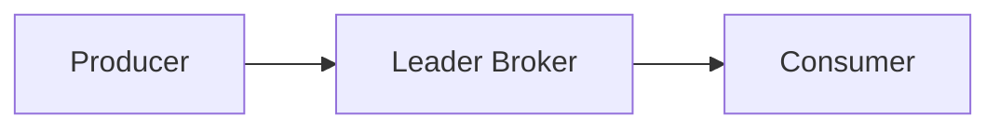

# kafka
```
 ___   _  _______  _______  ___   _  _______ 
|   | | ||   _   ||       ||   | | ||   _   |
|   |_| ||  |_|  ||    ___||   |_| ||  |_|  |
|      _||       ||   |___ |      _||       |
|     |_ |       ||    ___||     |_ |       |
|    _  ||   _   ||   |    |    _  ||   _   |
|___| |_||__| |__||___|    |___| |_||__| |__|
```

```
ls > names.txt
sed -i "/\b\(vtt\)\b/d" names.txt
cat names.txt | sed 's/^/### /' | sed 's/.\{4\}$//'
```

# Table of Contents

- Theoritical
  - Apache Kafka
  - Components
  - policies
  - Tips & Tricks
- Hands On
  - Directories
  - configs
  - commands
- Contents of course
- acknowledgment

# Theoritical

## Components
### Apache Kafka 
- Apache Kafka is distributed publish-subscribe messaging system

### Broker

- If there are multiple brokers on 1 server, it must have:
1. Unique port
2. Unique broker ID
3. Unique log directory

### Controller
- One of the brokers serves as the controller, which is responsible for managing the states of partitionins and replicas and for performing administrative tasks like reassigning partitions.
- Zookeeper's job is only to select controller. Nothing else.

### Zookeeper
- main responsibilities of zookeeper
  - Maintain list of active brokers
  - elects controller
  - Manages configuration of the topics and partitions
- A cluster of zookepers are called ensemble
- in every zookeeper cluster you should set up quorum. Qourum is the minimum quantity of the servers that should be up and running in order to be operational.
- It is recommended to have odd number of servers in the zookeeper enemble and set qourum to *(n+1)/2* where n is quantity of servers

### Topics & Partitions
- If topic "cities" is created with default configuration (single partition), broker will create a folder *cities-0* for single partition
- A partition is simply a seperate folder with differtn files
- Producers decide to write on which partition
- Partition Leader handles partition read/write operation. Producers and consumers only communicate with Leader broker of a specific partition, other replicated brokers are for active/passive backup plans
- It is best practice to set replication to 3. so there is 1 active and 2 passive partition available


### Consumer / Producers
- Producer: send messages to Kafka Cluster
- Consumer: receive messages from kafka cluster
- Kafka has a built-in producer called kafka-console-producer
- Kafka cluster stores messages even if they were already consumed by one of the consumers. Same messages may be read multiple times by different consumers
- Multiple consumers and multiple producers could exchange messages via *single centralized storage point* - kafka cluster
- Producers and Consumers don't know about each other
- Producers and Consumers may appear and disappear. but Kafka doesn't care about that. It's job is to store messages and recive or send them on demand
- Every consumer must be part of a consumer group
- *__consumer_offsets* is a topic which stores location of every consumer in messaging consumption process
- Every consumer has to be part of a consumer group

### Messages
- New messages will append at the end. You can not insert any messages before previous messages.
- Every message inside of the topic has unique number called "Offset". First message in each topic has offset 0. Consumers start reading messages starting from specific offset. For example:
```
Topic Cities:
> Paris [offset 0]
> London [offset 1]
> Sydney [offset 2]
> Delhi  [offset 3]
> Madrid [offset 4]
```
- Messages are Immutable
- It is best practice to keep messages as small as possible
- Message Structure
  - Timestamp --> Can configure to be assigned via broker or producer.
  - Offset Number (unique across partition)
  - Key (Optional)
  - Value (sequence of bytes) 


## policies
- Kafka doesn't store all messages forever and after specific amount of time (or when size of the log exceeds configured max size) messages are deleted.
- Default log retention period is *7 Days (168 hours)*
- Segment.bytes in topic is maximum size of log file of a specific partition in a topic, it is 1 GB. After a log file reaches 1 GB, another log file will be created.

## Tips & Tricks
- ReplicationFactor of Topics means how many times a topic should be replicated on different kafka servers/brokers.
- If Brokers should be publicly accessible you need to adjust "advertised.listeners" property in Broker config
- If you consume messages from a certain partition, order of messages won't change. But if you consume messages from all partitions, order of messages might change, This is because messages are being written in different partitions.
- If you are running producer and consumer, then the order of messages won't change

# Hands On
## Directories
- /tmp/kafka-logs --> Logs

## Configs
### configs/server.properties
- by default number of partitions for topics is 1.

### Default Ports
|     Service     | Port |
|:---------------:|:----:|
| Server / Broker | 9092 |
|    Zookeeper    | 2182 |

## Commands
### Broker / Zookeeper

- START ZOOKEEPER
```
$ bin/zookeeper-server-start.sh config/zookeeper.properties
```

- START KAFKA BROKER
``` 
$ bin/kafka-server-start.sh config/server.properties
```

- GET INFORMATION FROM ZOOKEEPER ABOUT ACTIVE BROKER IDS
```
$ bin/zookeeper-shell.sh localhost:2181 ls /brokers/ids
```

- GET INFORMATION FROM ZOOKEEPER ABOUT SPECIFIC BROKER BY ID
```
$ bin/zookeeper-shell.sh localhost:2181 get /brokers/ids/0
```

### Topics
- CREATE TOPIC
``` $ bin/kafka-topics.sh \
--bootstrap-server localhost:9092 \
--create \
--replication-factor 1 \
--partitions 3 \
--topic test
 ```

- LIST TOPICS
``` $ bin/kafka-topics.sh \
--bootstrap-server localhost:9092 \
--list
```

- TOPIC DETAILS
```
$ bin/kafka-topics.sh \
--bootstrap-server localhost:9092 \
--describe \
--topic test
```

### Consumer / Producer
- START CONSOLE PRODUCER
```
$ bin/kafka-console-producer.sh \
--broker-list localhost:9092 \
--topic test
```

- START CONSOLE CONSUMER
```
$ bin/kafka-console-consumer.sh \
--bootstrap-server localhost:9092 \
--topic test
```

- START CONSOLE CONSUMER AND READ MESSAGES FROM BEGINNING
```
$ bin/kafka-console-consumer.sh \
--bootstrap-server localhost:9092 \
--topic test \
--from-beginning
```

- START CONSOLE CONSUMER AND READ MESSAGES FROM BEGINNING FROM SPECIFIC PARTITION
```
$ bin/kafka-console-consumer.sh \
--bootstrap-server localhost:9092 \
--partition 1 \
--topic test \
--from-beginning
```

- START CONSOLE CONSUMER AND READ MESSAGES FROM SPECIFIC OFFSET FROM SPECIFIC PARTITION
```
$ bin/kafka-console-consumer.sh \
--bootstrap-server localhost:9092 \
--partition 1 \
--topic test \
--offset 0
```

- START CONSOLE CONSUMER WITH SPECIFIC CONSUMER GROUP
``` $
bin/kafka-console-consumer.sh \
--bootstrap-server localhost:9092 \
--topic test \
--group test \
--from-beginning
```

- LIST CONSUMER GROUPS
```
$ bin/kafka-consumer-groups.sh \
--bootstrap-server localhost:9092 \
--list
```

- CONSUMER GROUP DETAILS
```
$ bin/kafka-consumer-groups.sh \
--bootstrap-server localhost:9092 \
--group test \
--describe
```


# Contents of course
## 1 - Introduction
## 2 - Apache Kafka Installation Overview
## 3 - Installing Apache Kafka on the remote Ubuntu server
## 4 - Installing Apache Kafka on Windows
## 5 - Starting Apache Zookeeper and Kafka Broker

## 6 - Creating and exploring Kafka Topic
### 22 - SECTION 5 Introduction
### 23 - How to connect to Kafka cluster
### 24 - Create new Kafka topic
### 25 - What happened after creation of the new topic
### 26 - Read details about topic

## 7 - Producing and consuming Messages
### 27 - SECTION 6 Introduction
### 28 - Send some messages using Kafka Console Producer
### 29 - Consuming messages using Kafka Console Consumer
### 30 - Consuming messages from the beginning
### 31 - Running multiple consumers
### 32 - Running multiple producers
### 33 - What was changed in the Kafka logs

## 8 - What is Apache Kafka and how it works
### 34 - SECTION 7 Introduction
### 35 - What is Apache Kafka
### 36 - Broker
### 37 - Broker cluster
### 38 - Zookeeper
### 39 - Zookeeper ensemble
### 40 - Multiple Kafka clusters
### 41 - Default ports of Zookeeper and Broker
### 42 - Kafka Topic
### 43 - Message structure
### 44 - Topics and Partitions
### 45 - Spreading messages across partitions
### 46 - Partition Leader and Followers
### 47 - Controller and its responsibilities
### 48 - How Producers write messages to the topic
### 49 - How Consumers read messages from the topic

## 9 - GitHub Repository and Diagrams for the course
### 50 - SECTION 8 Introduction
### 51 - GitHub repository and list of basic Kafka commands
### 52 - Diagrams for the course

## 10 - EXAMPLE 1 Topic with Multiple Partitions
### 53 - SECTION 9 Introduction
### 54 - If you use remote Kafka brokers.
### 55 - Cleaning up existing kafka installation
### 56 - Creating topic with multiple partitions
### 57 - How messages were spread across different partitions
### 58 - Reading messages from specific partition
### 59 - Reading messages from specific offset in specific partition
### 60 - Reading details about topic and consumeroffsets topic
### 61 - Summary for multiple partitions example

## 11 - EXAMPLE 2 Kafka Cluster with Multiple Brokers
### 62 - SECTION 10 Introduction
### 63 - Example overview run multiple brokers
### 64 - Creating separate configuration files for brokers
### 65 - Launching three brokers
### 66 - Getting cluster information and broker details from Zookeeper
### 67 - Creating multiplepartition topic in the Kafka cluster
### 68 - Looking at logs folders of every broker
### 69 - Producing and consuming messages in the cluster
### 70 - Details about topic in the cluster
### 71 - Simulating broker failure in the cluster
### 72 - Summary for broker cluster and topic without replication

## 12 - EXAMPLE 3 Multiple Brokers and Topic with Replication
### 73 - SECTION 11 Introduction
### 74 - Preparing for the next example with replication
### 75 - Launching brokers and creating topic with replication
### 76 - Observing logs folder and details of the topic
### 77 - Producing and consuming messages in the topic with replication
### 78 - Observing how messages were stored in the partitions on different brokers
### 79 - Bringing down one of three brokers and observing changes
### 80 - Bringing down another broker in the cluster
### 81 - Bringing back both brokers
### 82 - Summary for replication

## 13 - EXAMPLE 4 Kafka Consumer Groups
### 83 - SECTION 12 Introduction
### 84 - Example with consumer groups overview
### 85 - Exploring default consumer groups
### 86 - Starting consumer in the custom consumer group
### 87 - Starting second consumer in the same consumer group
### 88 - Launching one more consumer in the same group
### 89 - Idle consumers in the group
### 90 - Summary for consumer groups

## 14 - EXAMPLE 5 Performance Testing
### 91 - SECTION 13 Introduction
### 92 - Overview of the performance testing example
### 93 - Starting cluster and launching basic performance test
### 94 - Increasing performance test parameters
### 95 - Testing consumer performance
### 96 - Getting nonzero LAG values for consumers
### 97 - Performance test example summary


## 15 - PROJECT 1 Java
### 100 - Project Files for the Java section
### 101 - Installing IntelliJ editor
### 102 - Creating and configuring Maven project
### 103 - Starting Kafka Cluster
### 104 - Creating Java Producer
### 105 - Continue Creating Java Producer
### 106 - Launching Java Producer
### 107 - Explaining most common Producer parameters
### 108 - Modifying Serializer type
### 109 - Producing meaningful messages with delay
### 110 - Refactoring Producer by adding previous example
### 111 - Creating consumer with autocommitting PART 1
### 112 - Creating consumer with autocommitting PART 2
### 113 - Consumer parameters overview
### 114 - Consumer with Manual Committing
### 115 - Consumer with Partitions Assignment
### 116 - Launching multipile consumers in the same consumer group
### 117 - CHALLENGE Subscribe vs Assign with consumer groups
### 98 - SECTION 14 Introduction
### 99 - If you use remote Kafka brokers.

## 16 - PROJECT 2 Nodejs

## 17 - PROJECT 3 Python

## 18 - Course Summary

# acknowledgment

## Contributors

APA 🖖🏻

## Links
- Course: https://www.udemy.com/course/apache_kafka/?couponCode=2021PM20

```
  aaaaaaaaaaaaa  ppppp   ppppppppp     aaaaaaaaaaaaa
  a::::::::::::a p::::ppp:::::::::p    a::::::::::::a
  aaaaaaaaa:::::ap:::::::::::::::::p   aaaaaaaaa:::::a
           a::::app::::::ppppp::::::p           a::::a
    aaaaaaa:::::a p:::::p     p:::::p    aaaaaaa:::::a
  aa::::::::::::a p:::::p     p:::::p  aa::::::::::::a
 a::::aaaa::::::a p:::::p     p:::::p a::::aaaa::::::a
a::::a    a:::::a p:::::p    p::::::pa::::a    a:::::a
a::::a    a:::::a p:::::ppppp:::::::pa::::a    a:::::a
a:::::aaaa::::::a p::::::::::::::::p a:::::aaaa::::::a
 a::::::::::aa:::ap::::::::::::::pp   a::::::::::aa:::a
  aaaaaaaaaa  aaaap::::::pppppppp      aaaaaaaaaa  aaaa
                  p:::::p
                  p:::::p
                 p:::::::p
                 p:::::::p
                 p:::::::p
                 ppppppppp


```
