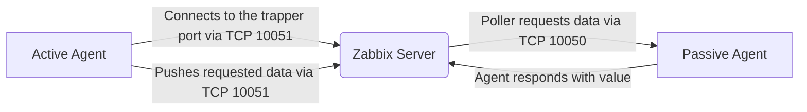

# Zabbix

```
 _______  _______  _______  _______  ___   __   __ 
|       ||   _   ||  _    ||  _    ||   | |  |_|  |
|____   ||  |_|  || |_|   || |_|   ||   | |       |
 ____|  ||       ||       ||       ||   | |       |
| ______||       ||  _   | |  _   | |   |  |     | 
| |_____ |   _   || |_|   || |_|   ||   | |   _   |
|_______||__| |__||_______||_______||___| |__| |__|
```

# Table of Contents
- Theoretical
  - Introduction
  - Features
  - Components
  - Files & directories
  - Tips & Tricks
- Hands On
  - Starting Up
  - Installing Agents
- acknowledgment
  - Contributors
  - Links


# Theoretical
## Introduction
- Zabbix is an enterprise-class open source distributed monitoring solution.
- Zabbix is a software that monitors numerous parameters of a network and the health and integrity of servers, virtual machines, applications, services, databases, websites, the cloud and more. Zabbix uses a flexible notification mechanism that allows users to configure email-based alerts for virtually any event. This allows a fast reaction to server problems. Zabbix offers excellent reporting and data visualization features based on the stored data. This makes Zabbix ideal for capacity planning.
- Zabbix supports both polling and trapping. All Zabbix reports and statistics, as well as configuration parameters, are accessed through a web-based frontend. A web-based frontend ensures that the status of your network and the health of your servers can be assessed from any location. Properly configured, Zabbix can play an important role in monitoring IT infrastructure. This is equally true for small organizations with a few servers and for large companies with a multitude of servers.

## Features
### Data gathering
- availability and performance checks
- support for SNMP (both trapping and polling), IPMI, JMX, VMware monitoring
- custom checks
- gathering desired data at custom intervals
- performed by server/proxy and by agents

### Flexible threshold definitions
- you can define very flexible problem thresholds, called triggers, referencing values from the backend database

### Highly configurable alerting
- sending notifications can be customized for the escalation schedule, recipient, media type
- notifications can be made meaningful and helpful using macro variables
- automatic actions include remote commands

### Real-time graphing
- monitored items are immediately graphed using the built-in graphing functionality

### Web monitoring capabilities
- Zabbix can follow a path of simulated mouse clicks on a web site and check for functionality and response time

### Extensive visualization options
- ability to create custom graphs that can combine multiple items into a single view
- network maps
- slideshows in a dashboard-style overview
- reports
- high-level (business) view of monitored resources

### Historical data storage
- data stored in a database
- configurable history
- built-in housekeeping procedure

### Easy configuration
- add monitored devices as hosts
- hosts are picked up for monitoring, once in the database
- apply templates to monitored devices

### Use of templates
- grouping checks in templates
- templates can inherit other templates

### Network discovery
- automatic discovery of network devices
- agent autoregistration
- discovery of file systems, network interfaces and SNMP OIDs

### Fast web interface
- a web-based frontend in PHP
- accessible from anywhere
- you can click your way through
- audit log

### Zabbix API
- Zabbix API provides programmable interface to Zabbix for mass manipulations, third-party software integration and other purposes.

### Permissions system
- secure user authentication
- certain users can be limited to certain views

### Full featured and easily extensible agent
- deployed on monitoring targets
- can be deployed on both Linux and Windows

### Binary daemons
- written in C, for performance and small memory footprint
- easily portable

### Ready for complex environments
- remote monitoring made easy by using a Zabbix proxy

## Components
### Server
Zabbix server is the central component to which agents report availability and integrity information and statistics. The server is the central repository in which all configuration, statistical and operational data are stored.

### Database storage
All configuration information as well as the data gathered by Zabbix is stored in a database.

### Web interface
For an easy access to Zabbix from anywhere and from any platform, the web-based interface is provided. The interface is part of Zabbix server, and usually (but not necessarily) runs on the same physical machine as the one running the server.

### Proxy
Zabbix proxy can collect performance and availability data on behalf of Zabbix server. A proxy is an optional part of Zabbix deployment; however, it may be very beneficial to distribute the load of a single Zabbix server.

### Agent
Zabbix agents are deployed on monitoring targets to actively monitor local resources and applications and report the gathered data to Zabbix server. Since Zabbix 4.4, there are two types of agents available: the Zabbix agent (lightweight, supported on many platforms, written in C) and the Zabbix agent 2 (extra-flexible, easily extendable with plugins, written in Go).
#### Active Agent VS Passive Agent



### Data flow
In addition it is important to take a step back and have a look at the overall data flow within Zabbix. In order to create an item that gathers data you must first create a host. Moving to the other end of the Zabbix spectrum you must first have an item to create a trigger. You must have a trigger to create an action. Thus if you want to receive an alert that your CPU load is too high on Server X you must first create a host entry for Server X followed by an item for monitoring its CPU, then a trigger which activates if the CPU is too high, followed by an action which sends you an email. While that may seem like a lot of steps, with the use of templating it really isn't. However, due to this design it is possible to create a very flexible setup.

- Server, Frontend Agent
- Proxy
- Agent
- Agent 2
- Java Gateway
- Web Service


## Files & directories
-  zabbix_server.conf
- zabbix_agentd.conf

## Tips & Tricks
- changes take up to 5 minutes, it's not straight away.

## Commands

# Hands On

## Starting Up
- Zabbix server mysql
```
$ docker run -d --name mysql-server --restart=always
-p 10050:10050
-p 10051:10051
-v /srv/Docker/MySQL:/var/lib/mysql
-e DB_SERVER_HOST="mysql-world"
-e MYSQL_USER="zabbixworld"
-e MYSQL_DATABASE="zabbixworld"
-e MYSQL_PASSWORD=""
zabbix/zabbix-server-mysql
--character-set-server=utf8mb4
--collation-server=utf8mb4_unicode_ci --default-authentication-plugin=mysql_native_password
```

- Zabbix web apache mysql
```
$ docker run -d --name zabbix-web-apache-mysql --restart=always
-p 80:80
-p 8080:8080
-p 443:443
-e DB_SERVER_HOST="172.17.0.5"
-e MYSQL_USER="root"
-e MYSQL_PASSWORD="test"
-e ZBX_SERVER_HOST="172.17.0.6"
-e PHP_TZ="Europe/Riga"     // THIS ONE IS FOR TIMEZONE
-e VIRTUAL_HOST=zabbix.domain.com
-e LETSENCRYPT_EMAIL=support@domain.com
-e LETSENCRYPT_HOST=zabbix.domain.com
-v /srv/Docker/containers/certs/zabbix.domain.com/etc/ssl/apache2
zabbix/zabbix-web-apache-mysql
```
- Default user: Admin / Default password: zabbix

## Installing Agent


## Proxies


### Community Answers
- Q: Which DB to use?
- A: Also MySQL really doesn't do well with time series data. Which is basically what Zabbix data is. Postgreql will do better (for a bunch of reasons) But also you can use TimeScaleDB on Postgreql with Zabbix and it will be even better. And of you combine PostgreSQL with ZFS and compression you get bonkers performance.

- Q: Active vs Passive proxy?
- A: 99% of our monitoring is Active.It allows us to monitor 13,000 Hosts and 7000 VPS with minimal load on the Proxies. The only monitoring we have set to Passive is things like
  - ICMP Ping: Ensure port is running externally. We check the port is bound from the OS side AND from outside the VM, a little overkill but we've had issues in the past where a port looks bound and working but was uncontactable outside the VM.
  - Zabbix Agent Hostname: We use this item to get the nice Green box in Host Availability and as part of a Trigger around agent comms working/not working. 


# acknowledgment
## Contributors

APA 🖖🏻

## Links

```                                                                                
  aaaaaaaaaaaaa  ppppp   ppppppppp     aaaaaaaaaaaaa   
  a::::::::::::a p::::ppp:::::::::p    a::::::::::::a  
  aaaaaaaaa:::::ap:::::::::::::::::p   aaaaaaaaa:::::a 
           a::::app::::::ppppp::::::p           a::::a 
    aaaaaaa:::::a p:::::p     p:::::p    aaaaaaa:::::a 
  aa::::::::::::a p:::::p     p:::::p  aa::::::::::::a 
 a::::aaaa::::::a p:::::p     p:::::p a::::aaaa::::::a 
a::::a    a:::::a p:::::p    p::::::pa::::a    a:::::a 
a::::a    a:::::a p:::::ppppp:::::::pa::::a    a:::::a 
a:::::aaaa::::::a p::::::::::::::::p a:::::aaaa::::::a 
 a::::::::::aa:::ap::::::::::::::pp   a::::::::::aa:::a
  aaaaaaaaaa  aaaap::::::pppppppp      aaaaaaaaaa  aaaa
                  p:::::p                              
                  p:::::p                              
                 p:::::::p                             
                 p:::::::p                             
                 p:::::::p                             
                 ppppppppp                                                        
```