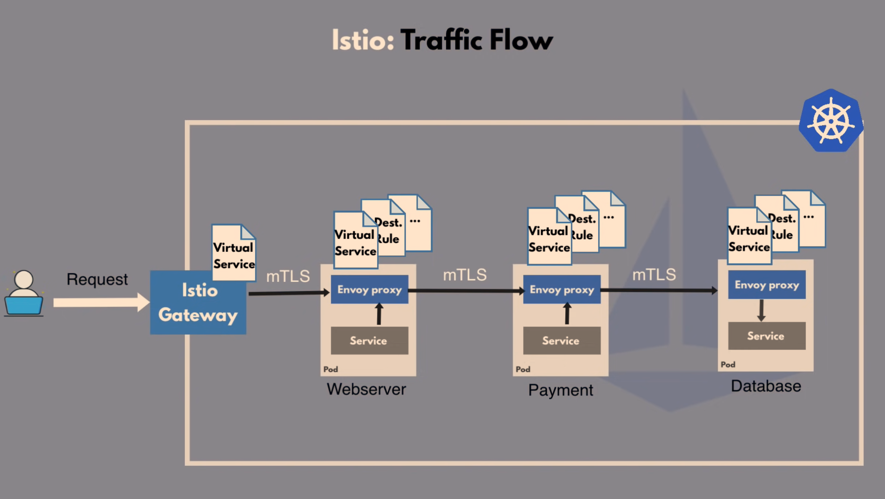

# Istio
```
 ___   _______  _______  ___   _______ 
|   | |       ||       ||   | |       |
|   | |  _____||_     _||   | |   _   |
|   | | |_____   |   |  |   | |  | |  |
|   | |_____  |  |   |  |   | |  |_|  |
|   |  _____| |  |   |  |   | |       |
|___| |_______|  |___|  |___| |_______|
```

## Challenges of a microservice architecture
- Istio is a service mesh
- Service mesh manages communication between microservices
- All the service end-points must be configured to web server, so when we add a new microservice we need to add its communication configuration (COMM) so other microservices can talk to it. so we have that information as part of app deployment code
- usually communication inside cluster is not secured, every service inside cluster can talk to any other service. So some security logic (SEC) is also needed inside each microservice

Components that are neede inside each microservice:
- Business (or Service) Logic (BL)
- Communication Configuration (COMM)
- Security Logic (SEC)
- Retry Logic (R)
- Metrics & Tracing Logic (MT)

## Solution: Service Mesh with Sidecar Pattern
- These Non-Business Logic must be added to each app. Solution --> Service Meshb with Sidecar Pattern
- Side car Proxy has a control plane, which inject these to microservices:
  - handles these networking logic
  - acts as a proxy
  - third-party app
  - cluster operators can configure it easily
  - developers can focus on the actual business logic
 
- Micro services can talk to each other through these proxies. So the network layer of cluster consists of control plane and proxies of service mesh

Pod:
- MicroServie
- Proxy:
  - Comm.config
  - Security
  - Retry
  - Metrics
  - Tracing

## Service Mesh Traffic Split feature
- You can easily configure your service mesh use Canary deployment which is to send 10% of traffic to your new version of app (for testing purposes) and other 90% to old/stable version of deployment.

## Istio Architecture
- Istio was created in 2017 by Google, IBl & Lyft
- Service Mesh is a Pattern or Paradigm, & Istio is an implementation
- Proxies (Also called Data Plane): envoy (an open-source project) that is being used widely in service meshes
- Control Plane: Istiod which configure, discover and certifies each proxy inside microservices pods
- Several components in earlier versions until v1.5: Pilot - Gallery - Citadel - Mixer
- After v1.5 all of those components are integrated inside Istiod componenet. for convenience purposes.

## How to configure Istio?
- You don't have to adjust Deployment & service k8s YAML file
- Istio configuration seperate from app config
- Istio configored with Kubernets YAML files
- Istio uses Kubernetes CustomResourceDefinitions (CRD)
- CRD:
  - Extending the k8s API
  - Custom Kubernetes component/object for e.g. third-party technologies (like Istio, Prometheus, etc.)
  - Can be used like any other native Kubernetes objcet
- By using a few Istio CRDs, we can configure different traffic routes for our microservices, like traffic routing, which services can communicate, traffic split, retry rules
- Two main CRDs for configuring service to service communication
  - VirtualService: How you route your traffic **TO** a given destination
  - DestinationRule: Configure what happens to traffic **FOR** that destination. Configure Some policies on traffic (Once traffic is actually routed to desired microservice) e.g. what kind of load balancing to use
 - We create CRD's --> Istiod **converts** these high level routing rules into **Envoy-specific configurations** --> Configuration is propagated into proxy sidecars
 - We don't configure Proxies, we configure Istiod
 - Proxies can communicate without connecting to Istiod

## Istio Features: Service Discovery, Security, Metrics & Tracing

Dynamic Service Registry (Pilot Componenet inside Istiod)
- Istiod has an Internal registry for Services & their endpoins.
- No static configuration of endpoints, new microservices gets registered automatically

Security - Certificate management (Citadel Componenet inside Istiod)
- It has an internal CA
- Secure TLS communication between microservices

Metrics and Tracing
- Gather telemetry data

Configuration (Gallery Componenet inside Istiod)

## Istio Gateway
Istio Ingress Gateway
- an alternative to nginx Ingress controller
- Entry point to k8s cluster
- Runs as a pod in cluster and acts as a LoadBalancer
- directs traffic to MicroServices using VirtualService
- can be created using a gateway CRD

- IMPORTANT: Note that the Kubernetes Gateway API CRDs do not come installed by default on most Kubernetes clusters, so make sure they are installed before using the Gateway API:
```
$ kubectl get crd gateways.gateway.networking.k8s.io &> /dev/null || \
  { kubectl kustomize "github.com/kubernetes-sigs/gateway-api/config/crd?ref=v1.0.0" | kubectl apply -f -; }
```

## Final Overview: Traffic Flow with Istio


# acknowledgment 
## Contributors

APA 🖖🏻

## Links
- https://istio.io/latest/docs/examples/microservices-istio/
- https://istio.io/latest/docs/examples/microservices-istio/bookinfo-kubernetes/

```                                                                                                       
  aaaaaaaaaaaaa  ppppp   ppppppppp     aaaaaaaaaaaaa   
  a::::::::::::a p::::ppp:::::::::p    a::::::::::::a  
  aaaaaaaaa:::::ap:::::::::::::::::p   aaaaaaaaa:::::a 
           a::::app::::::ppppp::::::p           a::::a 
    aaaaaaa:::::a p:::::p     p:::::p    aaaaaaa:::::a 
  aa::::::::::::a p:::::p     p:::::p  aa::::::::::::a 
 a::::aaaa::::::a p:::::p     p:::::p a::::aaaa::::::a 
a::::a    a:::::a p:::::p    p::::::pa::::a    a:::::a 
a::::a    a:::::a p:::::ppppp:::::::pa::::a    a:::::a 
a:::::aaaa::::::a p::::::::::::::::p a:::::aaaa::::::a 
 a::::::::::aa:::ap::::::::::::::pp   a::::::::::aa:::a
  aaaaaaaaaa  aaaap::::::pppppppp      aaaaaaaaaa  aaaa
                  p:::::p                              
                  p:::::p                              
                 p:::::::p                             
                 p:::::::p                             
                 p:::::::p                             
                 ppppppppp                             
                                                       
```
