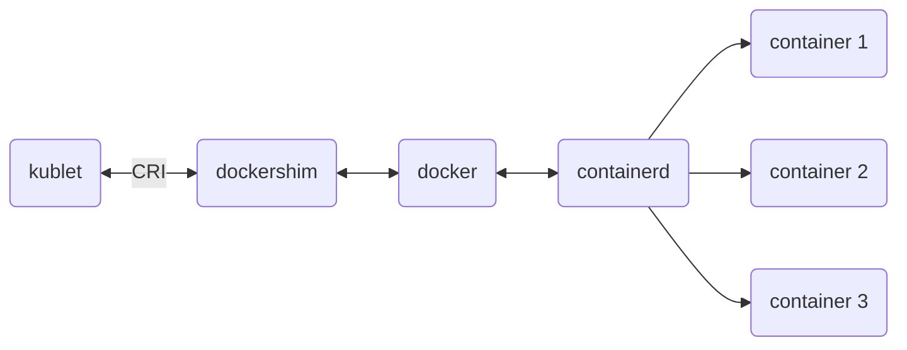
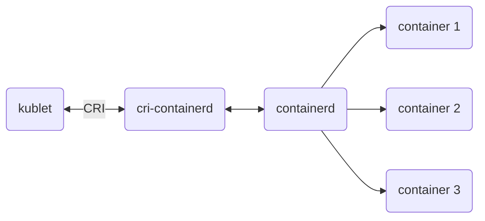

# Kubernetes Course
```
 ___   _   _____   _______ 
|   | | | |  _  | |       |
|   |_| | | |_| | |  _____|
|      _||   _   || |_____ 
|     |_ |  | |  ||_____  |
|    _  ||  |_|  | _____| |
|___| |_||_______||_______|
```

# Table of contents
- Tips & Tricks
- Directories
- Ports
- Commands

- Kubernetes Course
- Advanced Kubernetes Course

## Tips & Tricks
- It is possible to have a k8s cluster using linux services not containers, but it is very difficult & unconvenient.
- k8s policy for deprecating some feature is after 3 versions, for example if it has deprecated some thing in 1.19, it will stop working in 1.23
- Kubelet has purpose of managing RAM & CPU on node, when swap is enabled, it is not able to manage resources properly. Must turn it off in order to work properly
- runc is creating namespaces and Cgroups


## Directories
## Ports
## Commands

# Kubernetes Course
# Contents
- Install, Configure and validation
- Core Concept (Architecture, Pods, Deployments, etc)
- Scheduling
- Logging & Monitoring
- Application Lifecycle Management
- Cluster Maintenance
- Security
- Storage
- Networking

# Sessions
## Session 1 - Core Concepts & Architecture

- K8s is written in GO lang
- It is possible to have a k8s cluster using linux services not containers, but it is very difficult & unconvenient.
- k8s policy for deprecating some feature is after 3 versions, for example if it has deprecated some thing in 1.19, it will stop working in 1.23

### Components:
- Master Nodes: manages k8s cluster
- Worker Nodes: Applications are there
- ETCD Cluster: Is for archiving everything. Key-value pair DB. Jason-based
- Kube Scheduler: scheduled which workloads is going to be assigned to which worker
- Kube Contreoller Manager: Checks status of workers and workloads. Has so many Controllers. It is not a centralized contrller. In a 5 second interval check health of components
- Kube APIServer: A Manager which have to be informed for every interaction. Components do not talk to each other directly. The talk to API-Server and then API-Server communicate what have to be done. The only component that is connected to ETCD
- Kubelet: Exists on master node + worker node. Have so many responsibilities. Kubelet does status checks to API-Server. Master node Kubelet checks 
- CRD (Container Runtime Engine): A container controller
- Kube Proxy: Exists on master node + worker node. Set Firewall Rules. For example for port forwarding

### Architecture
#### Master Node
- Kubelet
- Kube Proxy
- CRD
- Kube APIServer
- ETCD Cluster
- Kube Contreoller Manager
- Kube Scheduler

#### Worker Node
- Kubelet
- Kube Proxy
- CRD

### Deploying an app procedure
- Setup a yaml file for my-app
- After applying, yaml file is being passed to API-Server. In this stage "Pod is Created" is being outputted, but it is not actually created yet.
- Then it is passed to ETCD then scheduler. 
- After Scheduler make checks, it passes it request to related kublet of a worker node.
- Kublet of worker node then commadns Containerd to create containers.
- After it starts to run, kubelet acknowledge API-Server
- API-Server tells ETCD that node is active and running
- Controller Manager checks all components during the process

### dockershim vs cri-containerd
- docker uses containerd for its lifecycle management (start, stop, ...)

- dockershim

<span style="font-size: 2em;">&#x2B07;</span>
<span style="font-size: 2em;">&#x2B07;</span>
<span style="font-size: 2em;">&#x2B07;</span>


- cri-containerd developed as a driver between kubelet and containerd, so it improved performance of dockershim and docker


- You usually don't need to interact with containers directly, but when need to troubleshoot them, instead of ` $ docker ` you have to use ` $ ctr ` for example:
```
$ ctr images pull doceker.io/library/redis:alpine
$ ctr run doceker.io/library/redis:alpine redis
```
- instead of ` $ ctr` use ` $ nerdctl ` It is exactly like ` $ docker `

### Initialize a k8s Cluster
1. Provision the VMs (Min of 1 Master, 1 Worker):
2. Select and Install CRE (Containerd or others) on all the nodes. Get containerd from github. Install runc
3. Install Kubeadm, kubectl & kubelet on all the nodes
4. Initialize the cluster (on the master node)
5. Apply a CNI (Calico or flannel) on cluster
6. Join worker nodes to the cluster

### Install & Configure K&s:
- A compatible Linux host (Debian or Red Hat)
- 2GB or more of RAM per machine (any less will leave little room for your
apps).
- 2 CPUs or more.
- Full network connectivity between all machines in the cluster (public or
private network is fine).
- Unique hostname, MAC address, and product_uuid for every node.
- Certain ports are open on your machines
- Swap disabled. You MUST disable swap in order for the kubelet to work
properly
```
$ free -m --> check how much swap is being used
$ swappoff -a --> temporarily turn swap off
$ nano /etc/fstab --> To permanently turn swap off
```
- Set Time Zone (Asia/Tehran) ` $ timedatectl set-timezone Asia/Tehran `
- static IP on each node
- Set Public DNS (shecan.ir, 403.online or Open-VPN for Iran)
- Join the Worker Nodes

### Ports & Protocols
#### Control plane
| **Protocol** | **Direction** | **Port Range** |       **Purpose**       |      **Used By**     |
|:------------:|:-------------:|:--------------:|:-----------------------:|:--------------------:|
|      TCP     |    Inbound    |      6443      |      K8s API Server     |          All         |
|      TCP     |    Inbound    |    2379-2380   |  ETCD server client API | kube-apiserver, etcd |
|      TCP     |    Inbound    |      10250     |       Kubelet API       |  self, Control Plane |
|      TCP     |    Inbound    |      10259     |      Kube-Scheduler     |         self         |
|      TCP     |    Inbound    |      10257     | Kube-Controller-Manager |         self         |

- 2379 --> is a port that API-SERVER commuicate with ETCD 
- 2380 --> is a port that ETCDs commuicate with ETCD

#### Worker node
| **Protocol** | **Direction** | **Port Range** |    **Purpose**    |     **Used By**     |
|:------------:|:-------------:|:--------------:|:-----------------:|:-------------------:|
|      TCP     |    Inbound    |      10250     |    Kubelet API    | self, Control Plane |
|      TCP     |    Inbound    |   30000-32767  | NodePort Services |         ALL         |

- runc is creating namespaces and Cgroups

## Session 2

- runc: is in docker, create and manages cgroups and namespaces in linux kernel

### Initialize a k8s Cluster
#### Contaienrd
- get containerd from [https://www.github.com/containerd/containerd/releases/download/v1.7.16/containerd-1.7.16.tar.gz](https://www.github.com/containerd/containerd/releases/download/v1.7.16/containerd-1.7.16.tar.gz)
- extract it to /usr/local/ ` $ tar Cxzvf /usr/local/ containerd-1.6.31-linux-amd64.tar.gz `
- Download containerd service ` $ wget https://raw.githubsercontent.com/containerd/containerd/main/containerd.service ` and then ` $ mv containerd.service /usr/lib/systemd/system ` then ` $ systemtl deamon-reload` and ` $ systemctl start containerd.service `

#### runc
- get runc from [https://github.com/opencontainers/runc/releases/download/v1.1.12/runc.amd64](https://github.com/opencontainers/runc/releases/download/v1.1.12/runc.amd64)
- ` $ install -m 755 runc.amd64 /usr/local/sbin/runc `

<br>

- ` $ mkdir /etc/containerd `
- ` containerd config default | tee /etc/containerd/config.toml ` --> created default config

#### CNI for containerd
- see project [https://github.com/containernetworking/plugins/](https://github.com/containernetworking/plugins/)
- get CNI plugin from [https://github.com/containernetworking/plugins/releases/download/v1.4.1/cni-plugins-linux-amd64-v1.4.1.tgz](https://github.com/containernetworking/plugins/releases/download/v1.4.1/cni-plugins-linux-amd64-v1.4.1.tgz)
- ` $ mkdir -p /opt/cni/bin ` and then ` $ tar Cxzv /opt/cni/bin/ ni-plugins-linux-amd64-v1.4.1.tgz `

<br>

- Now we have to introduce cgroup to containerd
```
$ vim /etc/containerd/config.toml
search for { plugins."io.containerd.grpc.v1.cri".containerd.runtimes.runc }
add this line to end of section: SystemdCgroup = true

go to next section: { plugins."io.containerd.grpc.v1.cri".containerd.runtimes.runc.options }
change: SystemdCgroup = false --> SystemdCgroup = true
```
- then ` $ systemctl restart containerd.service `


```
================
# sysctl params required by setup, params persist across rebootscat <<EOF | sudo tee /etc/sysctl.d/k8s.confnet.ipv4.ip_forward = 1EOF# Apply sysctl params without rebootsudo sysctl --system
=============
https://kubernetes.io/releases/
===========
https://kubernetes.io/docs/setup/production-environment/tools/kubeadm/install-kubeadm/
==================
apt install kubelet=1.27.12-1.1 kubeadm=1.27.12-1.1 kubectl=1.27.12-1.1 -y
==================
cat <<EOF | sudo tee /etc/modules-load.d/k8s.conf
overlay
br_netfilter
EOF

sudo modprobe overlay
sudo modprobe br_netfilter

# sysctl params required by setup, params persist across reboots
cat <<EOF | sudo tee /etc/sysctl.d/k8s.conf
net.bridge.bridge-nf-call-iptables  = 1
net.bridge.bridge-nf-call-ip6tables = 1
net.ipv4.ip_forward                 = 1
EOF

# Apply sysctl params without reboot
sudo sysctl --system
=====
https://docs.tigera.io/calico/latest/getting-started/kubernetes/quickstart
=======
kubectl label node worker2 kubernetes.io/role=worker-2-B
=========
kubectl get node 
kubectl get ns
kubectl get pod
kubectl get pod -o wide
kubectl get pod -n kube-system
===========
kubeadm token list
kubeadm token create --print-join-command --ttl 2h
==============
source <(kubectl completion bash) --> kubectl auto complete
echo 'source <(kubectl completion bash)' >> ~/.bashrc
===========
kubectl version
kubeadm version
kubectl cluster-info
/opt/cni/bin => network driver
=================
https://github.com/containerd/nerdctl
===========
https://github.com/containerd/nerdctl/blob/main/docs/command-reference.md
==========
https://github.com/containerd/nerdctl/releases/download/v1.7.6/nerdctl-full-1.7.6-linux-amd64.tar.gz
===========
server = "https://registry-1.docker.io"
host."https://registry.dokcer.ir".capabilities = ["pull", "resolve"]
========
plugins."io.containerd.grpc.v1.cri".registry
========

```

## Session 3
```
kubectl -n kube-system exec -it etcd-master1 -- etcdctl get / --cert="/etc/kubernetes/pki/etcd/server.crt" --cacert="/etc/kubernetes/pki/etcd/ca.crt" --key="/etc/kubernetes/pki/etcd/server.key" --prefix --keys-only
======
```


## Session 4
```
kubectl get all --all-namespaces
======
kubectl create -f pod.yaml
kubectl describe pod nginx-pod
===
apiVersion: v1
kind: Pod
metadata:
  name: pod-nginx
  labels:
    app: nginx
    type: frontend
spec:
  containers:
    - name: nginx-container
      image: nginx:1.21
======
apiVersion: v1
kind: Pod
metadata:
  name: pod-nginx
  labels:
    app: nginx
    type: frontend
spec:
  containers:
    - name: nginx-container
      image: nginx:1.20
  restartPolicy: Never
  ====
  nerdcl -n k8s.io kill <container_name>
  ========
  kubectl delete -f  "path/name.yaml"
  ====
  kubectl edit pod <pod_name>
  ====
kubectl run nginx-pod --image nginx:1.21
===
kubectl get pod nginx-pod -o yaml > pod-nginx.yaml
 ====== 
 apiVersion: v1
kind: Pod
metadata:
  name: pod-nginx
  labels:
    app: nginx
    type: frontend
spec:
  containers:
    - name: nginx-container
      image: nginx:1.20
      imagePullPolicy: Never
=======
kubectl run nginx-pod  --image nginx:1.21
====
apiVersion: apps/v1
kind: ReplicaSet
metadata:
  name: nginx-replicaset
  labels:
    app: nginx
    type: frontend
spec:
  replicas: 5
  selector:
    matchLabels:
        course: kubernetes
  template:
    metadata: 
      labels:
        anisa: devops
        course: kubernetes
    spec:    
      containers:
        - name: nginx-container
          image: nginx:1.21     
====kubectl get all --all-namespaces
======
kubectl create -f pod.yaml
kubectl describe pod nginx-pod
===
apiVersion: v1
kind: Pod
metadata:
  name: pod-nginx
  labels:
    app: nginx
    type: frontend
spec:
  containers:
    - name: nginx-container
      image: nginx:1.21
======
apiVersion: v1
kind: Pod
metadata:
  name: pod-nginx
  labels:
    app: nginx
    type: frontend
spec:
  containers:
    - name: nginx-container
      image: nginx:1.20
  restartPolicy: Never
  ====
  nerdcl -n k8s.io kill <container_name>
  ========
  kubectl delete -f  "path/name.yaml"
  ====
  kubectl edit pod <pod_name>
  ====
kubectl run nginx-pod --image nginx:1.21
===
kubectl get pod nginx-pod -o yaml > pod-nginx.yaml
 ====== 
 apiVersion: v1
kind: Pod
metadata:
  name: pod-nginx
  labels:
    app: nginx
    type: frontend
spec:
  containers:
    - name: nginx-container
      image: nginx:1.20
      imagePullPolicy: Never
=======
kubectl run nginx-pod  --image nginx:1.21
====
apiVersion: apps/v1
kind: ReplicaSet
metadata:
  name: nginx-replicaset
  labels:
    app: nginx
    type: frontend
spec:
  replicas: 5
  selector:
    matchLabels:
        course: kubernetes
  template:
    metadata: 
      labels:
        anisa: devops
        course: kubernetes
    spec:    
      containers:
        - name: nginx-container
          image: nginx:1.21     
====
```

## Session 5
```
apiVersion: apps/v1
kind: v
metadata:
  name: nginx-deployment
  labels:
    app: nginx-anisa
spec:   
  replicas: 6
  selector: 
    matchLabels:
      anisa: kubernetes
  template: 
    metadata:
      labels:
        anisa: kubernetes
    spec:
      containers:
        - name: nginx-container
          image: docker.arvancloud.ir/nginx:1.21  ====
kubectl config set-context kubernetes-admin@kubernetes --namespace=dev
====
apiVersion: apps/v1
kind: Deployment
metadata:
  name: nginx-deployment
  namespace: dev
  labels:
    app: nginx-anisa
spec:   
  replicas: 6
  selector: 
    matchLabels:
      anisa: kubernetes
  template: 
    metadata:
      labels:
        anisa: kubernetes
    spec:
      containers:
        - name: nginx-container
          image: docker.arvancloud.ir/nginx:1.21  
          resources:
            requests:
              cpu: "10m"
              memory: "10M"
            limits:
              cpu: "2"
              memory: "512M" 
==========
apiVersion: v1
kind: ResourceQuota
metadata:
  name: dev-quota
  namespace: dev 
spec:
  hard: 
    pods: "10"
    count/deployments.apps: "2"
    cpu: "100m"
    memory: "100M"
    =====
    apiVersion: v1
kind: Service
metadata:
  name: nginx
  namespace: dev
spec:
  type: NodePort
  ports:
    - targetPort: 80
      port: 8080
          nodePort: 31457
  selector:
    app: nginx
====
```

## Session 6 (7 on classes)
```

apiVersion: v1
kind: Service
metadata:
  name: nginx-internal
  namespace: dev
spec:
  type: ClusterIP
  ports:
    - targetPort: 80
      port: 8080
  selector:
    app: nginx
====
kubectl -n default run debugger --image alpine --command -- sleep infinity
====
alpine: apk add curl
=====
curl http://nginx-internal.dev.svc.cluster.local:8080
curl http://nginx-internal.dev:8080
==========
apiVersion: v1
kind: Service
metadata:
  name: nginx
  namespace: dev
spec:
  type: LoadBalancer
  ports:
    - targetPort: 80
      port: 8080
  selector:
    app: nginx
=======
apiVersion: v1
kind: Pod
metadata:
  name: nginx
spec:
  containers:
  - name: nginx
    image: nginx
  nodeName: master1
====
Label and selector:
kubectl get node --show-labels
kubectl get pod --show-labels
kubectl get deployment --show-labels
kubectl get pod --selector app=nginx -o wide
========
kubectl create deployment web-server --image docker.arvancloud.ir/nginx:1.21 --replicas 5
====
apiVersion: apps/v1
kind: Deployment
metadata:
  name: nginx-deployment
  namespace: dev
  labels:
    app: nginx-anisa
spec:   
  replicas: 8
  selector: 
    matchLabels:
      anisa: kubernetes
  template: 
    metadata:
      labels:
        anisa: kubernetes
    spec:
      containers:
        - name: nginx-container
          image: docker.arvancloud.ir/nginx:1.21 
      tolerations:
        - key: "anisa"
          operator: "Equal"
          value: "kubernetes"
          effect: "NoSchedule"
    =====
    kubectl taint node worker1 anisa-
========
kubectl taint node worker1 anisa=kubernetes:NoSchedule-
=======
kubectl taint node worker1 anisa=kubernetes:NoSchedule
====
apiVersion: apps/v1
kind: Deployment
metadata:
  name: nginx-deployment
  namespace: dev
  labels:
    app: nginx-anisa
spec:   
  replicas: 8
  selector: 
    matchLabels:
      anisa: kubernetes
  template: 
    metadata:
      labels:
        anisa: kubernetes
    spec:
      containers:
        - name: nginx-container
          image: docker.arvancloud.ir/nginx:1.21 
      tolerations:
        - key: "node-role.kubernetes.io/control-plane"
          operator: "Exists"
====
kubectl taint node worker2 app=nginx:PreferNoSchedule
=======
kubectl taint node worker1 app=nginx:NoExecute
=====
```

## Session 7 (8 on classes)
```
apiVersion: apps/v1
kind: DaemonSet
metadata:
  name: nginx
  namespace: dev
spec:
  selector:
    matchLabels:
      app: nginx
  template:
    metadata:
      labels:
        app: nginx
    spec:
      containers:
        - name: nginx
          image: nginx
==========
apiVersion: apps/v1
kind: Deployment
metadata:
  name: nginx
  namespace: dev
spec:
  replicas: 3
  selector:
    matchLabels:
      app: nginx
  template:
    metadata:
      labels:
        app: nginx
    spec:
      containers:
        - name: nginx
          image: nginx:1.21
      nodeSelector:
        size: small
========
kubectl label node kubeworker-2 size=small
=====
apiVersion: apps/v1
kind: Deployment
metadata:
  name: nginx
  namespace: dev
spec:
  replicas: 3
  selector:
    matchLabels:
      app: nginx
  template:
    metadata:
      labels:
        app: nginx
    spec:
      containers:
        - name: nginx
          image: nginx:1.18
      affinity:
        nodeAffinity:
                  requiredDuringSchedulingIgnoredDuringExecution:
            nodeSelectorTerms:
              - matchExpressions:
                 - key: "size"
                   operator: "In"
                   values:
                     - "large"
                     - "small"
============
apiVersion: apps/v1
kind: Deployment
metadata:
  name: nginx-deployment
  namespace: dev
  labels:
    app: nginx
spec:
  replicas: 10
  selector:
    matchLabels:
      type: frontend
  template:
    metadata:
      labels:
        type: frontend
    spec:
      containers:
        - name: nginx-container
          image: nginx:1.20
      affinity:
        nodeAffinity:
          preferredDuringSchedulingIgnoredDuringExecution:
            - weight: 1
              preference:
                matchExpressions:
                  - key: color
                    operator: In
                    values:
                      - blue
==========
apiVersion: apps/v1
kind: Deployment
metadata:
  name: nginx-red
  namespace: dev
spec:
  replicas: 3
  selector:
    matchLabels:
      app: nginx
  template:
    metadata:
      labels:
        app: nginx
    spec:
      affinity:
        nodeAffinity:
          requiredDuringSchedulingIgnoredDuringExecution:
            nodeSelectorTerms:
              - matchExpressions:
                - key: "color"
                  operator: "In"
                  values:
                    - red
      tolerations:
        - key: "color"
          operator: "Equal"
          value: "red"
          effect: "NoSchedule"
      containers:
        - name: nginx
          image: nginx
========       

```


## Session 8 (9 on classes)

## Session 9 (11 on classes)
```
apiVersion: v1
kind: Pod
metadata:
  name: alpine-pod
  namespace: default
spec:
  containers:
    - name: alpine-container
      image: registry.docker.ir/alpine
      command:
        - sleep
        - infinity
      env:
        - name: WORDPRESS_DB_NAME
          value: "anisa"
        - name: WORDPRESS_DB_USER
          valueFrom:
            configMapKeyRef:
              name: app-config
              key: DB_USER
=====
kubectl create configmap config --from-env-file=.env
======
kubectl -n dev create secret docker-registry ckatestaccount --docker-username=burux --docker-password=@nis@12345678 --dry-run=client -o yaml > docker-registry-secret.yaml
======
apiVersion: v1
kind: Pod
metadata:
  name: pod-multi
  namespace: default
  labels:
    app: nginx
spec:
  volumes:
    - name: myvol
      emptyDir:
        sizeLimit: 10Mi
  initContainers:
    - name: config-creator
      image: registry.docker.ir/alpine
      volumeMounts:
        - name: myvol
          mountPath: /mnt/vol
      command:
        - /bin/sh
        - -c
        - |
          echo "$(date) here is your Config" > /mnt/vol/init1.txt
          sleep 5
    - name: git-cloner
      image: registry.docker.ir/alpine
      volumeMounts:
        - name: myvol
          mountPath: /mnt/vol
      command:
        - /bin/sh
        - -c
        - |
          echo "$(date) here is your git repository" > /mnt/vol/init2.txt
  containers:
    - name: nginx-container
      image: registry.docker.ir/nginx:1.21
      volumeMounts:
        - name: myvol
          mountPath: /mnt/vol
======

```

## Session 10 (12 on classes)
```

```

## Session 11 (13 on classes)
```

etcdctl snapshot save snapshot20240718.db --cert=/etc/kubernetes/pki/etcd/server.crt --key=/etc/kubernetes/pki/etcd/server.key --cacert=/etc/kubernetes/pki/etcd/ca.crt
=====
etcdctl snapshot status snapshot20240718.db --write-out=table
=====


```

## Session 12 (14 on classes)
```

 kubectl --kubeconfig /root/.kube/config config use-context anisa@kubernetes
 =====
 apiVersion: networking.k8s.io/v1
kind: NetworkPolicy
metadata:
  name: webserver
  namespace: dev
spec:
  podSelector:
    matchLabels:
      app: webserver
  policyTypes:
    - Ingress
  ingress:
    - from:
        - podSelector:
            matchLabels:
              app: green
      ports:
        - port: 80
          protocol: TCP
=====
apiVersion: rbac.authorization.k8s.io/v1
kind: RoleBinding
metadata:
  name: anisa-developer
  namespace: dev
roleRef:
  apiGroup: "rbac.authorization.k8s.io"
  kind: "Role"
  name: "developer"
subjects:
  - apiGroup: "rbac.authorization.k8s.io"
    kind: "User"
    name: "anisa"
    ====
    apiVersion: rbac.authorization.k8s.io/v1
kind: ClusterRole
metadata:
  name: developer
rules:
  - apiGroups:
      - ""
      - "apps"
    resources:
      - "pods"
      - "deployments"
      - "nodes"
    verbs:
      - "list"    
      - "get"
      ======
      apiVersion: rbac.authorization.k8s.io/v1
kind: Role
metadata:
  name: developer
  namespace: dev
rules:
  - apiGroups:
      - ""
    resources:
      - "pods"
    verbs:
      - "list"
      - "get"
    resourceNames:
      - nginx-pod
  - apiGroups:
      - "apps"
    resources:
      - "deployments"
    verbs:
      - "list"
      - "get"
      - "watch"
      ======
      apiVersion: rbac.authorization.k8s.io/v1
kind: ClusterRoleBinding
metadata:
  name: anisa-developer
roleRef:
  apiGroup: "rbac.authorization.k8s.io"
  kind: "ClusterRole"
  name: "developer"
subjects:
  - apiGroup: "rbac.authorization.k8s.io"
    kind: "User"
    name: "anisa"
    ======
```


# Advanced Kubernetes Course
# Sessions
## Session 1

## Session 2 (3 on classes)
```
frontend kubernetes-frontend
  bind *:6443
  mode tcp
  option tcplog
  default_backend kubernetes-backend

backend kubernetes-backend
  option httpchk GET /healthz
  http-check expect status 200
  mode tcp
  option ssl-hello-chk
  balance roundrobin
    server kmaster1 192.168.1.5:6443 check fall 3 rise 2
    server kmaster2 192.168.1.6:6443 check fall 3 rise 2
    server kmaster3 192.168.1.7:6443 check fall 3 rise 2
======
apt install haproxy keepalived -y
=====
#!/bin/sh

errorExit() {
  echo "*** $@" 1>&2
  exit 1
}

curl --silent --max-time 2 --insecure https://localhost:6443/ -o /dev/null || errorExit "Error GET https://localhost:6443/"
if ip addr | grep -q 192.168.1.20; then
  curl --silent --max-time 2 --insecure https://192.168.1.20:6443/ -o /dev/null || errorExit "Error GET https://192.168.1.20:6443/"
fi
====
vrrp_script check_apiserver {
  script "/etc/keepalived/check_apiserver.sh"
  interval 3
  timeout 10
  fall 5
  rise 2
  weight 2
}

vrrp_instance VI_1 {
    state MASTER
    interface enp0s3
    virtual_router_id 1
    priority 100
    advert_int 5
    authentication {
        auth_type PASS
        auth_pass mysecret
    }
    virtual_ipaddress {
        192.168.1.20
    }
    track_script {
        check_apiserver
    }
}
====
etcdctl version
===
[Unit]
Description=etcd

[Service]
Type=exec
ExecStart=/usr/local/bin/etcd \
  --name etcd1 \
  --initial-advertise-peer-urls http://192.168.1.10:2380 \
  --listen-peer-urls http://192.168.1.10:2380 \
  --advertise-client-urls http://192.168.1.10:2379 \
  --listen-client-urls http://192.168.1.10:2379,http://127.0.0.1:2379 \
  --initial-cluster-token etcd-cluster-1 \
  --initial-cluster etcd1=http://192.168.1.10:2380,etcd2=http://192.168.1.11:2380,etcd3=http://192.168.1.12:2380 \
  --initial-cluster-state new
Restart=on-failure
RestartSec=5

[Install]
WantedBy=multi-user.target
====
```

- Master node resources:

  - Minimum: 8 GB Ram + 4 core CPU
  - on average: 16 GB Ram + 12 core CPU

- Worker node resources:
  - Minimum: 16 GB Ram + 16 core CPU

## Session 3 (4 on classes)
```

https://github.com/cloudflare/cfssl/
===
ca-config.json:

{
    "signing": {
        "default": {
            "expiry": "87600h"
        },
        "profiles": {
            "etcd": {
                "expiry": "8760h",
                "usages": ["signing","key encipherment","server auth","client auth"]
            }
        }
    }
}
====
ca-csr.json :
 
{
  "CN": "etcd cluster",
  "key": {
    "algo": "rsa",
    "size": 2048
  },
  "names": [
    {
      "C": "GB",
      "L": "England",
      "O": "Kubernetes",
      "OU": "ETCD-CA",
      "ST": "Cambridge"
    }
  ]
}

cfssl gencert -initca ca-csr.json | cfssljson -bare ca
====
etcd-csr.json :

{
  "CN": "etcd",
  "hosts": [
    "localhost",
    "127.0.0.1",
    "192.168.1.10",
    "192.168.1.11",
    "192.168.1.12"
  ],
  "key": {
    "algo": "rsa",
    "size": 2048
  },
  "names": [
    {
      "C": "GB",
      "L": "England",
      "O": "Kubernetes",
      "OU": "etcd",
      "ST": "Cambridge"
    }
  ]
}

cfssl gencert -ca=ca.pem -ca-key=ca-key.pem -config=ca-config.json -profile=etcd etcd-csr.json | cfssljson -bare etcd
=====
/etc/systemd/system/etcd.service:

[Unit]
Description=etcd

[Service]
Type=notify
ExecStart=/usr/local/bin/etcd \
  --name etcd1 \
  --cert-file=/etc/etcd/pki/etcd.pem \
  --key-file=/etc/etcd/pki/etcd-key.pem \
  --peer-cert-file=/etc/etcd/pki/etcd.pem \
  --peer-key-file=/etc/etcd/pki/etcd-key.pem \
  --trusted-ca-file=/etc/etcd/pki/ca.pem \
  --peer-trusted-ca-file=/etc/etcd/pki/ca.pem \
  --peer-client-cert-auth \
  --client-cert-auth \
  --initial-advertise-peer-urls https://192.168.1.10:2380 \
  --listen-peer-urls https://192.168.1.10:2380 \
  --advertise-client-urls https://192.168.1.10:2379 \
  --listen-client-urls https://192.168.1.10:2379,https://127.0.0.1:2379 \
  --initial-cluster-token etcd-cluster-1 \
  --initial-cluster etcd1=https://192.168.1.10:2380,etcd2=https://192.168.1.11:2380,etcd3=https://192.168.1.12:2380 \
  --initial-cluster-state new \
  --data-dir=/etc/etcd/pki
Restart=on-failure
RestartSec=5

[Install]
WantedBy=multi-user.target

systemctl daemon-reload
systemctl start etcd

etcdctl --endpoints=https://127.0.0.1:2379 --cacert=/etc/etcd/pki/ca.pem --cert=/etc/etcd/pki/etcd.pem --key=/etc/etcd/pki/etcd-key.pem member list
======
kubeadm-config.yaml:

apiVersion: kubeadm.k8s.io/v1beta3
kind: ClusterConfiguration
kubernetesVersion: v1.28.9
controlPlaneEndpoint: 192.168.1.50:6443
networking:
  podSubnet: "10.10.0.0/16"
etcd:
    external:
        endpoints:
        - https://192.168.1.10:2379
        - https://192.168.1.11:2379
        - https://192.168.1.12:2379
        caFile: /etc/kubernetes/pki/etcd/ca.pem
        certFile: /etc/kubernetes/pki/etcd/etcd.pem
        keyFile: /etc/kubernetes/pki/etcd/etcd-key.pem

---
apiVersion: kubeadm.k8s.io/v1beta3
kind: InitConfiguration
localAPIEndpoint:
  advertiseAddress: "192.168.1.5"
======
etcdctl get / --endpoints=https://192.168.1.10:2379 --cacert=/etc/etcd/pki/ca.pem --cert=/etc/etcd/pki/etcd.pem --key=/etc/etcd/pki/etcd-key.pem --prefix --keys-only
====
etcdctl snapshot restore snapshot20240605.db --data-dir /var/lib/etcd/ --initial-cluster etcd1=https://192.168.1.10:2380 --initial-advertise-peer-urls https://192.168.1.10:2380 --name etcd1
====
etcdctl snapshot save snapshot20240605.db --cert=/etc/kubernetes/pki/etcd/server.crt --cacert=/etc/kubernetes/pki/etcd/ca.crt --key=/etc/kubernetes/pki/etcd/server.key
====
```

## Session 4 (5 on classes)

## Session 5 (6 on classes)

## Session 6 (7 on classes)

## Session 7 (8 on classes)

## Session 8 (9 on classes)

## Session 9 (10 on classes)

## Session 10 (12 on classes)

## Session 11 (13 on classes)
```

tar Cxzvvf /usr/local nerdctl-full-1.7.6-linux-amd64.tar.gz
====
/etc/gitlab-runner/config.toml
====
kubectl create secret docker-registry anisa-registry --docker-username=burux --docker-password=@nis@12345678
====
image: docker:latestservices:  - docker:dindstages:  - build  - deployvariables:  COMMIT: $CI_COMMIT_SHORT_SHA  IMAGE_TAG1: burux/nginx:$COMMITBUILD:  stage: build  only:    - main    script:    - docker build -t $IMAGE_TAG1 .    - docker push $IMAGE_TAG1    - echo "push on docker hub"DEPLOY:  stage: deploy  only:    - main      script:    - kubectl set image deployment/anisa-web nginx-container=$IMAGE_TAG1    - echo "deploy done"


```

## Session 12 (14 on classes)

## Session 13 (15 on classes)

## Session 14 (16 on classes)
```
apiVersion: batch/v1
kind: Job
metadata:
  name: helloworld
spec:
  template:
    spec:
      containers:
      - name: busybox
        image: busybox
        command: ["echo", "Hello Kubernetes!!!"]
      restartPolicy: Never
=====
apiVersion: batch/v1
kind: Job
metadata:
  name: helloworld
spec:
  ttlSecondsAfterFinished: 20
  template:
    spec:
      containers:
        - name: busybox
          image: busybox
          command: ["echo", "hello Kubernetes!!!"]
      restartPolicy: Never
====
apiVersion: batch/v1
kind: Job
metadata:
  name: helloworld
spec:
  template:
    spec:
      containers:
      - name: busybox
        image: busybox
        command: ["sleep", "60"]
      restartPolicy: Never
      ===
      apiVersion: batch/v1
kind: Job
metadata:
  name: helloworld
spec:
  completions: 2
  template:
    spec:
      containers:
      - name: busybox
        image: busybox
        command: ["echo", "Hello Kubernetes!!!"]
      restartPolicy: Never
      ====
      apiVersion: batch/v1
kind: Job
metadata:
  name: helloworld
spec:
  completions: 2
  parallelism: 2
  template:
    spec:
      containers:
      - name: busybox
        image: busybox
        command: ["echo", "Hello Kubernetes!!!"]
      restartPolicy: Never
===
apiVersion: batch/v1
kind: Job
metadata:
  name: helloworld
spec:
  template:
    spec:
      containers:
      - name: busybox
        image: busybox
        command: ["ls", "/anisa"]
      restartPolicy: Never
===
apiVersion: batch/v1
kind: Job
metadata:
  name: helloworld
spec:
  backoffLimit: 2
  template:
    spec:
      containers:
      - name: busybox
        image: busybox
        command: ["ls", "/anisa"]
      restartPolicy: Never
    ====
    kubectl apply -f jobs.yaml
apiVersion: batch/v1
kind: CronJob
metadata:
  name: helloworld-cron
spec:
  schedule: "* * * * *"
  suspend: true
  jobTemplate:
    spec:
      template:
        spec:
          containers:
          - name: busybox
            image: busybox
            command: ["echo", "Hello Kubernetes!!!"]
          restartPolicy: Never
   
   ======
   apiVersion: batch/v1
kind: CronJob
metadata:
  name: helloworld-cron
spec:
  schedule: "* * * * *"
  successfulJobsHistoryLimit: 0
  failedJobsHistoryLimit: 0 
  jobTemplate:
    spec:
      template:
        spec:
          containers:
          - name: busybox
            image: busybox
            command: ["echo", "Hello Kubernetes!!!"]
          restartPolicy: Never 
          =====
          apiVersion: batch/v1
kind: CronJob
metadata:
  name: helloworld-cron
spec:
  schedule: "* * * * *"
  jobTemplate:
    spec:
      template:
        spec:
          containers:
          - name: busybox
            image: busybox
            command: ["echo", "Hello Kubernetes!!!"]
          restartPolicy: Never
          ====
          apiVersion: batch/v1
kind: Job
metadata:
  name: helloworld
spec:
  activeDeadlineSeconds: 10
  template:
    spec:
      containers:
      - name: busybox
        image: busybox
        command: ["sleep", "60"]
      restartPolicy: Never 
```

## Session 15 (17 on classes)
```

apiVersion: autoscaling/v2
kind: HorizontalPodAutoscaler
metadata:
  name: web-server-hpa
  namespace: dev
spec:
  scaleTargetRef:
    kind: Deployment
    name: php-apache
    apiVersion: apps/v1
  minReplicas: 1
  maxReplicas: 10
  metrics:
    - type: Resource
      resource:
        name: cpu
        target:
          type: Utilization
          averageUtilization: 80
    - type: Resource
      resource:
        name: memory
        target:
          type: AverageValue
          averageValue: 200Mi
====
apiVersion: apps/v1
kind: Deployment
metadata:
  name: php-apache
  namespace: dev
spec: 
  selector: 
    matchLabels:
      run: apache
  replicas: 1
  template:
    metadata:
      labels:
        run: apache
    spec:
      containers:
        - name: php-apache-container
          image: registry.k8s.io/hpa-example
          resources:
            limits:
              cpu: 500m
            requests:
              cpu: 100m
====
```

## Session 16 (18 on classes)

## Session 17 (19 on classes)
```

echo "Password: $(kubectl -n argocd get secret argocd-secret -o jsonpath="{.data.clearPassword}" | base64 -d)"
====
$(Build.Repository.Name):$(Build.BuildId)
Copy Files to: $(Build.ArtifactStagingDirectory)


```


# Session2 - HA Master Nodes

# acknowledgment
## Contributors

APA 🖖🏻

## Links

```
  aaaaaaaaaaaaa  ppppp   ppppppppp     aaaaaaaaaaaaa   
  a::::::::::::a p::::ppp:::::::::p    a::::::::::::a  
  aaaaaaaaa:::::ap:::::::::::::::::p   aaaaaaaaa:::::a 
           a::::app::::::ppppp::::::p           a::::a 
    aaaaaaa:::::a p:::::p     p:::::p    aaaaaaa:::::a 
  aa::::::::::::a p:::::p     p:::::p  aa::::::::::::a 
 a::::aaaa::::::a p:::::p     p:::::p a::::aaaa::::::a 
a::::a    a:::::a p:::::p    p::::::pa::::a    a:::::a 
a::::a    a:::::a p:::::ppppp:::::::pa::::a    a:::::a 
a:::::aaaa::::::a p::::::::::::::::p a:::::aaaa::::::a 
 a::::::::::aa:::ap::::::::::::::pp   a::::::::::aa:::a
  aaaaaaaaaa  aaaap::::::pppppppp      aaaaaaaaaa  aaaa
                  p:::::p                              
                  p:::::p                              
                 p:::::::p                             
                 p:::::::p                             
                 p:::::::p                             
                 ppppppppp                             
```