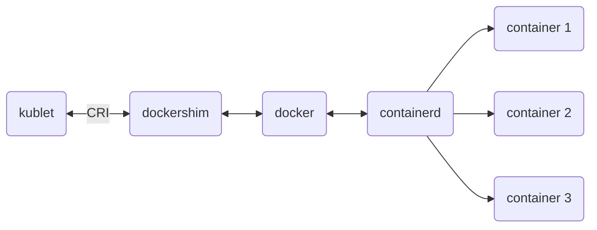
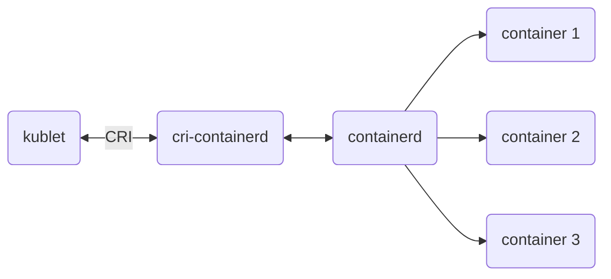

# Kubernetes Course
```
 ___   _   _____   _______ 
|   | | | |  _  | |       |
|   |_| | | |_| | |  _____|
|      _||   _   || |_____ 
|     |_ |  | |  ||_____  |
|    _  ||  |_|  | _____| |
|___| |_||_______||_______|
```

# Table of contents
- [Architecture](#architecture)
- [Tips & Tricks](#tips--tricks)
- [Directories](#directories)
- [Ports](#ports)
- [Commands](#commands)
- [Resources](#resources)
- [Errors](Errors)
- [Concepts](#concepts)

- [Kubernetes Course](#kubernetes-course)
- [Advanced Kubernetes Course](#advanced-kubernetes-course)

## Architecture
### Master Node
- Kubelet
- Kube Proxy
- CRD
- Kube APIServer
- ETCD Cluster
- Kube Controller Manager
- Kube Scheduler

### Worker Node
- Kubelet
- Kube Proxy
- CRD

## Tips & Tricks
- It is possible to have a k8s cluster using linux services not containers, but it is very difficult & unconvenient.
- k8s policy for deprecating some feature is after 3 versions, for example if it has deprecated some thing in 1.19, it will stop working in 1.23
- Kubelet has purpose of managing RAM & CPU on node, when swap is enabled, it is not able to manage resources properly. Must turn it off in order to work properly
- runc is creating namespaces and Cgroups
- Kubeadm, Kubelet & kubectl are versioned together
- There is nothing as a pod. You can't see any procss mamed pod, but containers actually exesits
- If any problems hapened during creation of a pod, you can ` $ service kubelet restart`
- Mostly API-Server is aimed for attacks
- If we change any manifests in /etc/kubernetes/manifests/ then after editting, there is no need to restart anything. Changes are going to be made.
- Always have a backup from /etc/kubernetes/manifests/
- What is a ` /pause ` container that all of containers have it when you ` $ nerdctl -n k8s.io ps ` ? It is a sandbox container that executes before actual container is up. sandbox asks for IP for actual container network from kube-proxy
- In K8s restart policy is always
- For LoadBalancing Network Traffic, We use HAPRoxy + keepalived in Masters and Nginx reverse proxy in workers. On Workers you can also use terafic because it has a good UI
- You can't ping a k8s service. Because it is actually some forwarding firewall rules, unless you don't specify port number of service, There is nothing to actually see
- You can increase probability of packets sending to a specific node by changing its related IPTables rule
- kube-proxy and core-dns pods are add-on not static pod!
- kubelet is a service (not a pod) because It is going to initialize all other pods using CRI --> containerd
- The component that checks for taints is kube-scheduler
- In a multi-container situation in a pod to get a list of all of conatiners you can ` $ kubectl get pod <POD-NAME>  -ojsonpath='{.spec.containers[*].namen }' `
- in probes, default value for ` initialDelaySeconds, periodSecond & failureThreshold is 3 seconds `
- There is no such thing as undrain. Whether you drain or cordon a node, you need to ` uncordon ` the node.
- right after installing k8s,do ` $ apt-mark hold kubectl kubelet kubeadm ` so they are not being updated using ` apt-update `
- when you ` $ kubectl get node ` the version that is shown is kubelet's version

## Directories
### Kube Config
- ` $HOME/.kube `
- ` /etc/kubernetes/admin.conf `

### Drivers
- ` /opt/cni/bin ` --> Network Driver
#### Kubelet drivers
- ` /var/lib/kubelet/device-plugins/kubelet.sock ` --> Driver for containerd
- ` /var/lib/kubelet/plugins_registry/csi.tigera.io-reg.sock ` --> Setting IPs using Calico
- ` /var/lib/kubelet/plugins/csi.sock ` --> storage and PVs drivers

### Core components of k8s (Static Pod Path)
- Kubelet watch this path and make changes as soon as you make them in this directory
- ` /etc/kubernetes/manifests/etcd.yaml `
- ` /etc/kubernetes/manifests/kube-apiserver.yaml `
- ` /etc/kubernetes/manifests/kube-controller.yaml `
- ` /etc/kubernetes/manifests/kube-scheduler.yaml `

#### ETCD stores data
- ` /var/lib/etcd `

#### Kubelet certificates
- ` /var/lib/kubelet/kubelet-node01.crt `
- ` /var/lib/kubelet/kubelet-node01.key `


## Ports
| **Port**          |     **Utility**     |
|:-----------------:|:-------------------:|
|   6443            |      API SERVER     |
|   2379            | API SERVER --> ETCD |
|   2380            |    ETCD <--> ETCD   |
|   2381            |   Monitoring ETCD   |
|   30000 - 32767   |   NodePort Range    |


#### Control plane
| **Protocol** | **Direction** | **Port Range** |       **Purpose**       |      **Used By**     |
|:------------:|:-------------:|:--------------:|:-----------------------:|:--------------------:|
|      TCP     |    Inbound    |      6443      |      K8s API Server     |          All         |
|      TCP     |    Inbound    |    2379-2380   |  ETCD server client API | kube-apiserver, etcd |
|      TCP     |    Inbound    |      10250     |       Kubelet API       |  self, Control Plane |
|      TCP     |    Inbound    |      10259     |      Kube-Scheduler     |         self         |
|      TCP     |    Inbound    |      10257     | Kube-Controller-Manager |         self         |

- 2379 --> is a port that API-SERVER commuicate with ETCD 
- 2380 --> is a port that ETCDs commuicate with ETCD

#### Worker node
| **Protocol** | **Direction** | **Port Range** |    **Purpose**    |     **Used By**     |
|:------------:|:-------------:|:--------------:|:-----------------:|:-------------------:|
|      TCP     |    Inbound    |      10250     |    Kubelet API    | self, Control Plane |
|      TCP     |    Inbound    |   30000-32767  | NodePort Services |         ALL         |


## Commands

### Information
- ` $ kubectl version `
- ` $ kubeadm version `
- ` $ kubectl cluster-info `

<br>

- ` $ kubectl describe pod nginx-pod `
- ` $ kubectl edit pod <pod_name> `
- ` $ kubectl get pod nginx-pod -o yaml > pod-nginx.yaml `
- ` $ kubectl get deployments.apps --all-namespaces ` --> get all deployments
- ` $ kubectl get deployments.apps --all-namespaces > all_deps.yaml ` --> save all deployments

### Token
- To list token: ` $ kubeadm token list `
- To create and also print all of joining command: ` $ kubeadm token create --print-join-command --ttl 1h `

### Create Resources
- ` $ kubectl create -f deployment-definition.yml ` --> For updating we need to use ` replace ` 
- ` $ kubectl apply -f deployment-definition.yml `  --> For updating we need to use ` update ` 

### Logs
- ` $ kubectl get logs `
- ` $ kubectl get event `

### Labels & Selectors
- ` $ kubectl label nodes <node-name> <label-key>=<label-value> `
- ` $ kubectl label node worker2 kubernetes.io/role=worker-2-B ` --> defined Role, that's being shown in $ kubectl get nodes
- ` $ kubectl get node worker2 --show-labels `
- ` $ kubectl get pod --show-labels `
- ` $ kubectl get deployment --show-labels `
- ` $ kubectl get pod --selector app=nginx -o wide `
- ` $ kubectl label node worker1 anisa- ` --> For removing all labels with key anisa
- ` $ kubectl label node worker1 anisa=kubernetes:NoSchedule- ` --> For removing label

### Taints & Tolerations
- ` $ kubectl taint nodes <node-name> <key>=<value>:<taint-effect> (NoSchedule | PreferNoSchedule | NoExecute) `
- ` $ kubectl taint node worker1 anisa=kubernetes:NoSchedule `
- ` $ kubectl taint node worker1 anisa- ` --> For removing all taints with key anisa
- ` $ kubectl taint node worker1 anisa=kubernetes:NoSchedule- ` --> For removing taint
- ` $ kubectl describe node kubemaster | grep taint ` --> For seeing taints on node


### Executing a command inside pod
- ` $ kubectl -n kube-system exec -it etcd-master1 -- sh ` --> connects to a pod to execute something
- ` $ nerdctl -n k8s.io exec -it a42ffs4y sh ` --> connects to a pod to execute something

### Deleting resources
- ` $ nerdcl -n k8s.io kill <container_name> `
- ` $ kubectl delete -f  "path/name.yaml" `
- ` $ kubectl delete pod  nginx-pod `

### Namespace
- ` $ kubectl create -f namespace-dev.yml `
- ` $ kubectl create namespace dev `
- ` $ kubectl config set-context kubernetes-admin@kubernetes --namespace=dev ` --> make dev namespace default namespace inside kube.config file


### Test & Debug
- ` $ kubectl run nginx-pod  --image nginx:1.21 `
- ` $ kubectl run debugger-pod  --image docker.arvancloud.ir/alpine --command -- sleep infinity `

### Rolling Update
- ` $ kubectl rollout status deployment/myapp-deployment `
- ` $ kubectl rollout history deployment/myapp-deployment `
- ` $ kubectl rollout undo deployment/myapp-deployment ` --> RollBack 1 version
- ` $ kubectl rollout undo deployment/myapp-deployment --to-revision 1 ` --> RollBack to specific version based on rollout history
- ` $ kubectl set image deployment/myapp-deployment \ nginx=nginx:1.9.1 ` --> It only updates value of nginx image on ETCD but it is going to keep deployment as it was before. So it is not the efficient
- ` $ kubectl apply -f deployment-definition.yml `
- ` $ kubectl annotate deployments.apps nginx-deploymetn kubernetes.io/change-cause="deploy new version of image 1:21" ` --> We can write a descripton to ` Change Cause ` section of rollinUpdate, This data is in form of annotation 

### ENVs & ConfigMaps & Secrets
- ` $ kubectl create configmap <config-name> --from-literal=<key>=<value> `  --> imperative form of defining CM
- ` $ kubectl create configmap <config-name> --from-file=<path-to-file> `  --> imperative form of defining CM from an .env file

- ` $ kubectl create secret generic <secret-name> --from-literal=<key>=<value> `  --> imperative form of defining secret
- ` $ kubectl create secret generic <secret-name> --from-file=<path-to-file> `  --> imperative form of defining secret from an .env file

### Service
- ` $ kubectl get endpoints nginx-svc ` 
- ` $ kubectl expose deployment nginx-deploy-main --port 80 ` --> creating a fast ClusterIP service without writing yaml file 


### Cluster Maintenace
- ` $ kubeadm upgrade plan `
- ` $ kubeadm upgrade apply `

- ` $ kubectl get node ` --> the version that is shown is kubelet's version
- ` $ kubeadm version `
- ` $ kubectl version `
- ` $ kubectl cluster-info `

### Certificates
- ` $ kubeadm certs check-expiration `
- ` $ kubeadm certs renew <NAME-OF-CERT> ` --> for renew specific cert
- ` $ kubeadm certs renew all ` --> for renew all certs

- ` $ kubectl get csr `
- ` $ kubectl certificat approve anisa-csr csr ` --> approve CSR
- ` $ kubectl certificat deny anisa-csr csr ` --> deny CSR
- ` $ kubectl describe csr anisa-csr `
- ` $ kubectl get csr anisa-csr -o yaml `
- ` $ kubectl get csr anisa-csr -o jsonpath='{.status.certifiacte}' | base64 -d` --> get certficate

### Create KubeConfig for a user
- ` $  curl https://my-kube-playground:6443/api/v1/pods --key admin.key --cert admin.crt --cacert ca.crt ` --> without creating kubeconfig file, just with RestAPI
- ` $  kubectl get pods --server my-kube-playground:6443 --client-key admin.key --client-certificate admin.crt --certificate-authority ca.crt ` --> without creating kubeconfig file, by passing
- ` $  kubectl --kubeconfig /root/.kube/config config use-context anisa@kubernete ` --> change context of KubeConfig

### Curl Kubelet
- ` $ curl localhost:10249/proxyMode `  --> returns iptables or ipvs


## Components:
### Master Nodes
- manages k8s cluster
---

### Worker Nodes
- Applications are there
---

### ETCD Cluster
- It is for archiving everything. Key-value pair DB. Jason-based.
- ETCD is an open source distributed key-value store used to hold and manage thecritical information that distributed systems need to keep running.
- You can see its process: ` $ ps -aux | grep etcd `
---

### Kube Scheduler
- scheduled which workloads is going to be assigned to which worker
- Kube scheduler schedule based on:
1. Filter nodes: For example if it matches lable of node, It is going to be scheduled there. And if there is a taint on node, It is not going to be scheduled
2. Rank Nodes (based on resources)
- The component that checks for taints is kube-scheduler
---

### Kube Controller Manager
- Checks status of workers and workloads. In a 5 second interval check health of components.
-  Has so many Controllers. It is not a centralized contrller:
#### Node Controller
1. Watch status
2. Remediate Situation
3. Node Monitor Period = 5s
4. Node Monitor Grace Perido = 40s --> After this 40s, The node is going to have an unschedulable taint
5. POD Eviction Timeout = 5m --> Pods are going to other nodes, scheduler decides on how

#### Replication controller
- In times of Evicting node, Replication controller moves Pods that are buid using Replicaset or Deployment to nodes that are working 

#### Certificate API manager
- using CA, has two components:
  1. CSR-Approving
  2. CSR-Signinig

#### PV-Binder Controller
#### Service-Account Controller
#### Stateful-Set Controller
#### ReplicaSet Controller
#### CronJob Controller
#### Job-Controller Controller
#### PV-Protection Controller
#### Deployment Controller
#### Namespace Controller
#### Endpoint Controller
---

### Kube APIServer
- A Manager which have to be informed for every interaction. Components do not talk to each other directly. The talk to API-Server and then API-Server communicate what have to be done. The only component that is connected to ETCD
- You can see its process: ` $ ps -aux | grep kube-api `
---

### Kubelet
- Exists on master node + worker node. Have so many responsibilities. Kubelet does status checks to API-Server. Master node Kubelet checks
- Does not recognize anything as a container. just Pod. Pod is just a concept that does not acyually exists.
- Its home directory is: ` /var/lib/kubelet `
- Works as a unit service, not a pod
- Has different responsibilities:
1. Register Node
2. Create PODs
3. Monitor Node & PODs

- cAdvisor component of Kubelet has access to metrics of resourcse and can be used for monitoring solutions
- livenessProbe, readinessProbe, startupProbe are part of kubelet
---

### CRD (Container Runtime Engine)
- A container controller
---

### Kube Proxy
- Exists on master node + worker node. Set Firewall Rules. For example for port forwarding
- Create IPTables Rules for network of K8S
- Services are transforming into IPtables firewall rules. Also take note that Services don't actually exists, They are logical constructs
- Every 5 seconds Check for service creations/changes
---

### Service
- has 2 main pros:
1. Load balancing (Round Robin by default)
2. connecting via name, not IP
---

### CoreDNS
---

## Errors
- CrashLoopBackoff: When container gets restarted so many times. So container creation has an error somewhere.
- ImagePullBackoff: Can't pull image

## Resources

### Namespace
- To create Namespace using yaml file:
```
apiVersion: v1
kind: Namespace
metadata:
  name: dev
```

#### Namespace Policy
- Request is when starting, limit is maximum amount of resource
```
apiVersion: v1
kind: ResourceQuota
metadata:
  name: dev-quota
  namespace: dev 
spec:
  hard: 
    pods: "10"
    count/deployments.apps: "2"
    requests.cpu: "100m"
    limits.cpu: "10"
    requests.memory: "100M"
    limits.memory: "10Gi"
```

<br>

- For connecting to a service outside of current namespace:
  - db-service.dev.svc.cluster-local
  - Service name . Namespace . Service . domain

#### Systematic Namespaces
##### default
- default namespace when you login to k8s using admin user

##### kube-node-lease

##### kube-public
- Whatever resource you put here, is accessible for all other namespaces

##### kube-system
- systemcatic resources for k8s
```
$ kubectl get pod -n kube-system
coredns (2 pods)
etcd
kube-apiserver
kube-controller
kube-Proxy
kube-scheduler
```

### Service
- Enable communication between various components within and outside
of the application
- Different Types of services:
1. NodePort
2. ClusterIP
3. LoadBalancer

#### NodePort Service
- Is a layer above ClusterIP, So you can use it for both external and inter-cluster connections
- Port Range: 30000 - 32767
- Service has an internal IP Address (From ClusterIP part of NodePort Serive) with an assigned desired internal Port.
- There are 3 different ports:
1. Target Port: Port of Pod that we want to map to
2. Port (From ClusterIP part of NodePort Serive): Assigned to Internal part of Service. Can be not unique across cluster, since there are lots of services that can be created and al of them are going to have different IPs, so they are having
3. NodePort: External Port that we connect to service using it

- Port Forwarding is happening using Kube-Proxy in IPTables level 
- Using Internal Serivce (From ClusterIP part of NodePort Serive), You can LoadBalance traffic to different Pods. LoadBalancing Algorithm is RoundRobin.
- thing is session is to sensitive to IP. So If you Change IP of clinet (Refresh page for example) There is this chance that You are going to be connected to a different pod. If You want this to not happen, You can ` SessionAffinity: Yes ` 

```
apiVersion: v1
kind: Service
metadata:
  name: nginx
  namespace: dev
spec:
  type: NodePort
  ports:
    - targetPort: 80
      port: 8080
      nodePort: 31457
  selector:
    app: nginx
```

- To Use SessionAffinity:
```
apiVersion: v1
kind: Service
metadata:
  name: myservice
spec:
  type: NodePort
  ports:
    - name: http
      protocol: TCP
      port: 80
      targetPort: 80
  selector:
    app: myapp
  # The Following adds session affinity
  SessionAffinity: ClientIP
  SessionAffinityConfig:
    clientIP:
      timeoutSeconds: 600
```

#### ClusterIP Service
- Used for inter-cluster connections
- Is default form of service. If you Don't assign anything in spec/type, It is going to be


```
apiVersion: v1
kind: Service
metadata:
  name: backend
  namespace: dev
spec:
  type: ClusterIP
  ports:
    - targetPort: 80
      port: 80
  selector:
    type: back-end
```

#### LoadBalancer Service
- Mostly used in cloud environments.
- Is a layer above NodePort
- After you create a loadBalancer Service, You are going to have an External-IP (Public) So you can LoadBalance using domain to differnet services.
```
apiVersion: v1
kind: Service
metadata:
  name: nginx
  namespace: dev
spec:
  type: LoadBalancer
  ports:
    - targetPort: 80
      port: 8080
  selector:
    app: nginx
```


### POD
- There is nothing as a pod. You can't see any procss mamed pod, but containers actually exesits
- Kubelet actually does not understand container, you need some logical thing as pod
- You can not have same kind of containers on a pod, because there are network/namespace conflicts
- despite of how many containers/volumes a Pod have, it is going to be assigned 1 IP Address
- Differetn forms of creating pod:
1. manifests
2. Deployment
3. ReplicaSet
4. DaemonSet

```
apiVersion: v1
kind: Pod
metadata:
  name: pod-nginx
  namespace: dev
  labels:
    app: nginx
    type: frontend
spec:
  containers:
    - name: nginx-container
      image: nginx:1.20
      imagePullPolicy: Never
  restartPolicy: Never
```

### Replicaset
- is a layer above pod. managed by kube-controller
- In replicaset yaml file, first metadata is assigned to our replicaset, second metadata is assigned to our pods.
- You can't assign replicaset's pod's a name.
- When you use ` $ kubectl create -f relicaset.yml ` you cannot change number of replicas and then ` $ kubectl apply -f relicaset.yml ` You have to ` $ kubectl replace -f relicaset.yml `
- For changing number of relpicas:
```
$ kubectl replace -f relicaset.yml
$ kubectl scale --replicas=6 -f replicaset.yml
$ kubectl scale --replicas=6 replicaset myapp-nginx-replica
```

```
apiVersion: apps/v1
kind: ReplicaSet
metadata:
  name: nginx-replicaset
  namespace: dev
  labels:
    app: nginx
    type: frontend
spec:
  replicas: 5
  selector:
    matchLabels:
        course: kubernetes
  template:
    metadata:
      labels:
        anisa: devops
        course: kubernetes
    spec:
      containers:
        - name: nginx-container
          image: docker.arvancloud.ir/nginx:1.21
```
- ` $ kubectl describe replicasetes.apps nginx-replicaset ` 

- When we update a replicaSet-myapp.yml file, we need to delete old pod manually, then k8s is going to create new version automatically. For more convenience we can make old version replicas to 0, then apply it, then update whatever we want in our yaml file , then change number of replicas to desired number. so scale down then scale up


---

### Deployment
- Is a layer above Replicaset, So that it manages replicaset + pod
- Benefits:
  - Rolling Updates: In rolling updates (versions) it is useful because it has 0 downtime. It is maximum cahnges 25% of pods at a version update.
  - Rollback Changes: Rolling back is also really easy
  - Pause/Resume Changes: You can also pause deploying a version. and start it at a certain time, so everything is ready for resume changes
- When you create a deployment, your pod name looks like (Replicaset and pod name are going to have a random set of characters assigned to them): ` <Deployment name> - <Replicaset name> - <Pod name> `
```
apiVersion: apps/v1
kind: Deployment
metadata:
  name: nginx-deployment
  namespace: dev
  labels:
    app: nginx-anisa
spec:   
  replicas: 6
  selector: 
    matchLabels:
      anisa: kubernetes
  template: 
    metadata:
      labels:
        anisa: kubernetes
    spec:
      containers:
        - name: nginx-container
          image: docker.arvancloud.ir/nginx:1.21  
          resources:
            requests:
              cpu: "10m"
              memory: "10M"
            limits:
              cpu: "2"
              memory: "512M" 
```

### Daemon Set
- 1 instance of it is going to be deployed on all nodes
- kube-proxy is a daemon Set
- It is good for log & monitoring solutions
```
apiVersion: apps/v1
kind: Daemonset
metadata:
  name: nginx-deployment
  namespace: dev
  labels:
    app: nginx-anisa
spec:   
  selector: 
    matchLabels:
      anisa: kubernetes
  template: 
    metadata:
      labels:
        anisa: kubernetes
    spec:
      containers:
        - name: nginx-container
          image: docker.arvancloud.ir/nginx:1.21  
```

### Static Pods
- all of systematic pods that executes with your k8s cluster, which are these 4: controller, etcd, scheduler, API-Server
- kube-proxy and core-dns pods are add-on not static pod!
- Kubelet watch this path and make changes as soon as you make them in this directory
- ` /etc/kubernetes/manifests/etcd.yaml `
- ` /etc/kubernetes/manifests/kube-apiserver.yaml `
- ` /etc/kubernetes/manifests/kube-controller.yaml `
- ` /etc/kubernetes/manifests/kube-scheduler.yaml `

- all static pods have ` -master ` at end of their name
- You can change staticPodPath via ` /var/lib/kubelet/config.yaml ` 
- Since the component that checks for taints is kube-scheduler, then static-pods don't need a toleration for being deployed on master nodes

## Drivers:
### CRI (Container Runtime Interface)
- containerd, docker, rkt, cri-o

### CSI (Container Network Interface)
- Calico, fFlannel, Cilium, Weaveworks

### CNI (Container Storage Interface)
- Local, Openstack, Amazon EBS, Dell EMC, GlusterFS, portworx

# Kubernetes Course
# Contents    
- Install, Configure and validation
- Core Concept (Architecture, Pods, Deployments, etc)
- Scheduling
- Logging & Monitoring
- Application Lifecycle Management
- Cluster Maintenance
- Security
- Storage
- Networking

# Sessions
## Session 1 - Core Concepts & Architecture

- K8s is written in GO lang
- It is possible to have a k8s cluster using linux services not containers, but it is very difficult & unconvenient.
- k8s policy for deprecating some feature is after 3 versions, for example if it has deprecated some thing in 1.19, it will stop working in 1.23

### Components:
- Master Nodes: manages k8s cluster
- Worker Nodes: Applications are there
- ETCD Cluster: Is for archiving everything. Key-value pair DB. Jason-based
- Kube Scheduler: scheduled which workloads is going to be assigned to which worker
- Kube Contreoller Manager: Checks status of workers and workloads. Has so many Controllers. It is not a centralized contrller. In a 5 second interval check health of components
- Kube APIServer: A Manager which have to be informed for every interaction. Components do not talk to each other directly. The talk to API-Server and then API-Server communicate what have to be done. The only component that is connected to ETCD
- Kubelet: Exists on master node + worker node. Have so many responsibilities. Kubelet does status checks to API-Server. Master node Kubelet checks 
- CRD (Container Runtime Engine): A container controller
- Kube Proxy: Exists on master node + worker node. Set Firewall Rules. For example for port forwarding

### Architecture
#### Master Node
- Kubelet
- Kube Proxy
- CRD
- Kube APIServer
- ETCD Cluster
- Kube Contreoller Manager
- Kube Scheduler

#### Worker Node
- Kubelet
- Kube Proxy
- CRD

### Deploying an app procedure
- Setup a yaml file for my-app
- After applying, yaml file is being passed to API-Server. In this stage "Pod is Created" is being outputted, but it is not actually created yet.
- Then it is passed to ETCD then scheduler. 
- After Scheduler make checks, it passes it request to related kublet of a worker node.
- Kublet of worker node then commadns Containerd to create containers.
- After it starts to run, kubelet acknowledge API-Server
- API-Server tells ETCD that node is active and running
- Controller Manager checks all components during the process

### dockershim vs cri-containerd
- docker uses containerd for its lifecycle management (start, stop, ...)

- dockershim

<span style="font-size: 2em;">&#x2B07;</span>
<span style="font-size: 2em;">&#x2B07;</span>
<span style="font-size: 2em;">&#x2B07;</span>


- cri-containerd developed as a driver between kubelet and containerd, so it improved performance of dockershim and docker


- You usually don't need to interact with containers directly, but when need to troubleshoot them, instead of ` $ docker ` you have to use ` $ ctr ` for example:
```
$ ctr images pull doceker.io/library/redis:alpine
$ ctr run doceker.io/library/redis:alpine redis
```
- instead of ` $ ctr` use ` $ nerdctl ` It is exactly like ` $ docker `

### Initialize a k8s Cluster
1. Provision the VMs (Min of 1 Master, 1 Worker):
2. Select and Install CRE (Containerd or others) on all the nodes. Get containerd from github. Install runc
3. Install Kubeadm, kubectl & kubelet on all the nodes
4. Initialize the cluster (on the master node)
5. Apply a CNI (Calico or flannel) on cluster
6. Join worker nodes to the cluster

### Install & Configure K&s:
- A compatible Linux host (Debian or Red Hat)
- 2GB or more of RAM per machine (any less will leave little room for your
apps).
- 2 CPUs or more.
- Full network connectivity between all machines in the cluster (public or
private network is fine).
- Unique hostname, MAC address, and product_uuid for every node.
- Certain ports are open on your machines
- Swap disabled. You MUST disable swap in order for the kubelet to work
properly
```
$ free -m --> check how much swap is being used
$ swappoff -a --> temporarily turn swap off
$ nano /etc/fstab --> To permanently turn swap off
```
- Set Time Zone (Asia/Tehran) ` $ timedatectl set-timezone Asia/Tehran `
- static IP on each node
- Set Public DNS (shecan.ir, 403.online or Open-VPN for Iran)
- Join the Worker Nodes

### Ports & Protocols
#### Control plane
| **Protocol** | **Direction** | **Port Range** |       **Purpose**       |      **Used By**     |
|:------------:|:-------------:|:--------------:|:-----------------------:|:--------------------:|
|      TCP     |    Inbound    |      6443      |      K8s API Server     |          All         |
|      TCP     |    Inbound    |    2379-2380   |  ETCD server client API | kube-apiserver, etcd |
|      TCP     |    Inbound    |      10250     |       Kubelet API       |  self, Control Plane |
|      TCP     |    Inbound    |      10259     |      Kube-Scheduler     |         self         |
|      TCP     |    Inbound    |      10257     | Kube-Controller-Manager |         self         |

- 2379 --> is a port that API-SERVER commuicate with ETCD 
- 2380 --> is a port that ETCDs commuicate with ETCD

#### Worker node
| **Protocol** | **Direction** | **Port Range** |    **Purpose**    |     **Used By**     |
|:------------:|:-------------:|:--------------:|:-----------------:|:-------------------:|
|      TCP     |    Inbound    |      10250     |    Kubelet API    | self, Control Plane |
|      TCP     |    Inbound    |   30000-32767  | NodePort Services |         ALL         |

- runc is creating namespaces and Cgroups

## Session 2 - Initialize a k8s Cluster

- runc: is in docker, create and manages cgroups and namespaces in linux kernel

### Initialize a k8s Cluster
#### Contaienrd
- get containerd from [https://www.github.com/containerd/containerd/releases/download/v1.7.16/containerd-1.7.16.tar.gz](https://www.github.com/containerd/containerd/releases/download/v1.7.16/containerd-1.7.16.tar.gz)
- extract it to /usr/local/ ` $ tar Cxzvf /usr/local/ containerd-1.6.31-linux-amd64.tar.gz `
- Download containerd service ` $ wget https://raw.githubsercontent.com/containerd/containerd/main/containerd.service ` and then ` $ mv containerd.service /usr/lib/systemd/system ` then ` $ systemtl deamon-reload` and ` $ systemctl start containerd.service `

#### runc
- get runc from [https://github.com/opencontainers/runc/releases/download/v1.1.12/runc.amd64](https://github.com/opencontainers/runc/releases/download/v1.1.12/runc.amd64)
- ` $ install -m 755 runc.amd64 /usr/local/sbin/runc `

<br>

- ` $ mkdir /etc/containerd `
- ` containerd config default | tee /etc/containerd/config.toml ` --> created default config

#### CNI for containerd
- see project [https://github.com/containernetworking/plugins/](https://github.com/containernetworking/plugins/)
- get CNI plugin from [https://github.com/containernetworking/plugins/releases/download/v1.4.1/cni-plugins-linux-amd64-v1.4.1.tgz](https://github.com/containernetworking/plugins/releases/download/v1.4.1/cni-plugins-linux-amd64-v1.4.1.tgz)
- ` $ mkdir -p /opt/cni/bin ` and then ` $ tar Cxzv /opt/cni/bin/ ni-plugins-linux-amd64-v1.4.1.tgz `

<br>

- Now we have to introduce cgroup to containerd
```
$ vim /etc/containerd/config.toml
search for { plugins."io.containerd.grpc.v1.cri".containerd.runtimes.runc }
add this line to end of section: SystemdCgroup = true

go to next section: { plugins."io.containerd.grpc.v1.cri".containerd.runtimes.runc.options }
change: SystemdCgroup = false --> SystemdCgroup = true
```
- then ` $ systemctl restart containerd.service `

#### Enabling IPV4 packet forwarding
```
# sysctl params required by setup, params persist across reboots
cat <<EOF | sudo tee /etc/sysctl.d/k8s.conf
net.ipv4.ip_forward = 1
EOF

# Apply sysctl params without reboot
sudo sysctl --system
```
- Verify that net.ipv4.ip_forward is set to 1 with: ` $ sysctl net.ipv4.ip_forward `

#### Allow Bridge Network packets for IPTables Configuration
```
cat <<EOF | sudo tee /etc/modules-load.d/k8s.conf
overlay
br_netfilter
EOF

sudo modprobe overlay
sudo modprobe br_netfilter

# sysctl params required by setup, params persist across reboots
cat <<EOF | sudo tee /etc/sysctl.d/k8s.conf
net.bridge.bridge-nf-call-iptables  = 1
net.bridge.bridge-nf-call-ip6tables = 1
net.ipv4.ip_forward                 = 1
EOF

# Apply sysctl params without reboot
sudo sysctl --system
```


#### Installing Kubeadm, Kubelet & kubectl
- [https://kubernetes.io/docs/setup/production-environment/tools/kubeadm/install-kubeadm/](https://kubernetes.io/docs/setup/production-environment/tools/kubeadm/install-kubeadm/)
- After adding related k8s version source to sources.list ` $ apt install kubelet=1.27.12-1.1 kubeadm=1.27.12-1.1 kubectl=1.27.12-1.1 -y `

#### Initializing k8s cluster on master nodes
- ` $ kubeadm init --pod-network-cidr=10.10.0.0/16 --apiserver-advertise-address=<IP of master node, On network Interface that we want> --kubernetes-version 1.27.12`


#### Copying Kube-config file
- Now you can use ` $ kubectl get node  --kubeconfig /etc/kubernetes/admin.conf `
- For convenience and not passing ` --kubeconfig /etc/kubernetes/admin.conf ` everytime, you can:
```
$ mkdir -p $HOME/.kube
$ sudo cp -i /etc/kubernetes/admin.conf $HOME/.kube/config
$ sudo chown $(id -u):%(id -f) $HOME/.kube/config
```

#### Installing Calico
- When we initialize a cluster, etcd, kube-apiserver, kube-controller, kube-Proxy, kube-scheduler are going to be assigned IP Address of bridge (exact host IP), but coreDNS won't initialize untill we have a CNI. In this state, our node is not schedulable since It can't assign an IP address to created pods. So we need an overlay network.
- [https://docs.tigera.io/calico/latest/getting-started/kubernetes/quickstart](https://docs.tigera.io/calico/latest/getting-started/kubernetes/quickstart)

- ` $ kubectl create -f https://raw.githubusercontent.com/projectcalico/calico/v3.29.2/manifests/tigera-operator.yaml `

- IMPORTANT! DO NOT PROCEED LIKE DOCUMENT, INSTEAD:
```
$ wget https://raw.githubusercontent.com/projectcalico/calico/v3.29.2/manifests/custom-resources.yaml
$ vim custom-resources.yaml
Change: cidr: 192.168.0.0/16 --> cidr: 10.10.0.0/16 

$ kubectl create -f custom-resources.yaml
```

- If in process of initialization have any problems, ` $ service kubelet restart `


#### Joining Workers
- To list token: ` $ kubeadm token list `
- To create and also print all of joining command: ` $ kubeadm token create --print-join-command --ttl 1h `

#### Auto completion bash for kubectl
```
$ source <(kubectl completion bash) --> kubectl auto complete
$ echo 'source <(kubectl completion bash)' >> ~/.bashrc
```


#### Installing Nerdctl
- for managing and Troubleshooting containers
- [https://github.com/containerd/nerdctl](https://github.com/containerd/nerdctl)
- Lots of Nerdctl commands are like docker. you can check differneces here: [https://github.com/containerd/nerdctl/blob/main/docs/command-reference.md](https://github.com/containerd/nerdctl/blob/main/docs/command-reference.md)
- Download full version of it. [https://github.com/containerd/nerdctl/releases/download/v1.7.6/nerdctl-full-1.7.6-linux-amd64.tar.gz](https://github.com/containerd/nerdctl/releases/download/v1.7.6/nerdctl-full-1.7.6-linux-amd64.tar.gz)

- You can see all k8s related containers ` $ nerdtctl -n k8s.io ps `

### E2E Test
- Full test has around 1000 checks – takes ages (12h)
- Conformance test has around 160 checks – enough to be certified (1.5h)
- Examples:
  - Networking should function for intra-pod communication
  - Services should serv basic endpoint form pods
  - DNS should provide DNS for services
  - Service endpoints latency should not be very high


## Session 3 - Components
- To get all keys of ETCD:
```
$ kubectl -n kube-system exec -it etcd-master1 -- etcdctl get / --cert="/etc/kubernetes/pki/etcd/server.crt" --cacert="/etc/kubernetes/pki/etcd/ca.crt" --key="/etc/kubernetes/pki/etcd/server.key" --prefix --keys-only
```

### Kube API Server
- steps after execution of a simple get command using kubectl is passed to kube API Server, for example $ kubectl get nodes :
1. authenticate User
2. Validate request (authorization)
3. Retrieve data from ETCD

- steps after execution of a simple post command using kubectl is passed to kube API Server, for example $ kubectl create node :
1. authenticate User
2. Validate request (authorization)
3. Retrieve data from ETCD
4. Update ETCD
5. Scheduler
6. Kubelet


## Session 4 - Pod, Replicaset, Deployment
- In YAML File, first values are named top level.
- In Yaml file, we write in camel case style

### necessary top levels for pod in a manifest:
```
apiVersion:
kind:
metadata:

spec:
```

#### apiVersion
- For apiVersion reference:
  - [https://kubernetes.io/docs/reference/kubernetes-api/workload-resources/](https://kubernetes.io/docs/reference/kubernetes-api/workload-resources/)
  - [https://kubernetes.io/docs/reference/generated/kubernetes-api/v1.27/](https://kubernetes.io/docs/reference/generated/kubernetes-api/v1.27/) 
- If our resource was part of core group, you don't need to write: core/v1 , You just write: v1
  nerdcl -n k8s.io kill <container_name>
 
#### Kind
- in kind top level, first word is Always capital

#### Metadata 

#### spec

- A container name consists of: [Namespace]/[Pod Name]/[Container Name]


## Session 5 - Namespace, NamespacePolicy, ClusterIP Service, NodePort Service


## Session 6 (7 on classes) - LoadBalance Service, Manual Scheduling, Lables & Selectors, Annotations, Taint & Tolerations
### Scheduling
#### Scheduling Using NodeName
- For manual scheduling using NodeName, add ` nodeName ` to your yaml file:
```
apiVersion: v1
kind: Pod
metadata:
  name: nginx
spec:
  containers:
  - name: nginx
    image: nginx
  nodeName: worker2
```
- Using NodeName you override all taints, so you can deploy directly on master nodes

#### Scheduling in No Scheduler
- In this setting, since you don't have automatic scheduling, you need to define a binding resource, then using curl pass it to API-Server
```
pod-definition.yaml
apiVersion: v1
kind: Pod
metadata:
  name: nginx
spec:
  containers:
  - name: nginx
    image: nginx
    ports:
      - containerPort: 8000


pod-bind-definition.yaml
apiVersion: v1
kind: Binding
metadata:
  name: nginx
target:
  apiversion: v1
  kind: Node
  name: node02
```
```
$ curl --header "Content-Type:application/jason" --request POST '{"apiVersion":"v1", "kind":"Binding" ... }' http://$SERVER/api/v1/namespace/default/pods/$PODNAME/binding/
```

### Annotations
- You can add some notes to your yaml file in order to keep things in mind. This functionality is not being used often.
- Mostly it is being used for config saving. For example in this annotation ` cache: True ` then read this value and set caching of app to true
- put values in " "
```
apiVersion: apps/v1
kind: Deployment
metadata:
  name: nginx-deployment
  namespace: dev
  labels:
    app: nginx-anisa
  annotation:
    buildVersion: "1.34"
spec:   
  replicas: 8
  selector: 
    matchLabels:
      anisa: kubernetes
  template: 
    metadata:
      labels:
        anisa: kubernetes
    spec:
      containers:
        - name: nginx-container
          image: docker.arvancloud.ir/nginx:1.21 
```

### Taint & Tolerations
- Taints have 3 effects that you can specify:
1. NoSchedule
  - New PODs are not schedulers on the node
  - Existing PODs stay
2. PreferNoSchedule
  - Like No Schedule but is not guranteed
3. NoExecute
  - New PODs are not Scheduled on the node
  - Existing PODs are evicted

- Master nodes are NoSchedule by default
- You can set a taint without a value, just a key, so for tolerating it you can use ` operator: exists `
- An empty ` key ` with operator ` exists ` matches all keys, values and effects which means that this will tolerate everything

- For tolerating a taint like ` $ kubectl taint node worker1 anisa=kubernetes:NoSchedule ` we can do
```
apiVersion: apps/v1
kind: Deployment
metadata:
  name: nginx-deployment
  namespace: dev
  labels:
    app: nginx-anisa
spec:   
  replicas: 8
  selector: 
    matchLabels:
      anisa: kubernetes
  template: 
    metadata:
      labels:
        anisa: kubernetes
    spec:
      containers:
        - name: nginx-container
          image: docker.arvancloud.ir/nginx:1.21 
      tolerations:
        - key: "anisa"
          operator: "Equal"
          value: "kubernetes"
          effect: "NoSchedule"
```

- For removing master node taint: ` $ kubectl taint node master1 node-role.kubernetes.io/control-plane- `
- For having a pod that can tolerate master node:
```
apiVersion: apps/v1
kind: Deployment
metadata:
  name: nginx-deployment
  namespace: dev
  labels:
    app: nginx-anisa
spec:   
  replicas: 8
  selector: 
    matchLabels:
      anisa: kubernetes
  template: 
    metadata:
      labels:
        anisa: kubernetes
    spec:
      containers:
        - name: nginx-container
          image: docker.arvancloud.ir/nginx:1.21 
      tolerations:
        - key: "node-role.kubernetes.io/control-plane"
          operator: "Exists"
```

- When you are using taint and tolerations, you can't force a deployment to be deployed on certain node, It is probable to be deployed on a node with toleration but it is not guaranteed that it will 100% be deployed on that and not other free-tainted nodes


## Session 7 (8 on classes) - Node Selector, Node Affinity, Resource limit, Daemon Set, Static Pods
### Node Selector
- Its opposit of taints, You can decide where your pod must go to
- a use case:
```
$ kubectl label node kubeworker-2 size=small

apiVersion: apps/v1
kind: Deployment
metadata:
  name: nginx
  namespace: dev
spec:
  replicas: 3
  selector:
    matchLabels:
      app: nginx
  template:
    metadata:
      labels:
        app: nginx
    spec:
      containers:
        - name: nginx
          image: nginx:1.21
      nodeSelector:
        size: small
```

- Node Selector is not optimized for when you want to use some logical rules for example ` NOT small ` or ` large OR medium ` so we use node affinity

### Node Affinity
- Node Affinity Types:

| **Operator** |                           **Behavior**                          |
|:------------:|:---------------------------------------------------------------:|
|      In      |    The label value is present in the supplied set of strings    |
|     NotIn    | The label value is not contained in the supplied set of strings |
|    Exists    |            A label with this key exists on the object           |
| DoesNotExist |           No label with this key exists on the object           |


- Type 3 & 4 of this table are planned for future

|        | **During Scheduling** | **During Execution** |
|:------:|:---------------------:|:--------------------:|
| Type 1 |        Required       |        Ignored       |
| Type 2 |       Preferred       |        Ignored       |
| Type 3 |        Required       |       Required       |
| Type 4 |       Preferred       |       Required       |


```
apiVersion: apps/v1
kind: Deployment
metadata:
  name: nginx
  namespace: dev
spec:
  replicas: 3
  selector:
    matchLabels:
      app: nginx
  template:
    metadata:
      labels:
        app: nginx
    spec:
      containers:
        - name: nginx
          image: nginx:1.18
      affinity:
        nodeAffinity:
          requiredDuringSchedulingIgnoredDuringExecution:
            nodeSelectorTerms:
              - matchExpressions:
                 - key: "size"
                   operator: "In"
                   values:
                     - "large"
                     - "small"
```

- When you use preferredDuringSchedulingIgnoredDuringExecution you need to assign it a wheight:
```
apiVersion: apps/v1
kind: Deployment
metadata:
  name: nginx-deployment
  namespace: dev
  labels:
    app: nginx
spec:
  replicas: 10
  selector:
    matchLabels:
      type: frontend
  template:
    metadata:
      labels:
        type: frontend
    spec:
      containers:
        - name: nginx-container
          image: nginx:1.20
      affinity:
        nodeAffinity:
          requiredDuringSchedulingIgnoredDuringExecution:
            nodeSelectorTerms:
              - matchExpressions:
                 - key: "size"
                   operator: "In"
                   values:
                     - "large"
          preferredDuringSchedulingIgnoredDuringExecution:
            - weight: 5
              preference:
                matchExpressions:
                  - key: color
                    operator: In
                    values:
                      - blue
            - weight: 3
              preference:
                matchExpressions:
                  - key: color
                    operator: In
                    values:
                      - red
```

- Usecase: we have 4 nodes labled as blue, red, green and other. We want blue deployment to only be deployed on blue node and we don't want anything rather than blue to be deployed on blue node. We can achieve such thing using a combination of Node Affinity & Taint:

```
$ kubectl tain node worker1 color=red:NoSchedule

$ vim red-deployment.yml
apiVersion: apps/v1
kind: Deployment
metadata:
  name: nginx-red
  namespace: dev
spec:
  replicas: 3
  selector:
    matchLabels:
      app: nginx
  template:
    metadata:
      labels:
        app: nginx
    spec:
      affinity:
        nodeAffinity:
          requiredDuringSchedulingIgnoredDuringExecution:
            nodeSelectorTerms:
              - matchExpressions:
                - key: "color"
                  operator: "In"
                  values:
                    - red
      tolerations:
        - key: "color"
          operator: "Equal"
          value: "red"
          effect: "NoSchedule"
      containers:
        - name: nginx
          image: nginx
```
### Resource limit
#### RAM limit
- 256Mi = 256*1024*1024 = 268,435,456 Bytes
- 256M = 256*1000*1000 = 256,000,000 Bytes

#### CPU limit
- 0.5 = 500m (at least=1m=0.001 of 1 core CPU)

- By default K8s assumes that each POD requires 0.5 CPU and 256 Mi Memory
- By default, K8s Set 1 vCPU and 512 Mi of Memory limits on a container
- When a Scheduler tries to place a POD on an node, it uses this number to identify which node has sufficient amount of resources

- What happens when a POD exceed beyond its limit?
  - CPU: K8s throttles the CPU for the POD
  - Memory: K8s terminate the POD (OOM-Killed)

- You can see amount of resources that are set for each pod using ` $ describe node master1 ` but pay attention if you see ` 0 (0%) ` Requests/limit it means that it is using default value which is 0.5 CPU and 256 Mi Memory

### Daemon Set VS Static Pods
|                 **Static Pods**                |                   **Daemon Set**                  |
|:----------------------------------------------:|:-------------------------------------------------:|
|               Created by Kubelet               | Created by Kube-API Server (DaemonSet Controller) |
| Deploy Control Plane components as Static Pods | Deploy Monitoring Agents, Logging Agents on nodes |

## Session 8 (9 on classes) - Multiple Schedulers, Monitoring, Logging, Application Lifecycle Management, Configure Application
### Multiple Schedulers
- You can write your own scheduler in GO lang and deploy it on your k8s cluster

### Monitoring
- We are talking about k8s own monitoring solution here, which is metric server, not third party solutions like Prometheus + Grafana which are free or DataDog and Dynatrace which require license
- What we expect from our monitoring system:
  - Node level metrics
    - The number of nodes in the cluster
    - How many of them are healthy
    - Performance metrics
      - CPU and Memory
      - Network
      - Disk utilization
  - POD level metrics
    - The number of PODs
    - Performance metrics
      - CPU and Memory
      - Pod restart status

Monitoring Solutions – Metrics Server:
- [https://github.com/kubernetes-sigs/metrics-server](https://github.com/kubernetes-sigs/metrics-server)
- Enables monitoring and analysis features for K8s
- Retrieves metrics from each K8s nodes and PODs --> It has access to kubelet's component cAdvisor
- Aggregates and stores metrics in memory --> so it is just real-time which is not ideal
- The metrics exposed by the Metrics-Server is used by HorizentalPodAutoScaler (HPA) and VerticalPodAutoScaler (VPA)
- Metrics are accessible via ` $ kubectl top `

### Logging
- from version 1.26 onward k8s keeps events for up to 60 minutes then delets those logs

### Application Lifecycle Management
### Rolling Updates & RollBacks
- For zero downtime updates we need to use deployment resource
- deploymnet's default strategyType for updates is rolling update, you can change it if you want
- In a recreate strategy k8s deletes all pods and recreats all of them again. If we want to have no downtime, we should use rolling update strategy
- In a rolling update strategy, by default **25%** of pods are going to out of access untill changes are completed. If we have 1 pod, then new version is being deployed and after its deployment, old version is going to be deletd
- When we use rolling update, a new replicaSet is going to be created for new version, but the old replicaSet won't we deleted, it just going to have 0 pods inside of it. When we use rollback, vice-verca happens, so new replicaSet is going to have 0 pods inside of it. Pay attention that in a rolling update scenario, if you delete old replicaSet, You are not going to be able to rollback if it's necessary
- ` $ kubectl annotate deployments.apps nginx-deploymetn kubernetes.io/change-cause="deploy new version of image 1:21" ` --> We can write a descripton to ` Change Cause ` section of rollinUpdate, This data is in form of annotation 

### Configure Application
- How to pass command & arguments to a container:
```
apiVersion: v1
kind: Pod
metadata:
  name: pod-nginx
  namespace: dev
  labels:
    app: nginx
    type: frontend
spec:
  containers:
    - name: nginx-container
      image: nginx:1.20
      command: ["sleep2.0"]
  
      args: ["10"]
```

- You can write & for or and && for and in your command arguments
```
apiVersion: apps/v1
kind: Deployment
metadata:
  name: debugger-deployment
  namespace: dev
  labels:
    app: nginx-anisa
spec:
  replicas: 1
  selector:
    matchLabels:
      anisa: kubernetes
  template:
    metadata:
      labels:
        anisa: kubernetes
    spec:
      containers:
        - name: debugger-container
        image: docker.arvancloud.ir/alpine
        command:
          - /bin/sh
          - -c
          - |
            mkdir anisa && ls && sleep infinity

```

- Or you can write it like this
```
...
    spec:
      containers:
        - name: debugger-container
        image: docker.arvancloud.ir/alpine
        command:
          - /bin/sh
          - -c
          - |
            mkdir anisa
            ls
            sleep infinity

```

## Session 9 (11 on classes) - Environment Variables, Multi-Container PODs, InitContainer PODs, Self-Healing Applications
### Environment Variables
- ENVs have a key-value structure
- for ensuring our ENV is set, we need to check it inside container
``` 
$ kubectl exec -it <POD_NAME> -- bash
$ printenv
or
$ echo $DB_PASS
```

- There are 3 ways for setting an ENV:
#### 1. Plain Key-Value
```
Deployment.yaml
...
  env:
    - name: APP_COLOR
      value: pink
```

#### 2. ConfigMap
- conifMap values must be string. boolean and numbers must be in qoutation
- You can update your CM in real-time with ` $ kubectl apply -f configmap.yaml `

- declaritive way of creating config-map.yaml
```
apiVersion: v1
kind: ConfigMap
metadata:
  name: app-config
data:
  containers:
    DB_PORT: "3306"
    DB_USER: root
    DB_CACHE: "true"
```


- There are 3 ways to address a CM from your deployment.yml
1. complete ENV
```
Deployment.yaml
...
    envFrom:
      configMapKeyRef:
        name: app-config
```

2. Singel ENV
```
Deployment.yaml
...
  - name: WORDPRESS_DB_USER
    valueFrom:
      configMapKeyRef:
        name: app-config
        key: DB_USER
```

3. Volume
- MountPath will be created if it is not present
- Mounted file if readonly
- If config file is changed, you need to restart pod for it to apply new changes
```
apiVersion: v1
kind: ConfigMap
metadata:
  name: app-config
data:
  config.env: |
    site-url=https://anisa.co.ir
    site_settings {
      port: 443
      ssl: true
    }
    backend_url: backend.anisa.co.ir
```

```
Deployment.yaml

apiVersion: v1
kind: Pod
metadata:
  name: alpine-pod
  namespace: default
spec:
  volumes:
  - name: app-config-volume
    configMap:
      name: app-config
  containers:
    - name: alpine-container
      image: registry.docker.ir/alpine
      command:
        - sleep
        - infinity
      volumeMounts:
        - name: app-config-volume
          mountPath: /mnt/config
```
- Create a tattoo design for me. I want it on my chest (on my heart). my desing have 2 parts, a pentagon and O+ (my blood typ). I want O+ to be inside and in center of pentagone. For pentagone i am looking for a tribal vibe. For O+ I want a classic sci-fi font + I want O+ lines to be filled so it is easy to realise from distance

#### 3. Secrets
- It is exactly like CM but it is base-64 encoded
- ` $ echo -n "YOUR_VALUE" | base64 ` --> for encoding
- ` $ echo -n "YOUR_VALUE" | base64 --encode ` --> for decoding


```
Deployment.yaml
...
envFrom:
  - name: APP_COLOR
    valueFrom:
      secretKeyRef:
        name: app-secret
```


- It is possible to combine ENV and CM. If write same key for a value, the one in ENV overrides the one in CM
```
apiVersion: v1
kind: Pod
metadata:
  name: alpine-pod
  namespace: default
spec:
  containers:
    - name: alpine-container
      image: registry.docker.ir/alpine
      command:
        - sleep
        - infinity
      env:
        - name: WORDPRESS_DB_NAME
          value: "anisa"
        - name: WORDPRESS_DB_USER
          valueFrom:
            configMapKeyRef:
              name: app-config
              key: DB_USER
```


### Multi-Container PODs
- Three common patterns when it comes to design a mlti-container POD:
1. side-car contaieners [Mostly used]
2. Adapter containers --> Process input and changes it to a desired format
3. Ambassador containers --> Proxy requests to outside


```
apiVersion: v1
kind: Pod
metadata:
  name: pod-multicontainer
  namespace: default
  labels:
    app: simple-webapp
spec:
  containers:
    - name: simple-webapp
      image: simple-webapp
      ports:
        - containerPort: 8080
    - name: log-agent
      image: log-agent
```
- When you ` $ kubectl exec -it pod-multicontainer -- bash ` you are going to connect to first container (default one), for example here it is simple-webapp. If you want to connect to other container you need to ` $ kubectl exec -it pod-multicontainer -c alpine-container -- bash `

### InitContainer PODs
- Initcontainers are on-time tasksk that run and complete before the app containers are started. The app container starts when all the InitContainers are successfully done.
- They are executed one by one sequentially, order is important
- If any of the InitContainers fail to complete, the POD is repeatedly restarted untill it succeeds
- Use cases:
  - A process that waits for an external service to be up
  - A process that prepares some data for the app containres

- an example could be:
```
...
initContianers:
  - name: init-myservice
    image: busybox:1.28
    command: ['sh', '-c',  'until nslookup myservice; do echo waiting for myservice; sleep 2; done;']
  - name: init-mydb
    image: busybox:1.28
    command: ['sh', '-c',  'until nslookup mydb; do echo waiting for mydb; sleep 2; done;']
```

```
apiVersion: v1
kind: Pod
metadata:
  name: pod-multi
  namespace: default
  labels:
    app: nginx
spec:
  volumes:
    - name: myvol
      emptyDir:
        sizeLimit: 10Mi
  initContainers:
    - name: config-creator
      image: registry.docker.ir/alpine
      volumeMounts:
        - name: myvol
          mountPath: /mnt/vol
      command:
        - /bin/sh
        - -c
        - |
          echo "$(date) here is your Config" > /mnt/vol/init1.txt
          sleep 5
    - name: git-cloner
      image: registry.docker.ir/alpine
      volumeMounts:
        - name: myvol
          mountPath: /mnt/vol
      command:
        - /bin/sh
        - -c
        - |
          echo "$(date) here is your git repository" > /mnt/vol/init2.txt
  containers:
    - name: nginx-container
      image: registry.docker.ir/nginx:1.21
      volumeMounts:
        - name: myvol
          mountPath: /mnt/vol
```

### Self-Healing Applications
- Container Probes: perform diagnostics periodically by the kubelet on a container

Types of probes:
1. livenessProbe
- indicates whether the container is running
- If it fails, the kubelet kills the container (So container restarts)

2. readinessProbe
- indicates whether the container is ready to respond to requests
- If it fails, Pod's IP address is removed from the endpoints of all services (Does not restart container)

3. startupProbe
- indicates whether the application is started
- if it fails, the kubelet kills the container

<br>

- To perform a diagnostic, the **kubelet** triggers a **handler**

Types of handlers:
1. ExecAction --> Executes a specific **command** inside the container
2. TCPSocketAction --> Performs a TCP check against the **POD's IP address** on a specific **port**
3. HTTPGetAction --> performs an **HTTP GET request** against the **POD's IP address** on a specific **port and path**

<br>

- default value for ` initialDelaySeconds, periodSecond & failureThreshold is 3 seconds `

- livenessProbe:
```
...
livenessProbe:
  exec:
    command:
    - cat
    - /tmp/healthy
  initialDelaySeconds: 5
  periodSeconds: 5
  failureThreshold: 5
```
```
...
livenessProbe:
  httpGet:
    path: /health
    port: 8080
    httpHeaders:
      - name: Custom-Header
        value: Awesome
  initialDelaySeconds: 3
  periodSeconds: 3
  failureThreshold: 3
```

- Readiness Probe
```
...
readinessProbe:
  tcpSocket:
    port: 8008
  initialDelaySeconds: 5
  periodSeconds:10
  failureThreshold: 3
livenessProbe:
  tcpSocket:
    port: 8080
  initialDelaySeconds: 15
  periodSeconds: 20
  failureThreshold: 3
```

- Startup Probe
```
...
ports:
- name: liveness-port
  containerPort: 8080
  hostPort:8080

livenessProbe:
  httpGet:
    path: /health
    port: liveness-port
  initialDelaySeconds: 3
  periodSeconds: 10
  failureThreshold: 1

livenessProbe:
  httpGet:
    path: /health
    port: liveness-port
  initialDelaySeconds: 3
  periodSeconds: 10
  failureThreshold: 30
```


## Session 10 (12 on classes) - Cluster Maintenance
### OS Upgrade
- If you drain a node, it'll have noExecute & noSchedule taints ` $ kubectl drain node-1 `
- If you cordon a node, it'll have noSchedule taints ` $ kubectl cordon node-2 `
- Whether you drain or cordon a node, you need to ` uncordon ` the node. There is no such thing as undrain. ` $ kubectl uncordon node-2 `
- right after installing k8s,do ` $ apt-mark hold kubectl kubelet kubeadm ` so they are not being updated using ` apt-update `

### Cluster Upgrade
- k8s uses semantic versioning: V1.11.3
  - 1: major
  - 11: Minor (features - functionality)
  - 3: Patch (bug fixes)
- k8s releases are following this: V1.10.0-alpha --> V1.10.0-beta --> V1.10.0-rc (release candidate) --> V1.10.0
- for updating to different versions, there are rules to follow. We based our update on kube-apiserver (because all componentes are connecting to api-server)
  - kube-apiservere --> base version: X (V1.10)
  - controller-manager --> X-1 (V1.10 or V1.09)
  - kube-scheduler --> X-1 (V1.10 or V1.09)
  - kubelet --> X-2 (V1.10 or V1.09 or V1.08)
  - kube-proxy --> X-2 (V1.10 or V1.09 or V1.08)
  - kubectl --> X+1, X, X-1 (V1.11 or V1.10 or V1.09)

- K8s support last 3 releases, For example by the time it publishes V1.13, V1.10 becomes unsupported
- For updating to V1.10 to V1.13, you need to update ro V1.11 then V1.12 then V1.13

- for upgrading cluster you can use ` kubeadm `
- ` $ kubeadm upgrade plan `
- ` $ kubeadm upgrade apply `
- upgrading master nodes are not hard, you just upgrade them one at a time.
- For upgrading worker nodes you need to ` drain ` them before upgrading
- different solutions for upgrading worker nodes
  - All at once
  - -1/+1 --> drain one worker, then un-cordon it
  - +1/-1 --> add a new updated worker node

- for upgrading ` $ kubeadm upgrade plan ` is pretty self-explainatory, so before upgrading your k8s componenets you need to update kubeadm itself
```
master-1$ kubeadm upgrade plan
master-1$ apt-mark unhold kubeadm kubectl kubelet
master-1$ apt list -a kubeadm
master-1$ apt install kubeadm=1.26.14-1.1 kubeadm=1.26.14-1.1 (from 1.26.12)
master-1$ kubeadm upgrade plan
master-1$ kubeadm upgrade apply v1.26.14

master-1$ apt install kubelet=1.26.14-1.1 (from 1.26.12)
master-1$ systemctl restart kubelet.service
master-1$ nerdctl -n k8s.io images

worker-1$ nerdctl -n k8s.io images
worker-1$ kubectl drain worker-1 --ignore-daemonsets
worker-1$ kubeadm upgrade node
worker-1$ apt install kubelet=1.26.14-1.1 (from 1.26.12)
worker-1$ systemctl restart kubelet.service
worker-1$ kubectl uncordon worker-1

and so on for other masters/workers

now for upgrading minor part of version (26 --> 27) we need to add v27 repo to our apt
master-1$ echo 'deb [signed-by=/etc/apt/keyrings/kubernetes-apt-keyring.gpg] https://pkgs.k8s.io/core:/stable:/v1.27/deb/ /' | sudo tee /etc/apt/sources.list.d/kubernetes.list
master-1$ sudo apt-get update
```


## Session 11 (13 on classes) - Backup & Restore Methodologies, Security

### Backup & Restore Methodologies
#### Hard way
- Backup all of your yaml files peridocally
- ` $ kubectl get deployments.apps --all-namespaces > all_deps.yaml ` --> save all deployments
- Backup periodically directories:
  - ` /etc/kubernetes/manifests ` --> static pods
  - ` /etc/kubernetes `
- Backup ` /var/lib/etcd ` peridocally

#### A bit pro way
- [velero.io](https://velero.io/) --> a cool tool for backuping stuff in clusters
- [https://kubernetes.io/docs/tasks/administer-cluster/configure-upgrade-etcd/](https://kubernetes.io/docs/tasks/administer-cluster/configure-upgrade-etcd/)
- using etcdctl

#### Backup & Restore using etcdctl
- install ` etcdctl ` on your machine
- ` $ etcdctl snapshot save snapshot20240718.db --endpoints=https://127.0.0.1:2379 --cert=/etc/kubernetes/pki/etcd/server.crt --key=/etc/kubernetes/pki/etcd/server.key --cacert=/etc/kubernetes/pki/etcd/ca.crt `
- ` $ etcdctl snapshot status snapshot20240718.db --write-out=table ` --> to checkout what has been backed-up
- for restoring backup, first we need to stop api-server ` $ mv /etc/kubernetes/manifests/kube-apiserver.yaml /etc/kubernetes/kube-apiserver.yaml `
- find these information needed in below step in ` /etc/kubernetes/manifests/etcd.yaml `
- ` $ etcdctl snapshot restore snapshot20240718.db --data-dir /var/lib/etcd-from-backup --initial-cluster master1=https://192.168.1.5:2380 --initial-advertise-peer-urls https://192.168.1.5:2380 --name=master1 `
- now inside ` /etc/kubernetes/manifests/etcd.yaml ` cahnge hsotPath: path: /var/lib/etcd --> /var/lib/etcd-from-backup
- Now we start api-server ` $ mv /etc/kubernetes/kube-apiserver.yaml /etc/kubernetes/manifests/kube-apiserver.yaml `

### Security
#### Cerificates in K8S
- in k8s, server and client both needs certificates for connection, so our security is doubled
- K8s has 3 CA servers:
1. Kube-API [apiserver.crt + apiserver.key]
2. ETCD [ etcdserver.crt + etcdserver.key]
3. Kubelet [ kubelet.crt + kubelet.key] --> when api-server sends some information about a pod and asks kubelet to create it, kubelet is server and apiserver is client

<br>

- k8s clients:
1. admin user [ .crt + .key]
2. scheduler [ scheduler.crt + scheduler.key]
3. controller-manager [ controller-manager.crt + controller-manager.key]
4. kube-proxy [ kube-proxy.crt + kube-proxy.key]
5. apiserver-etcd [ apiserver-etcd-client.crt + apiserver-etcd-client.key]
6. apiserver-kubelet [ apiserver-kubelet-client.crt + apiserver-kubelet-client.key]
7. kubelet-client [ kubelet-client.crt + kubelet-client.key]


Certificates divided based on their RootCA:
1. ETCD-CA:
  - ETCD [ etcdserver.crt + etcdserver.key]
  - apiserver-etcd [ apiserver-etcd-client.crt + apiserver-etcd-client.key]
2. CA [API SERVER + KUBELET SERVER]:
  - Kube-API [apiserver.crt + apiserver.key]
  - Kubelet [ kubelet.crt + kubelet.key]
  - admin user [ .crt + .key]
  - scheduler [ scheduler.crt + scheduler.key]
  - controller-manager [ controller-manager.crt + controller-manager.key]
  - apiserver-etcd [ apiserver-etcd-client.crt + apiserver-etcd-client.key]
  - apiserver-kubelet [ apiserver-kubelet-client.crt + apiserver-kubelet-client.key]
  - kubelet-client [ kubelet-client.crt + kubelet-client.key]
3. FRONT-PROXY-CA [KUBE-PROXY SERVER]:
  - kube-proxy [ kube-proxy.crt + kube-proxy.key]

<br>

- Directory where kubelet-client certificate is being stored:
  - ` /var/lib/kubelet/kubelet-node01.crt `
  - ` /var/lib/kubelet/kubelet-node01.key `
- CA certificates are issued for 10 years but other certificates are issued for 1 year
- When you renew CA Certificate then you need to renew all of its related certs also

#### TLS in k8s
- we have an object in k8s called ` CertificateSigningRequest Object ` which is connected to CA, when we request to sign a CSR using it it requests API-Server a
- Steps of signing a CSR:
  1. Create CSR Object
  2. Review Requests
  3. Approve Requests
  4. Share Certs to Users

- create a cert from client-side, CN (Common Name) is name of user we want:
```
$ openssl gen-rsa -out anisa.ke 2048
$ openssl req -new -key anisa.key -out anisa.csr
```

- for signing CSR in k8s cluster, we create a k8s object, we only change ` name and requet `  in this object. requet should be base64 and without spaces
```
$ cat anisa.csr | base64 -w 0
```

```
apiVersion: certifiactes.k8s.io/v1
kind: CertificateSigningRequest
metadata:
  name: anisa-csr
spec:
  groups:
    - system: authenticated
  request: "< $(cat anisa.csr | base64 -w 0) >"
  signerName: kuberntes.io/kube-apiserver-client
  usages:
    - client auth
```

```
$ kubectl get csr
$ kubectl certificat approve anisa-csr csr --> approve CSR
$ kubectl certificat deny anisa-csr csr --> deny CSR
$ kubectl describe csr anisa-csr
$ kubectl get csr anisa-csr -o yaml
$ kubectl get csr anisa-csr -o jsonpath='{.status.certifiacte}' | base64 -d --> get certficate
```

- also rememeber to give CA chain to user from ` /etc/kubernetes/pki/ca.crt `
- add ` anisa.crt + anisa.key + ca.crt `

#### Create KubeConfig for a user
- ` $  curl https://my-kube-playground:6443/api/v1/pods --key admin.key --cert admin.crt --cacert ca.crt ` --> without creating kubeconfig file, just with RestAPI
- ` $  kubectl get pods --server my-kube-playground:6443 --client-key admin.key --client-certificate admin.crt --certificate-authority ca.crt ` --> without creating kubeconfig file, by passing

- we can have multiple cluster configs in 1 kubeConfig file
- KubeConfig file is consisted of:
  1. Clusters
  2. Contexts (using Contexts we assing clusters and users tigether)
  3. Users

  - currentContext in kubeCon fig file shows which cluster is our default
```
apiVersion: v1
kind: Config

clusters:
- name: my-kube-playground
  cluster:
    certificate-authority: /HOME/DATA/ca.crt
    server: my-kube-playground:6443

contexts:
- name: my-kube-admin@my-kube-playground
  context:
    cluster: my-kube-playground
    user: my-kube-admin

users:
- name: my-kube-admin
  user:
    client-certificate: /HOME/DATA/admin.crt
    client-key: /HOME/DATA/admin.key
```

- for multiple clusters (values are hidden)
```
apiVersion: v1
kind: Config

current-context: dev-user@google

clusters:
- name: my-kube-playground
- name: development
- name: production
- name: google

contexts:
- name: my-kube-admin@my-kube-playground
- name: dev-user@google
- name: prod-user@production

users:
- name: my-kube-admin
- name: admin
- name: dev-user
- name: prod-user
```

## Session 12 (14 on classes) - Security, Network Policy, Volumes
### Security
#### Create KubeConfig for a user
- instead of addressing files of certificaftes, we can put base64 value of them inside our KubeConfig
```
apiVersion: v1
kind: Config

clusters:
- name: my-kube-playground
  cluster:
    certificate-authority-data: < base64 of ca.crt >
    server: my-kube-playground:6443

contexts:
- name: my-kube-admin@my-kube-playground
  context:
    cluster: my-kube-playground
    user: my-kube-admin

users:
- name: my-kube-admin
  user:
    client-certificate-data: < base64 of admin.crt >
    client-key-data: < base64 of admin.key >
```

- To change context of KubeConfig:
```
$  kubectl --kubeconfig /root/.kube/config config use-context anisa@kubernetes
```

- Now in order for our new created user to have access to different things in our cluster we need to create RoleBindings and Roles
```
apiVersion: rbac.authorization.k8s.io/v1
kind: Role
metadata:
  name: developer
  namespace: dev
rules:
  - apiGroups:
      - ""
    resources:
      - "pods"
    verbs:
      - "list"    
```
- In verbs, list only show names, but get can show details like describe
- We can chnge Role & RoleBindings in live-time, no need to deleting and re-creating them

- now we need to do a RoleBinding in order to bind user to role. We can assign multiple users to a role
```
apiVersion: rbac.authorization.k8s.io/v1
kind: RoleBinding
metadata:
  name: anisa-developer
  namespace: dev
roleRef:
  apiGroup: "rbac.authorization.k8s.io"
  kind: "Role"
  name: "developer"
subjects:
  - apiGroup: "rbac.authorization.k8s.io"
    kind: "User"
    name: "anisa"
  - apiGroup: "rbac.authorization.k8s.io"
    kind: "User"
    name: "anisa-2"
  - apiGroup: "rbac.authorization.k8s.io"
    kind: "User"
    name: "anisa-3"
```

- A more complicated role, specific access to nginx-pod resource
```
apiVersion: rbac.authorization.k8s.io/v1
kind: Role
metadata:
  name: developer
  namespace: dev
rules:
  - apiGroups:
      - ""
    resources:
      - "pods"
    verbs:
      - "list"
      - "get"
    resourceNames:
      - nginx-pod
  - apiGroups:
      - "apps"
    resources:
      - "deployments"
    verbs:
      - "list"
      - "get"
      - "watch"
```

- A ClusterRole is cluster scoped resource. It is not related to a namespace
```
apiVersion: rbac.authorization.k8s.io/v1
kind: ClusterRole
metadata:
  name: developer
rules:
  - apiGroups:
      - ""
      - "apps"
    resources:
      - "pods"
      - "deployments"
      - "nodes"
    verbs:
      - "list"    
      - "get"
```

- If we want to give a user complete access to aresource in all namespaces in our cluster, we assign it inside resource of a clusterRole

```
apiVersion: rbac.authorization.k8s.io/v1
kind: ClusterRoleBinding
metadata:
  name: anisa-developer
roleRef:
  apiGroup: "rbac.authorization.k8s.io"
  kind: "ClusterRole"
  name: "developer"
subjects:
  - apiGroup: "rbac.authorization.k8s.io"
    kind: "User"
    name: "anisa"
```

### Network Policy
- Network Policies only work on Calico
- Outward data in network for a pod is called ` Egress `
- Inward data in network for a pod is called ` Igress `

- Using network Policy we restrict that only our back-end can send data to DB, or only frontend can access nginx
- here we only allow the pod with app: green label to connect to our app: webserver
```
apiVersion: networking.k8s.io/v1
kind: NetworkPolicy
metadata:
  name: webserver
  namespace: dev
spec:
  podSelector:
    matchLabels:
      app: webserver
  policyTypes:
    - Ingress
  ingress:
    - from:
        - podSelector:
            matchLabels:
              app: green
      ports:
        - port: 80
          protocol: TCP
```

### Volumes
- Only give developers PVC access
- accessModes:
  1. ReadOnlyMany --> can be mounted to many pods, with read access
  2. ReadWriteOnce --> Only can be mounted to one pod at a time, with read-write access
  3. ReadWriteMany --> can be mounted to many pods, with read-write access

- PersistentVolumeReclaimPolicy:
  1. Retain [default] --> a PVC that is being deleted, PV is still available but it is not accessible, it is only available for backup purposes
  2. Delete --> when deleted PVC, PV is being deleted
  3. Recycle --> a PVC that is being deleted, PV is available and accessible

```
apiVersion: v1
kind: PersistentVolume
metadata:
  name: pv-vol1
spec:
  accessModes:
    - ReadWriteOnce
  capacity:
    storage: 100Mi
  hostPath:
    path: /var/local/aaa
  PersistentVolumeReclaimPolicy: Retain
```

- Take note that PV and PVC must have same accessModes
```
apiVersion: v1
kind: PersistentVolumeClaim
metadata:
  name: myclaim
spec:
  accessModes:
    - ReadWriteOnce
  resources:
    requests:
      storage: 100Mi
```

- Now we need to mount our volume to our pod
```
apiVersion: v1
kind: Pod
metadata:
  name: nginx-volume
  namespace: dev
spec:
  Volumes:
    - name: data-volume
      PersistentVolumeClaim:
        claimName: myclaim
  containers:
    - name: nginx-container
      image: nginx:1.22
      volumeMounts:
        - mountPath: /data
          name: data-volume
```

- for dynamic provisioning (storageClasses) we need to install its drivers
- For having a storageClass, we need a shared storage, it does not work on local
- when using storageClass we don't need to create PVs manually


## Additional session: HA Master
- [https://kubernetes.io/docs/setup/production-environment/tools/kubeadm/ha-topology/](https://kubernetes.io/docs/setup/production-environment/tools/kubeadm/ha-topology/)
- [https://github.com/kubernetes/kubeadm/blob/main/docs/ha-considerations.md#options-for-software-load-balancing](https://github.com/kubernetes/kubeadm/blob/main/docs/ha-considerations.md#options-for-software-load-balancing)

- one way of HA for masters is to have a LoadBalancer in front of master nodes. So worker nodes request LoadBalancer and then LB propagates requests. The Master nodes are also connecting to each other using LB. Since everything is passed uisng API-Server, LB needs to listen on port 6443
- in this model we are using stacked ETCD, which means it is inside of master nodes.
- This is good for small/medium scale workflows
- for achieving so we have 3 methods:
  1. external LB [we do this] --> a disadvantage of this approach is we have a single point of failure, so if our LB fails, we are in real problem
  2. keepalived & HAProxy --> We deploy it on our nodes using Deamonset.. we deploy a HA-Proxy pod on each of our nodes, then using keepalived we assign a virtual IP to our HAProxy. A node should be leader and we assign IP of this Leader node to our keepalived virtual IP
  3. kube-vip: It is a sum of keepalived & HAProxy. So it will do both of their work. We deploy it on our nodes using Deamonset.

doing first method: external LB:
- Take note that in this approach, traffic that is related to API-server is loadbalanced but syncing data between ETCDs, port 2380 is not going to pass throgh our HAProxy
- we need to ` --uplad-certs ` if we don't then we have to copy certificates manually to all of our master nodes
```
$ sudo kubeadm init \
  --kubernetes-version $K8S_VERSION \
  --apiserver-advertise-address $NODE_IP \
  --apiserver-bind-port $LOCAL_ LISTEN_PORT \
  --pod-network-cidr $POD_CIDR \
  --control-plane-endpoint $LOADBALANCER_DNS_NAME:$PORT \
  --upload-certs

OR

cluster-config.yaml

apiVersion: kubeadm.k8s.io/v1beta2
kind: InitConfiguration
localAPIEndpoint:
  advertiseAddress: $NODE_IP
  bindPort: $LOCAL_LISTEN_ PORT
---
apiVersion: kubeadm.k8s.io/v1beta2
kind: ClusterConfiguration
clusterName: $CLUSTER_NAME
kubernetesVersion: $K8S_VERSION
controlPlaneEndpoint: $LOADBALANCER_DNS_NAME: $PORT
networking:
  podSubnet: $POD_CIDR

$ sudo kubeadm init --config cluster.config.yaml --uplad-certs
```

- for joining master
```
$ kubeadm join $LOADBALANCER_DNS_NAME:$PORT \
  --control-plane \
  --apiserver-advertise-address SNODE_IP \
  --apiserver-bind-port $LOCAL_LISTEN_PORT \
  --apiserver-bind-port $PORT \
  --token $TOKEN \
  --discovery-token-ca-cert-hash sha256:$CA_CERT_HASH \
  --certificate-key $CERTIFICATE_KEY \
  --ignore-preflight-errors DirAvailable--etc-kubernetes-manifests
```

- for joining worker
```
$ kubeadm join $LOADBALANCER_DNS_NAME:$PORT \
  --token $TOKEN \
  --discovery-token-ca-cert-hash sha256:$CA_CERT_HASH \
  --certificate-key $CERTIFICATE_KEY \
```

- Now let's configure our HAProxy
- take note that we need to add ip address of our masters in ` /etc/hosts ` file such as ` ... 192.168.1.5   Master1 ... ` 
```
$ vim /etc/haproxy/haproxy.cfg
---------------------------------------
defaulte
        log   global
        mode  http
        option  httplog
        option  dontlognull
        timeout connect 5000
        timeout client  50000
        timeout server  50000
        errorfile 400 /etc/haproxy/errors/400.http
        errorfile 403 /etc/haproxy/errors/403.http
        errorfile 408 /etc/haproxy/errors/408.http
        errorfile 500 /etc/haproxy/errors/500.http
        errorfile 502 /etc/haproxy/errors/502.http
        errorfile 503 /etc/haproxy/errors/503.http
        errorfile 504 /etc/haproxy/errors/504.http

frontend apiserver    <-- What is being exposed to outside, it listens on port 6443
        bind *:6443
        mode tcp
        option tcplog
        default_backend apiserver
backend apiserver   <-- Where to pass traffic to
        option httpchk GET /healthz
        http-check expect status 200
        mode tcp
        option ssl-hello-chk
        balance     roundrobin
            server Master1 Master1:6443 check
            server Master2 Master2:6443 check
            server Master3 Master3:6443 check
```
- now let's check if our config file is valid ` $ haproxy -f /etc/haproxy/haproxy.cfg -c `
- ` $ service restart haproxy ` 

- Now let's create our cluster config file
```
cluster.yaml >> Master1
==================================================================
apiVersion: kubeadm.k8s.io/v1beta3
kind: InitConfiguration
localAPIEndpoint:
  advertiseAddress: 192.168.1.5
---
apiVersion: kubeadm.k8s.io/v1beta3
kind: ClusterConfiguration
clusterName: ha-kubernetes
kubernetesVersion: v1.24.11
controlPlaneEndpoint: 192.168.1.9:6443    <-- HAProxy IP Address
networking:
  podSubnet: 10.10.0.0/16
```

- Now it's time to init our cluster, on Master 1:
```
$ sudo kubeadm init --config cluster.yaml --upload-certs
```

- If we lost our node join command, how we can re-make it?
1. ` $ kubeadm init phase upload-certs --upload-certs ` --> That will generate a new certificate key
2. ` $ kubeadm token create --print-join-command --ttl=24h ` --> Print join command 
3. ` $JOIN_COMMAND_FROM_STEP2 --control-plane --certificate-key $KEY_FROM_STEP1 ` --> Join a new control plane node 

- After we joined all nodes, It's time to install Calico. we first install tigera-operator, then install calico by CRDs. Take note that we don't install calico CRD, we need to do some changes on it, so we wget it's CRD, then change it's CIDR to ours. It is now good to ` apply -f `
- After installing Calico, our work is done and complete.


##  Additional session: Ingress
- metallb can give our loadbalance services external IPs
- for doing so we need to install metallb first then make this resource of IPAddressPool
- [https://metallb.universe.tf/installation/](https://metallb.universe.tf/installation/)
- After installation we need to config Layer 2 configurations
- Metallb has 3 pods, 2 speaker for checking whether a loadBalancer service is being made and 1 controller

- This L2Advertisment is for binding Ip Address to Network Card using ARP protocol
```
apiVersion: metallb.io/v1beta1
kind: IPAddressPool
metadata:
  name: first pool
  namespace: metallb-system
spec:
  addresses:
  - 192.168.1.240-192.168.1.250
---
apiVersion: metallb.io/v1beta1
kind: L2Advertisment
metadata:
  name: first pool
  namespace: metallb-system
```

- Now we need to install ingress
- [https://kubernetes.io/docs/concepts/services-networking/ingress/](https://kubernetes.io/docs/concepts/services-networking/ingress/)
- [https://kubernetes.github.io/ingress-nginx/deploy/#bare-metal-clusters](https://kubernetes.github.io/ingress-nginx/deploy/#bare-metal-clusters)
- pay attention if you download resource from ` /cloud ` route it is making ingresses uisng LoadBalancer Service but if you create it using ` /bareMetal ` route it is making ingresses uisng NodePort Service 
- we dont ` apply -f <RESOURCE ROUTE FOR INGRESS> ` we ` wget ` it and make ` deployment ` --> ` DeamonSet ` . Because for ingress working properly we need it on all our nodes.
- If we are using Calico as our CNI, then there are some problems with ingress, so after installation we check for ` $ kubectl get svc -n ingress-nginx ` and then find the IP Address assigned to our ` LoadBalancer Controller ` this is address of our loadBalancer, here it is 192.168.1.240 and then we need to bind this IP Address to our Network card ` $ sudo ip addr add 192.168.1.50 dev enp0s3 `
- default web page for our ingress controller is 404 not found
- then we create a deployment and create a service for it to be exposed
```
apiVersion: apps/v1
kind: Deployment
metadata:
  labels:
    run: nginx
  name: nginx-deploy-main
spec:
  replicas: 1
  selector:
    matchLabels:
      run: nginx-main
  template:
    metadata:
      labels:
        run: nginx-main
    spec:
      containers:
      - image: nginx
        name: nginx

$ kubectl apply -f nginx-deploy-main.yaml

$ kubectl expose deployment nginx-deploy-main --port 80
```

- now we create an ingress
```
apiVersion: networking.k8s.io/v1
kind: Ingress
metadata:
  name: ingress-resource-1
spec:
  ingressClassName: nginx
  rules:
  - host: nginx.example.com
    http:
      paths:
      - path: /
        pathType: Prefix
        backend:
          service:
            name: nginx-deploy-main
            port:
              number: 80
kubectl apply -f ingress-resource-1.yaml
```

- Since we have set a host name in our ingress-resource-1, we need to define it in our ` /etc/hosts ` as such ` 192.168.1.240   nginx.example.com `
- If we haven't assigned a hostname it was being routed perfectly with IP Address


- Now  we want to assign a sub-domain to our workflow
```
apiVersion: apps/v1
kind: Deployment
metadata:
  labels:
    run: nginx
  name: nginx-deploy-blue
spec:
  replicas: 1
  selector:
    matchLabels:
      run: nginx-blue
  template:
    metadata:
      labels:
        run: nginx-blue
    spec:
      volumes:
      - name: webdata
        emptyDir: {}
      initContainers:
      - name: web-content
        image: busybox
        volumeMounts:
        - name: webdata
          mountPath: "/webdata"
        command: ["/bin/sh", "-c", 'echo "<h1>I am <font color=blue>BLUE</font></h1>" > /webdata/index.html']
      containers:
      - image: nginx
        name: nginx
        volumeMounts:
        - name: webdata
          mountPath: "/usr/share/nginx/html"


apiVersion: apps/v1
kind: Deployment
metadata:
  labels:
    run: nginx
  name: nginx-deploy-green
spec:
  replicas: 1
  selector:
    matchLabels:
      run: nginx-green
  template:
    metadata:
      labels:
        run: nginx-green
    spec:
      volumes:
      - name: webdata
        emptyDir: {}
      initContainers:
      - name: web-content
        image: busybox
        volumeMounts:
        - name: webdata
          mountPath: "/webdata"
        command: ["/bin/sh", "-c", 'echo "<h1>I am <font color=green>GREEN</font></h1>" > /webdata/index.html']
      containers:
      - image: nginx
        name: nginx
        volumeMounts:
        - name: webdata
          mountPath: "/usr/share/nginx/html"

$ kubectl apply -f nginx-deploy-blue.yaml -f nginx-deploy-green.yaml
$ kubectl expose deployment nginx-deploy-blue --port 80	  
$ kubectl expose deployment nginx-deploy-green --port 80

apiVersion: networking.k8s.io/v1
kind: Ingress
metadata:
  name: ingress-resource-2
spec:
  ingressClassName: nginx
  rules:
  - host: nginx.example.com
    http:
      paths:
      - path: /
        pathType: Prefix
        backend:
          service:
            name: nginx-deploy-main
            port:
              number: 80
  - host: blue.nginx.example.com
    http:
      paths:
      - path: /
        pathType: Prefix
        backend:
          service:
            name: nginx-deploy-blue
            port:
              number: 80
  - host: green.nginx.example.com
    http:
      paths:
      - path: /
        pathType: Prefix
        backend:
          service:
            name: nginx-deploy-green
            port:
              number: 80

$ kubectl apply -f ingress-resource-2.yaml

now we have to add green.nginx.example.com & blue.nginx.example.com to our /etc/hosts with IP Address of our LoadBalancer which is 192.168.1.240
```

- We can achieve so with different routes
- when we have multiple routes we need to ` metadata: annotations: nginx.ingress.kubernetes.io/rewrite-target: / `
- writing `   ingressClassName: nginx ` is mandatory 
```
$ kubectl delete -f ingress-resource-2.yaml

apiVersion: networking.k8s.io/v1
kind: Ingress
metadata:
  annotations:
    nginx.ingress.kubernetes.io/rewrite-target: /
  name: ingress-resource-3
spec:
  ingressClassName: nginx
  rules:
  - host: nginx.example.com
    http:
      paths:
      - path: /
        pathType: Prefix
        backend:
          service:
            name: nginx-deploy-main
            port:
              number: 80
      - path: /blue
        pathType: Prefix
        backend:
          service:
            name: nginx-deploy-blue
            port:
              number: 80
      - path: /green
        pathType: Prefix
        backend:
          service:
            name: nginx-deploy-green
            port:
              number: 80
			  
$ kubectl apply -f ingress-resource-3.yaml
```

## Additional session: turn a docker project into k8s

video 2 --> 00:00
slide 9  
Add contets to k8s_course

# Advanced Kubernetes Course
# Sessions
## Session 1
48:00

## Session 2 (3 on classes)
```
frontend kubernetes-frontend
  bind *:6443
  mode tcp
  option tcplog
  default_backend kubernetes-backend

backend kubernetes-backend
  option httpchk GET /healthz
  http-check expect status 200
  mode tcp
  option ssl-hello-chk
  balance roundrobin
    server kmaster1 192.168.1.5:6443 check fall 3 rise 2
    server kmaster2 192.168.1.6:6443 check fall 3 rise 2
    server kmaster3 192.168.1.7:6443 check fall 3 rise 2
======
apt install haproxy keepalived -y
=====
#!/bin/sh

errorExit() {
  echo "*** $@" 1>&2
  exit 1
}

curl --silent --max-time 2 --insecure https://localhost:6443/ -o /dev/null || errorExit "Error GET https://localhost:6443/"
if ip addr | grep -q 192.168.1.20; then
  curl --silent --max-time 2 --insecure https://192.168.1.20:6443/ -o /dev/null || errorExit "Error GET https://192.168.1.20:6443/"
fi
====
vrrp_script check_apiserver {
  script "/etc/keepalived/check_apiserver.sh"
  interval 3
  timeout 10
  fall 5
  rise 2
  weight 2
}

vrrp_instance VI_1 {
    state MASTER
    interface enp0s3
    virtual_router_id 1
    priority 100
    advert_int 5
    authentication {
        auth_type PASS
        auth_pass mysecret
    }
    virtual_ipaddress {
        192.168.1.20
    }
    track_script {
        check_apiserver
    }
}
====
etcdctl version
===
[Unit]
Description=etcd

[Service]
Type=exec
ExecStart=/usr/local/bin/etcd \
  --name etcd1 \
  --initial-advertise-peer-urls http://192.168.1.10:2380 \
  --listen-peer-urls http://192.168.1.10:2380 \
  --advertise-client-urls http://192.168.1.10:2379 \
  --listen-client-urls http://192.168.1.10:2379,http://127.0.0.1:2379 \
  --initial-cluster-token etcd-cluster-1 \
  --initial-cluster etcd1=http://192.168.1.10:2380,etcd2=http://192.168.1.11:2380,etcd3=http://192.168.1.12:2380 \
  --initial-cluster-state new
Restart=on-failure
RestartSec=5

[Install]
WantedBy=multi-user.target
====
```

- Master node resources:

  - Minimum: 8 GB Ram + 4 core CPU
  - on average: 16 GB Ram + 12 core CPU

- Worker node resources:
  - Minimum: 16 GB Ram + 16 core CPU

## Session 3 (4 on classes)
```

https://github.com/cloudflare/cfssl/
===
ca-config.json:

{
    "signing": {
        "default": {
            "expiry": "87600h"
        },
        "profiles": {
            "etcd": {
                "expiry": "8760h",
                "usages": ["signing","key encipherment","server auth","client auth"]
            }
        }
    }
}
====
ca-csr.json :
 
{
  "CN": "etcd cluster",
  "key": {
    "algo": "rsa",
    "size": 2048
  },
  "names": [
    {
      "C": "GB",
      "L": "England",
      "O": "Kubernetes",
      "OU": "ETCD-CA",
      "ST": "Cambridge"
    }
  ]
}

cfssl gencert -initca ca-csr.json | cfssljson -bare ca
====
etcd-csr.json :

{
  "CN": "etcd",
  "hosts": [
    "localhost",
    "127.0.0.1",
    "192.168.1.10",
    "192.168.1.11",
    "192.168.1.12"
  ],
  "key": {
    "algo": "rsa",
    "size": 2048
  },
  "names": [
    {
      "C": "GB",
      "L": "England",
      "O": "Kubernetes",
      "OU": "etcd",
      "ST": "Cambridge"
    }
  ]
}

cfssl gencert -ca=ca.pem -ca-key=ca-key.pem -config=ca-config.json -profile=etcd etcd-csr.json | cfssljson -bare etcd
=====
/etc/systemd/system/etcd.service:

[Unit]
Description=etcd

[Service]
Type=notify
ExecStart=/usr/local/bin/etcd \
  --name etcd1 \
  --cert-file=/etc/etcd/pki/etcd.pem \
  --key-file=/etc/etcd/pki/etcd-key.pem \
  --peer-cert-file=/etc/etcd/pki/etcd.pem \
  --peer-key-file=/etc/etcd/pki/etcd-key.pem \
  --trusted-ca-file=/etc/etcd/pki/ca.pem \
  --peer-trusted-ca-file=/etc/etcd/pki/ca.pem \
  --peer-client-cert-auth \
  --client-cert-auth \
  --initial-advertise-peer-urls https://192.168.1.10:2380 \
  --listen-peer-urls https://192.168.1.10:2380 \
  --advertise-client-urls https://192.168.1.10:2379 \
  --listen-client-urls https://192.168.1.10:2379,https://127.0.0.1:2379 \
  --initial-cluster-token etcd-cluster-1 \
  --initial-cluster etcd1=https://192.168.1.10:2380,etcd2=https://192.168.1.11:2380,etcd3=https://192.168.1.12:2380 \
  --initial-cluster-state new \
  --data-dir=/etc/etcd/pki
Restart=on-failure
RestartSec=5

[Install]
WantedBy=multi-user.target

systemctl daemon-reload
systemctl start etcd

etcdctl --endpoints=https://127.0.0.1:2379 --cacert=/etc/etcd/pki/ca.pem --cert=/etc/etcd/pki/etcd.pem --key=/etc/etcd/pki/etcd-key.pem member list
======
kubeadm-config.yaml:

apiVersion: kubeadm.k8s.io/v1beta3
kind: ClusterConfiguration
kubernetesVersion: v1.28.9
controlPlaneEndpoint: 192.168.1.50:6443
networking:
  podSubnet: "10.10.0.0/16"
etcd:
    external:
        endpoints:
        - https://192.168.1.10:2379
        - https://192.168.1.11:2379
        - https://192.168.1.12:2379
        caFile: /etc/kubernetes/pki/etcd/ca.pem
        certFile: /etc/kubernetes/pki/etcd/etcd.pem
        keyFile: /etc/kubernetes/pki/etcd/etcd-key.pem

---
apiVersion: kubeadm.k8s.io/v1beta3
kind: InitConfiguration
localAPIEndpoint:
  advertiseAddress: "192.168.1.5"
======
etcdctl get / --endpoints=https://192.168.1.10:2379 --cacert=/etc/etcd/pki/ca.pem --cert=/etc/etcd/pki/etcd.pem --key=/etc/etcd/pki/etcd-key.pem --prefix --keys-only
====
etcdctl snapshot restore snapshot20240605.db --data-dir /var/lib/etcd/ --initial-cluster etcd1=https://192.168.1.10:2380 --initial-advertise-peer-urls https://192.168.1.10:2380 --name etcd1
====
etcdctl snapshot save snapshot20240605.db --cert=/etc/kubernetes/pki/etcd/server.crt --cacert=/etc/kubernetes/pki/etcd/ca.crt --key=/etc/kubernetes/pki/etcd/server.key
====
```

## Session 4 (5 on classes)

## Session 5 (6 on classes)

## Session 6 (7 on classes)

## Session 7 (8 on classes)

## Session 8 (9 on classes)

## Session 9 (10 on classes)

## Session 10 (12 on classes)

## Session 11 (13 on classes)
```

tar Cxzvvf /usr/local nerdctl-full-1.7.6-linux-amd64.tar.gz
====
/etc/gitlab-runner/config.toml
====
kubectl create secret docker-registry anisa-registry --docker-username=burux --docker-password=@nis@12345678
====
image: docker:latestservices:  - docker:dindstages:  - build  - deployvariables:  COMMIT: $CI_COMMIT_SHORT_SHA  IMAGE_TAG1: burux/nginx:$COMMITBUILD:  stage: build  only:    - main    script:    - docker build -t $IMAGE_TAG1 .    - docker push $IMAGE_TAG1    - echo "push on docker hub"DEPLOY:  stage: deploy  only:    - main      script:    - kubectl set image deployment/anisa-web nginx-container=$IMAGE_TAG1    - echo "deploy done"


```

## Session 12 (14 on classes)

## Session 13 (15 on classes)

## Session 14 (16 on classes)
```
apiVersion: batch/v1
kind: Job
metadata:
  name: helloworld
spec:
  template:
    spec:
      containers:
      - name: busybox
        image: busybox
        command: ["echo", "Hello Kubernetes!!!"]
      restartPolicy: Never
=====
apiVersion: batch/v1
kind: Job
metadata:
  name: helloworld
spec:
  ttlSecondsAfterFinished: 20
  template:
    spec:
      containers:
        - name: busybox
          image: busybox
          command: ["echo", "hello Kubernetes!!!"]
      restartPolicy: Never
====
apiVersion: batch/v1
kind: Job
metadata:
  name: helloworld
spec:
  template:
    spec:
      containers:
      - name: busybox
        image: busybox
        command: ["sleep", "60"]
      restartPolicy: Never
      ===
      apiVersion: batch/v1
kind: Job
metadata:
  name: helloworld
spec:
  completions: 2
  template:
    spec:
      containers:
      - name: busybox
        image: busybox
        command: ["echo", "Hello Kubernetes!!!"]
      restartPolicy: Never
      ====
      apiVersion: batch/v1
kind: Job
metadata:
  name: helloworld
spec:
  completions: 2
  parallelism: 2
  template:
    spec:
      containers:
      - name: busybox
        image: busybox
        command: ["echo", "Hello Kubernetes!!!"]
      restartPolicy: Never
===
apiVersion: batch/v1
kind: Job
metadata:
  name: helloworld
spec:
  template:
    spec:
      containers:
      - name: busybox
        image: busybox
        command: ["ls", "/anisa"]
      restartPolicy: Never
===
apiVersion: batch/v1
kind: Job
metadata:
  name: helloworld
spec:
  backoffLimit: 2
  template:
    spec:
      containers:
      - name: busybox
        image: busybox
        command: ["ls", "/anisa"]
      restartPolicy: Never
    ====
    kubectl apply -f jobs.yaml
apiVersion: batch/v1
kind: CronJob
metadata:
  name: helloworld-cron
spec:
  schedule: "* * * * *"
  suspend: true
  jobTemplate:
    spec:
      template:
        spec:
          containers:
          - name: busybox
            image: busybox
            command: ["echo", "Hello Kubernetes!!!"]
          restartPolicy: Never
   
   ======
   apiVersion: batch/v1
kind: CronJob
metadata:
  name: helloworld-cron
spec:
  schedule: "* * * * *"
  successfulJobsHistoryLimit: 0
  failedJobsHistoryLimit: 0 
  jobTemplate:
    spec:
      template:
        spec:
          containers:
          - name: busybox
            image: busybox
            command: ["echo", "Hello Kubernetes!!!"]
          restartPolicy: Never 
          =====
          apiVersion: batch/v1
kind: CronJob
metadata:
  name: helloworld-cron
spec:
  schedule: "* * * * *"
  jobTemplate:
    spec:
      template:
        spec:
          containers:
          - name: busybox
            image: busybox
            command: ["echo", "Hello Kubernetes!!!"]
          restartPolicy: Never
          ====
          apiVersion: batch/v1
kind: Job
metadata:
  name: helloworld
spec:
  activeDeadlineSeconds: 10
  template:
    spec:
      containers:
      - name: busybox
        image: busybox
        command: ["sleep", "60"]
      restartPolicy: Never 
```

## Session 15 (17 on classes)
```

apiVersion: autoscaling/v2
kind: HorizontalPodAutoscaler
metadata:
  name: web-server-hpa
  namespace: dev
spec:
  scaleTargetRef:
    kind: Deployment
    name: php-apache
    apiVersion: apps/v1
  minReplicas: 1
  maxReplicas: 10
  metrics:
    - type: Resource
      resource:
        name: cpu
        target:
          type: Utilization
          averageUtilization: 80
    - type: Resource
      resource:
        name: memory
        target:
          type: AverageValue
          averageValue: 200Mi
====
apiVersion: apps/v1
kind: Deployment
metadata:
  name: php-apache
  namespace: dev
spec: 
  selector: 
    matchLabels:
      run: apache
  replicas: 1
  template:
    metadata:
      labels:
        run: apache
    spec:
      containers:
        - name: php-apache-container
          image: registry.k8s.io/hpa-example
          resources:
            limits:
              cpu: 500m
            requests:
              cpu: 100m
====
```

## Session 16 (18 on classes)

## Session 17 (19 on classes)
```

echo "Password: $(kubectl -n argocd get secret argocd-secret -o jsonpath="{.data.clearPassword}" | base64 -d)"
====
$(Build.Repository.Name):$(Build.BuildId)
Copy Files to: $(Build.ArtifactStagingDirectory)


```

# acknowledgment
## Contributors

APA 🖖🏻

## Links
### Initializing a k8s cluster
- [https://https://kubernetes.io/releases/](https://https://kubernetes.io/releases/)
- [https://kubernetes.io/docs/setup/production-environment/tools/kubeadm/install-kubeadm/](https://kubernetes.io/docs/setup/production-environment/tools/kubeadm/install-kubeadm/)
- calico: [https://docs.tigera.io/calico/latest/getting-started/kubernetes/quickstart](https://docs.tigera.io/calico/latest/getting-started/kubernetes/quickstart)

### Proxy
- [https://github.com/myxuchangbin/dnsmasq_sniproxy_install](https://github.com/myxuchangbin/dnsmasq_sniproxy_install)

### Cool tools
- [velero.io](https://velero.io/) --> a cool tool for backuping stuff in clusters
- Openpolicy agent --> webhook authorization

```
  aaaaaaaaaaaaa  ppppp   ppppppppp     aaaaaaaaaaaaa   
  a::::::::::::a p::::ppp:::::::::p    a::::::::::::a  
  aaaaaaaaa:::::ap:::::::::::::::::p   aaaaaaaaa:::::a 
           a::::app::::::ppppp::::::p           a::::a 
    aaaaaaa:::::a p:::::p     p:::::p    aaaaaaa:::::a 
  aa::::::::::::a p:::::p     p:::::p  aa::::::::::::a 
 a::::aaaa::::::a p:::::p     p:::::p a::::aaaa::::::a 
a::::a    a:::::a p:::::p    p::::::pa::::a    a:::::a 
a::::a    a:::::a p:::::ppppp:::::::pa::::a    a:::::a 
a:::::aaaa::::::a p::::::::::::::::p a:::::aaaa::::::a 
 a::::::::::aa:::ap::::::::::::::pp   a::::::::::aa:::a
  aaaaaaaaaa  aaaap::::::pppppppp      aaaaaaaaaa  aaaa
                  p:::::p                              
                  p:::::p                              
                 p:::::::p                             
                 p:::::::p                             
                 p:::::::p                             
                 ppppppppp                             
```