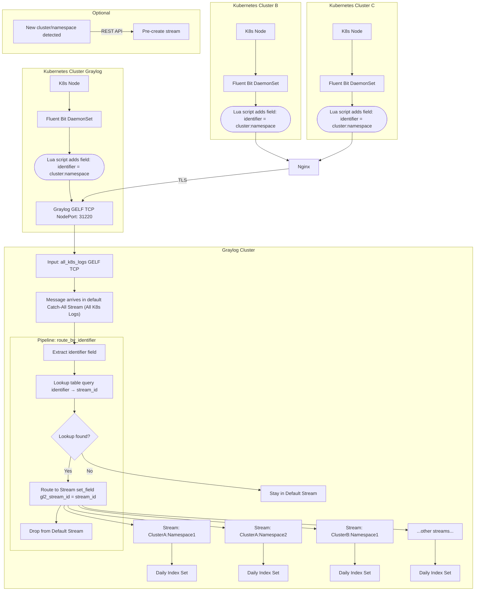

# Logging Plan on Kubernetes clusters
```
 ___   _   _____   _______        ___      _______  _______  _______  ___   __    _  _______ 
|   | | | |  _  | |       |      |   |    |       ||       ||       ||   | |  |  | ||       |
|   |_| | | |_| | |  _____|      |   |    |   _   ||    ___||    ___||   | |   |_| ||    ___|
|      _||   _   || |_____       |   |    |  | |  ||   | __ |   | __ |   | |       ||   | __ 
|     |_ |  | |  ||_____  |      |   |___ |  |_|  ||   ||  ||   ||  ||   | |  _    ||   ||  |
|    _  ||  |_|  | _____| |      |       ||       ||   |_| ||   |_| ||   | | | |   ||   |_| |
|___| |_||_______||_______|      |_______||_______||_______||_______||___| |_|  |__||_______|
```

## Table of Contents

1. [Overview](#overview)  
    - [Mermaid Flowchart](#mermaid-flowchart)  
    - [Flow Explanation](#flow-explanation)  
2. [TL;DR (one-line plan)](#tldr-one-line-plan)  
3. [Why DaemonSet (recommended) vs sidecar per-pod](#why-daemonset-recommended-vs-sidecar-per-pod)  
4. [What to run on the collector](#what-to-run-on-the-collector)  
5. [Step-by-step Hands-on](#step-by-step-hands-on)  
    - [A) Prepare Graylog (first)](#a-prepare-graylog-first)  
        - [Create Input](#create-input)  
        - [Create NodePort Service](#create-nodeport-service)  
    - [B) Deploy Fluent Bit as a DaemonSet (collector)](#b-deploy-fluent-bit-as-a-daemonset-collector)  
      - [What fields to expect in Graylog](#what-fields-to-expect-in-graylog)  
    - [D) Graylog: Streams and Indexing — how to split by cluster, project & day](#d-graylog-streams-and-indexing--how-to-split-by-cluster-project--day)  
        - [Option 1: One stream per namespace per cluster (explicit streams)](#option-1-one-stream-per-namespace-per-cluster-explicit-streams)  
        - [Option 2: Use pipeline rules for automatic streams](#option-2-use-pipeline-rules-for-automatic-streams)  
        - [Automating Stream Creation using REST API](#automating-stream-creation-using-rest-api)  
        - [Index sets & daily separation (per-day indices)](#index-sets--daily-separation-per-day-indices)  
    - [E) Enrichment & routing (pipelines)](#e-enrichment--routing-pipelines)  
    - [F) Optional: Graylog Dashboards / Alerts](#f-optional-graylog-dashboards--alerts)  
6. [Practical checklist](#practical-checklist)  
7. [Notes, pitfalls & suggestions](#notes-pitfalls--suggestions)  
8. [Acknowledgment](#acknowledgment)  
    - [Contributors](#contributors)  
    - [Links](#links)  

---

## Overview



### Flow Explanation

1. **Multiple clusters → Graylog NodePort**

   * Each cluster runs Fluent Bit DaemonSet.
   * Logs are forwarded to **Graylog NodePort** (`31220`) using GELF TCP.
   * Each cluster adds its `cluster` field for identification.

2. **Catch-All Stream**

   * All logs initially land here.

3. **Pipeline**

   * Reads `cluster` + `namespace` fields.
   * Routes logs to the correct **pre-created stream**.

4. **Streams per cluster + namespace**

   * Logical separation for each project/environment.

5. **Daily Index Set**

   * Each stream writes to a **daily rotated index**.

6. **Optional Automation**

   * Automatically creates streams for new cluster/namespace combinations via REST API.

---

## TL;DR (one-line plan)

* Fluent Bit DaemonSets on each cluster forward pod logs (excluding system namespaces) with cluster metadata via GELF TCP NodePort to Graylog, where a catch-all stream and pipeline automatically route logs into per-cluster+namespace streams stored in daily-rotated indices.

---

## Why DaemonSet (recommended) vs sidecar per-pod

* **DaemonSet collector** (one pod per node) reads container logs from the node (e.g., `/var/log/containers/*.log`), enriches them with Kubernetes metadata, and ships them centrally. This is lightweight, simple to manage, and scales automatically with nodes. Most production setups use Fluent Bit/Fluentd as DaemonSets to centralize Kubernetes logs.

* **Sidecar per-pod** forwards only that pod’s logs.
  *Pros:* isolation per application.
  *Cons:* operational overhead (every pod spec must include the sidecar), higher resource usage, complexity when pods are many or short-lived.

  * Use sidecars only for very special per-pod transformations or security/isolation requirements.

---

## What to run on the collector

* **Fluent Bit** (lightweight, ideal for Kubernetes) — has a GELF output plugin to send logs to Graylog.
* **Alternatives:** Fluentd, Filebeat, or Vector — all workable. Graylog accepts GELF/Beats/HTTP. Graylog supports Beats input and GELF HTTP/TCP/UDP inputs.

---

## Step-by-step Hands-on

### A) Prepare Graylog (first)

#### Create Input

1. Go to **System → Inputs → Launch new input**.
2. Select **GELF TCP**.
3. Bind it to port **12201**.
4. Give it a meaningful name (e.g., `k8s-log-input`).
5. Start the input.

* Optionally create a **Beats input** if I plan to use Filebeat/Winlogbeat. Graylog’s Beats input expects the Beats/Logstash protocol (TCP).
* Ensure Graylog is reachable from my source Kubernetes cluster (network, DNS, TLS). For production, enable TLS on the input (use TLS termination or place Graylog behind a TLS load balancer).

#### Create NodePort Service

I want external clusters to send logs to my Graylog GELF input (port 12201).

```yaml
apiVersion: v1
kind: Service
metadata:
  name: graylog-gelf
  namespace: graylog
spec:
  type: NodePort
  selector:
    app: graylog
  ports:
    - protocol: TCP
      port: 12201      # GELF TCP port inside Graylog
      targetPort: 12201
      nodePort: 31220  # NodePort I expose externally
```

* `port` = port inside the pod.
* `targetPort` = port Graylog input is listening on.
* `nodePort` = external port on all cluster nodes.

> I can now send logs from other clusters to `http://<any-node-ip>:31220`.

---

### B) Deploy Fluent Bit as a DaemonSet (collector)
* A **full production-ready Fluent Bit DaemonSet** for Kubernetes, specifically tuned:

  * Collects pod logs from `/var/log/containers/*.log`.
  * Enriches logs with Kubernetes metadata (cluster name, namespace, pod, container, labels).
  * Forwards logs to Graylog via GELF TCP.
  * Includes RBAC, ServiceAccount, ConfigMap, DaemonSet, and TLS placeholders.

1. Service Account + RBAC.
2. ConfigMap (Main Fluent Bit Config + Parsers)

   * Update the `Host` value inside `[OUTPUT]` to my Graylog hostname or IP.
3. DaemonSet (main Fluent Bit pod).
4. (Optional) TLS secret example — only if using TLS for GELF input.

##### What This Setup Achieves

* ✔ Collects logs from all pods on every node.
* ✔ Enriches logs with Kubernetes metadata (namespace, pod, container, labels).
* ✔ Sends logs to Graylog using GELF format.
* ✔ Fully production-ready: RBAC, TLS placeholder, resource limits, state DB, skip long lines, etc.


####  What fields to expect in Graylog
* `cluster name`
* `kubernetes.namespace_name`
* `kubernetes.pod_name`
* `kubernetes.container_name`
* `kubernetes.labels.app`
* `kubernetes.docker_id`
* `stream (stdout/stderr)`
* `log`
* `timestamp`

---

### D) Graylog: Streams and Indexing — how to split by cluster, project & day


HERE


#### 1) Use Streams to separate projects (cluster + namespaces)

##### Option 1: One stream per namespace per cluster (explicit streams)

1. Go to **Streams → Create Stream**.
2. Name: `cluster-A | payments` (or whichever cluster+namespace).
  - [x] Remove matches from ‘Default Stream’. Don't assign messages that match this stream to the ‘Default Stream’.
3. Stream rules:
   * Field: `dividing_name` → match exactly → `CLUSTERNAME:NAMESPACE`
4. Start stream.

* Repeat for each namespace and cluster I care about.

##### Option 2: Use pipeline rules for automatic Graylog streams

* Since I have many clusters and namespaces, manually creating streams is impractical.
* Use a Graylog pipeline that:

  1. Reads `cluster` and `kubernetes.namespace_name` fields.
  2. Routes logs to a stream dynamically based on `cluster|namespace`.
  3. Falls back to a catch-all stream if needed.

```
Fluent Bit --> Graylog catch-all stream --> pipeline routes to pre-created stream --> daily index
```

##### Create a pipeline

1. Go to **System → Pipelines → Create Pipeline**.
2. Create a rule with the snippet below.
3. Connect pipeline to the catch-all stream.
4. Start pipeline processing.

> Important: I need pre-created streams with names matching `cluster:namespace`.

Name: assigning_pipeline 
Description: assign each stream its logs based on dividing_name field of logs
```
rule "assign_dividing_name_stream"
when
    has_field("dividing_name")
then
    // Get the value of dividing_name
    let target_stream = to_string($message.dividing_name);

    // Check if the stream exists
    let streams = list_streams();
    let stream_exists = false;

    foreach(stream in streams) {
        if (stream.title == target_stream) {
            stream_exists = true;
        }
    }

    // If stream exists, assign the message
    if (stream_exists) {
        route_to_stream(target_stream);
        remove_from_default_stream();
    }
end
```

##### (Optional): Automating Stream Creation using REST API

```bash
curl -u admin:password -X POST "http://GRAYLOG_HOST:9000/api/streams" \
-H "Content-Type: application/json" \
-d '{
  "title": "cluster_prod_34:kube-system",
  "description": "Stream for cluster_prod_34:kube-system",
  "rules": [
    {
      "field": "dividing_name",
      "type": 1,
      "value": "cluster_prod_34:kube-system",
      "inverted": false
    }
  ],
  "index_set_id": "YOUR_INDEX_SET_ID",
  "remove_matches_from_default_stream": true
}'
```

* Replace `cluster-A` and `payments` dynamically in a script.
* Can be automated via a cronjob or CI pipeline.

##### Design decision

* For a small/stable number of namespaces (projects), I can create one stream per namespace (each stream can have its own index set if I want different retention).
* For many dynamic namespaces, I can create streams for important projects and use tags/fields for others. Pipelines + lookup tables can map namespaces to higher-level project buckets.

---

##### 2) Index sets & daily separation (per-day indices)

* Graylog stores messages in index sets. Each index set has a rotation strategy (time-based, size-based, or the new data-tiering optimizing strategy).
* Configure rotation to **daily** (`P1D`) so new indices are created per day.
* Retention policy deletes old indices after my desired window.

1. Go to **System → Indices → Create index set**.
2. Name it `k8s-logs-daily`.
3. Rotation strategy: **Index Time**.
4. Rotation period: `P1D` (daily).
5. Retention: delete after N indices/days (e.g., keep 30).
6. Assign streams to this index set.

> I can attach multiple streams to the same index set if retention is identical.

---

### E) Enrichment & routing (pipelines)

* Use pipeline rules to normalize fields (e.g., rename `_kubernetes_namespace_name` to `namespace`) or `route_to_stream("project-foo")` by logic.
* Graylog recommends pipelines for richer transformations and will deprecate some stream rule patterns in the future.

```text
rule "route_by_namespace"
when
  has_field("kubernetes") && to_string($message.kubernetes.namespace_name) == "payments"
then
  route_to_stream("Payments Stream ID");
end
```

---

### F) Optional: Graylog Dashboards / Alerts

* Use `cluster` + `namespace` fields as filters.
* Build dashboards per project.
* Alert per project or cluster if needed.

---

## Practical checklist

1. On each Kubernetes cluster:

   * Deploy Fluent Bit DaemonSet.
   * ConfigMap includes:

     * Kubernetes metadata filter.
     * `grep` filter for system namespaces.
     * `modify` filter to add `cluster` field.
     * GELF output to Graylog.

2. On Graylog:

   * Create GELF TCP input.
   * Create streams for cluster+namespace combinations (or pipeline dynamic routing).
   * Configure index set(s) with daily rotation and retention.

3. Verify flow:

   * Send test pod logs.
   * Check Graylog’s “All messages.”
   * Confirm fields: `cluster`, `kubernetes.namespace_name`, `message`, `timestamp`.
   * Confirm logs appear in the correct stream and index.

---

## Notes, pitfalls & suggestions

* Field names matter. Different collectors may send slightly different field names (`kubernetes.namespace_name`, `kube_namespace`, `_kubernetes_namespace_name`). Inspect incoming messages before building stream rules.
* Volume & index count. If I create one index set per namespace and have many namespaces, I’ll create many indices — this can stress Elasticsearch/OpenSearch. Prefer grouping low-importance namespaces into shared index sets with a common retention policy.
* Performance / TLS. For production, use TCP+TLS + authentication and monitor Graylog/ES cluster health.
* Testing tip: start by sending a few test logs via curl to my GELF HTTP input (Graylog docs show examples) to confirm input configuration before deploying the DaemonSet.

---

## TODO
- Add Nginx + Cert
- Change dividing_name to identifier
- inside fluenbit: remove unnecassary fields
- inside fluenbit: remove kube system logs
- policy for indexes
- naming of clusters for identifier

## Acknowledgment

### Contributors

* APA 🖖🏻

### Links
- [go2docs.graylog.org](go2docs.graylog.org)


```
  aaaaaaaaaaaaa  ppppp   ppppppppp     aaaaaaaaaaaaa   
  a::::::::::::a p::::ppp:::::::::p    a::::::::::::a  
  aaaaaaaaa:::::ap:::::::::::::::::p   aaaaaaaaa:::::a 
           a::::app::::::ppppp::::::p           a::::a 
    aaaaaaa:::::a p:::::p     p:::::p    aaaaaaa:::::a 
  aa::::::::::::a p:::::p     p:::::p  aa::::::::::::a 
 a::::aaaa::::::a p:::::p     p:::::p a::::aaaa::::::a 
a::::a    a:::::a p:::::p    p::::::pa::::a    a:::::a 
a::::a    a:::::a p:::::ppppp:::::::pa::::a    a:::::a 
a:::::aaaa::::::a p::::::::::::::::p a:::::aaaa::::::a 
 a::::::::::aa:::ap::::::::::::::pp   a::::::::::aa:::a
  aaaaaaaaaa  aaaap::::::pppppppp      aaaaaaaaaa  aaaa
                  p:::::p                              
                  p:::::p                              
                 p:::::::p                             
                 p:::::::p                             
                 p:::::::p                             
                 ppppppppp                                                        
```