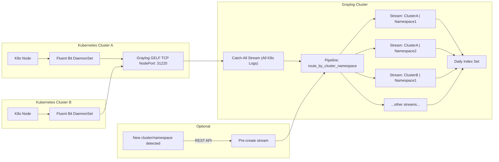

# Logging Plan on Kubernetes clusters
```
 ___   _   _____   _______        ___      _______  _______  _______  ___   __    _  _______ 
|   | | | |  _  | |       |      |   |    |       ||       ||       ||   | |  |  | ||       |
|   |_| | | |_| | |  _____|      |   |    |   _   ||    ___||    ___||   | |   |_| ||    ___|
|      _||   _   || |_____       |   |    |  | |  ||   | __ |   | __ |   | |       ||   | __ 
|     |_ |  | |  ||_____  |      |   |___ |  |_|  ||   ||  ||   ||  ||   | |  _    ||   ||  |
|    _  ||  |_|  | _____| |      |       ||       ||   |_| ||   |_| ||   | | | |   ||   |_| |
|___| |_||_______||_______|      |_______||_______||_______||_______||___| |_|  |__||_______|
```
## Table of contents


## Overview


1. **Multiple clusters → Graylog NodePort**
   * Each cluster runs Fluent Bit DaemonSet
   * Logs forwarded to **Graylog NodePort** (`31220`) using GELF TCP
   * Each cluster adds its `cluster` field for identification

2. **Catch-All Stream**
   * All logs initially land here

3. **Pipeline**
   * Reads `cluster` + `namespace` fields
   * Routes logs to the correct **pre-created stream**

4. **Streams per cluster + namespace**
   * Logical separation for each project / environment

5. **Daily Index Set**
   * Each stream writes to a **daily rotated index**

6. **Optional Automation**
   * Automatically create streams for new cluster+namespace combinations via REST API


## TL;DR (one-line plan)
- Fluent Bit DaemonSets on each cluster forward pod logs (excluding system namespaces) with cluster metadata via GELF TCP NodePort to Graylog, where a catch-all stream and pipeline automatically route logs into per-cluster+namespace streams stored in daily-rotated indices.

### Why DaemonSet (recommended) vs sidecar per-pod

- DaemonSet collector (one pod per node) reads container logs from the node (e.g. /var/log/containers/*.log), enriches them with k8s metadata and ships them centrally. This is lightweight, simpler to manage, and scales automatically with nodes. Many production setups use Fluent Bit/Fluentd as DaemonSets to centralize K8s logs. 

- Sidecar per-pod forwards only that pod’s logs. Pros: isolation per-app; cons: huge operational overhead (every pod spec must include the sidecar), higher resource usage, complexity when pods are many/short-lived. Use sidecars only for very special per-pod transformations or security/isolation requirements.

### What to run on the collector
- Fluent Bit (lightweight, great for k8s) — it has a GELF output plugin to send to Graylog. 

- Alternatives: Fluentd, Filebeat, or Vector — all workable; Graylog accepts GELF/Beats/HTTP. Graylog supports Beats input and GELF HTTP/TCP/UDP inputs. 

## Step-by-step Hands-on
### A) Prepare Graylog (first)
#### Craete Input
1. Go to System → Inputs → Launch new input
2. Select GELF TCP
3. Bind it to port 12201
4. Give it a meaningful name (e.g., k8s-log-input)
5. Start the input

- Optionally create a Beats input if you plan to use Filebeat/Winlogbeat. Graylog’s Beats input expects Beats/Logstash protocol (TCP). 

- Ensure Graylog is reachable from your source Kubernetes cluster (network, DNS, TLS). If production, enable TLS on the input (use TLS termination or put Graylog behind a TLS LB).

#### Craete NodePort Service
- You want external clusters to send logs to your Graylog GELF input (port 12201).
```
apiVersion: v1
kind: Service
metadata:
  name: graylog-gelf
  namespace: graylog
spec:
  type: NodePort
  selector:
    app: graylog
  ports:
    - protocol: TCP
      port: 12201      # GELF TCP port inside Graylog
      targetPort: 12201
      nodePort: 31220  # NodePort you expose externally
```
- `port` = port inside the pod
- `targetPort` = port Graylog input is listening on
- `nodePort` = external port on all cluster nodes

> You can now send logs from other clusters to http://<any-node-ip>:31220

### B) Deploy Fluent Bit as a DaemonSet (collector)
#### Production-Ready
- **a full production-ready Fluent Bit DaemonSet** for Kubernetes, specifically tuned
    - Collect pod logs from /var/log/containers/*.log
    - Enrich logs with Kubernetes metadata (its cluster name, namespace, pod, container, labels)
    - Forward logs to Graylog via GELF TCP
    - Includes RBAC, ServiceAccount, ConfigMap, DaemonSet, and TLS placeholders
    
1. Service Account + RBAC
2. ConfigMap (Main Fluent Bit Config + Parsers)
    - Update the `Host` value inside `[OUTPUT]` to your Graylog hostname or IP.
3. DaemonSet (main Fluent Bit pod)
4. (Optional) TLS secret example. Only if using TLS for GELF input:

##### What This Setup Achieves
- ✔ Collects logs from all pods on every node: (via DaemonSet + hostPath to /var/log/containers)

- ✔ Enriches logs with Kubernetes metadata: (namespace, pod, container, labels)

- ✔ Sends logs to Graylog using GELF: (the native format Graylog loves)

- ✔ Fully production-ready: RBAC, TLS placeholder, resource limits, state DB, skip long lines, etc.

#####  Your logs will now arrive in Graylog like this:
Fields you can filter/stream on:
- `cluster name`
- `kubernetes.namespace_name`
- `kubernetes.pod_name`
- `kubernetes.container_name`
- `kubernetes.labels.app`
- `kubernetes.docker_id`
- `stream (stdout/stderr)`
- `log`
- `timestamp`

This is perfect for creating Streams per project (namespace) and daily index rotation.

#### Minimal
- a minimal example (ConfigMap + DaemonSet). You’ll adapt image versions, resources, securityContext, and TLS to your environment.

1. ConfigMap (fluent-bit config) — key ideas:
- Tail container logs (/var/log/containers/*.log)
- Add Kubernetes metadata (kubernetes filter)
- Output using the gelf plugin to Graylog host:port

2. DaemonSet (mount container logs + config) — simplified:

- Apply
```
kubectl apply -f fluent-bit-configmap.yaml
kubectl apply -f fluent-bit-daemonset.yaml
```

- Notes: The kubernetes filter will attach kubernetes.namespace_name, kubernetes.pod_name, kubernetes.labels, etc, to each record. Use those fields in Graylog streams.

### C) What fields to expect in Graylog
- When Fluent Bit/Fluentd sends GELF, it typically includes fields like:

- `message` (the log line)
- `timestamp` (event time)
- `_kubernetes_namespace_name` or `kubernetes['namespace_name']` — how fields are named depends on the collector; commonly you get kubernetes.namespace_name or kube_namespace. Check a sample message in Graylog’s “All messages” to see field names. Use those exact field names when creating stream rules.


### D) Graylog: Streams and Indexing — how to split by cluster, project & day
#### 1) Use Streams to separate projects (cluster +namespaces)
##### Option 1: One stream per namespace per cluster (explicit streams)
1. Go to Streams → Create Stream
2. Name: `cluster-A | payments` (or whatever cluster+namespace)
3. Stream rules:
    - Field: `cluster` → match exactly → `cluster-A`
    - Field: `kubernetes.namespace_name` → match exactly → `payments`
4. Start stream

- Repeat for each namespace and cluster you care about.


##### Option 2: Use pipeline rules for Automatic Graylog streams for cluster + namespace
- Since you have many clusters and namespaces, manually creating streams for each is not practical.
- We can solve this with a Graylog pipeline that:
    1. Reads cluster and kubernetes.namespace_name fields.
    2. Creates (or routes to) a stream dynamically based on cluster|namespace.
    3. Optionally falls back to a catch-all stream if needed.

- Flow
```
Fluent Bit --> Graylog catch-all stream --> pipeline routes to pre-created stream --> daily index
```

Create a pipeline:
1. Extract `cluster` and `namespace`
2. Build stream name dynamically
3. Route to that stream

Example pipeline snippet:
```
rule "route_by_cluster_namespace"
when
  has_field("cluster") && has_field("kubernetes")
then
  let cluster_name = to_string($message.cluster);
  let ns = to_string($message.kubernetes.namespace_name);
  route_to_stream(concat(cluster_name,"|",ns));
end
```
> This requires you to pre-create streams with names like cluster-A|payments or use a single “catch-all” stream and use cluster+namespace fields for filtering.


##### Design decision:
- If you have a small and stable number of namespaces (projects), create one stream per namespace (each stream can be attached to its own index set if you want different retention).

- If you have many dynamic namespaces, create streams for the important projects and use tags/fields for others; you can also use pipelines + lookup tables to map namespaces to higher-level project buckets.

##### 2) Index sets & daily separation (per-day indices)
- Graylog stores messages into index sets. Each index set has a rotation strategy (time-based, size-based, or the new data-tiering optimizing strategy). You can configure rotation to rotate every day (ISO8601 P1D) so new indices are created per day. That achieves your “divide logs by day” requirement. Then retention policy deletes old indices after your retention window. 

1. Go to System → Indices → Create index set
2. Name it k8s-logs-daily
3. Rotation strategy: Index Time
4. Rotation period: P1D (daily)
5. Retention: delete after N indices/days (example: keep 30 daily indices)
6. Assign Streams to this index set
7. This ensures logs are split per day, per cluster/namespace stream
> You can also attach multiple streams to the same index set if retention is identical.

### E) Enrichment & routing (pipelines)
- Use pipeline rules to normalize fields (e.g., rename `_kubernetes_namespace_name` to `namespace`) or to `route_to_stream("project-foo")` by logic. Graylog docs recommend pipelines for richer transformations (and will deprecate some stream rule patterns in future). Use pipelines for complex routing/enrichment. 

- Example pipeline snippet to route on `kubernetes.namespace_name`:
```
rule "route_by_namespace"
when
  has_field("kubernetes") && to_string($message.kubernetes.namespace_name) == "payments"
then
  route_to_stream("Payments Stream ID");
end
```

### F) Optional: Graylog Dashboards / Alerts
- Use `cluster` + `namespace` fields as filters
- Build dashboards per project
- Alert per project or cluster if needed

## Practical checklist
1. On each Kubernetes cluster:
    - Deploy Fluent Bit DaemonSet
    - ConfigMap includes:
        - Kubernetes metadata filter
        - `grep` filter for system namespaces
        - `modify` filter to add `cluster` field
        - GELF output to Graylog

2. On Graylog:
    - Create GELF TCP input
    - Create streams for cluster+namespace combinations (or pipeline dynamic routing)
    - Configure index set(s) with daily rotation and retention

3. Verify flow:
    - Send test pod logs
    - Check Graylog’s “All messages”
    - Confirm fields: `cluster`, `kubernetes.namespace_name`, `message`, `timestamp`
    - Confirm logs appear in the right stream and index


## Notes, pitfalls & suggestions
- Field names matter. Different collectors may send slightly different field names (kubernetes.namespace_name, kube_namespace, _kubernetes_namespace_name). Inspect incoming messages before building stream rules. 
Stackademic
- Volume & indices count. If you create one index set per namespace and you have many namespaces, you’ll create many indices — that can stress Elasticsearch/OpenSearch. Prefer grouping low-importance namespaces into shared index sets with a common retention policy. 
- Performance / TLS. For production, use TCP+TLS + authentication and monitor Graylog/ES cluster health.
- Testing tip: start by sending a few test logs via curl to your GELF HTTP input (Graylog docs show examples) to confirm input configuration before deploying the DaemonSet. 
go2docs.graylog.org

# acknowledgment
## Contributors
- APA 🖖🏻

## Links

```
  aaaaaaaaaaaaa  ppppp   ppppppppp     aaaaaaaaaaaaa   
  a::::::::::::a p::::ppp:::::::::p    a::::::::::::a  
  aaaaaaaaa:::::ap:::::::::::::::::p   aaaaaaaaa:::::a 
           a::::app::::::ppppp::::::p           a::::a 
    aaaaaaa:::::a p:::::p     p:::::p    aaaaaaa:::::a 
  aa::::::::::::a p:::::p     p:::::p  aa::::::::::::a 
 a::::aaaa::::::a p:::::p     p:::::p a::::aaaa::::::a 
a::::a    a:::::a p:::::p    p::::::pa::::a    a:::::a 
a::::a    a:::::a p:::::ppppp:::::::pa::::a    a:::::a 
a:::::aaaa::::::a p::::::::::::::::p a:::::aaaa::::::a 
 a::::::::::aa:::ap::::::::::::::pp   a::::::::::aa:::a
  aaaaaaaaaa  aaaap::::::pppppppp      aaaaaaaaaa  aaaa
                  p:::::p                              
                  p:::::p                              
                 p:::::::p                             
                 p:::::::p                             
                 p:::::::p                             
                 ppppppppp                                                        
```