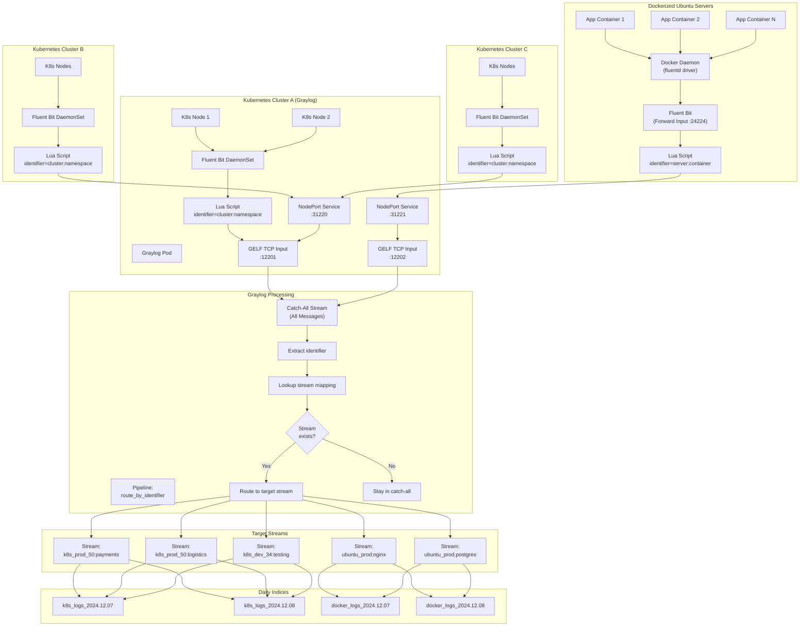

# Centralized Logging with Fluent Bit + Graylog

> **Unified logging solution for Kubernetes clusters and Dockerized servers**

```
 ___      _______  _______  _______  ___   __    _  _______ 
|   |    |       ||       ||       ||   | |  |  | ||       |
|   |    |   _   ||    ___||    ___||   | |   |_| ||    ___|
|   |    |  | |  ||   | __ |   | __ |   | |       ||   | __ 
|   |___ |  |_|  ||   ||  ||   ||  ||   | |  _    ||   ||  |
|       ||       ||   |_| ||   |_| ||   | | | |   ||   |_| |
|_______||_______||_______||_______||___| |_|  |__||_______|
```

## Table of Contents

1. [Overview](#overview)
   - [Architecture Diagram](#architecture-diagram)
   - [Flow Explanation](#flow-explanation)
2. [TL;DR](#tldr)
3. [Key Features](#key-features)
4. [Prerequisites](#prerequisites)
5. [Architecture Comparison](#architecture-comparison)
6. [Setup Guide](#setup-guide)
   - [Step 1: Prepare Graylog](#step-1-prepare-graylog)
   - [Step 2: Deploy on Kubernetes Clusters](#step-2-deploy-on-kubernetes-clusters)
   - [Step 3: Deploy on Dockerized Servers](#step-3-deploy-on-dockerized-servers)
7. [Graylog Configuration](#graylog-configuration)
   - [Streams and Routing](#streams-and-routing)
   - [Index Sets and Daily Rotation](#index-sets-and-daily-rotation)
   - [Pipeline Rules](#pipeline-rules)
8. [Field Reference](#field-reference)
9. [Verification and Testing](#verification-and-testing)
10. [Troubleshooting](#troubleshooting)
11. [Notes and Best Practices](#notes-and-best-practices)
12. [TODO](#todo)
13. [Contributors](#contributors)

---

## Overview

This logging solution centralizes logs from multiple sources into a single Graylog cluster:
- **Kubernetes clusters** (multiple clusters supported)
- **Dockerized Ubuntu servers** (bare-metal or VM-based)

All logs are enriched with metadata, routed to dedicated streams, and stored in daily-rotated indices for efficient querying and retention management.

### Architecture Diagram



### Flow Explanation

#### Kubernetes Clusters
1. **Fluent Bit DaemonSet** runs on every node, tailing `/var/log/containers/*.log`
2. **Kubernetes filter** enriches logs with pod, namespace, container metadata
3. **Lua script** adds `identifier` field: `<cluster_name>:<namespace>`
4. **GELF output** sends to Graylog NodePort (31220) via TCP
5. Logs arrive in **catch-all stream** → **pipeline routes** to target stream → stored in **daily indices**

#### Dockerized Servers
1. **Application containers** use Docker's `fluentd` logging driver
2. **Docker Daemon** forwards logs to Fluent Bit on `localhost:24224`
3. **Fluent Bit** receives via Forward input, runs **Lua script** to add `identifier`: `<server_name>:<container_name>`
4. **GELF output** sends to Graylog NodePort (31221) via TCP
5. Logs arrive in **catch-all stream** → **pipeline routes** to target stream → stored in **daily indices**

---

## TL;DR

**Kubernetes:** Fluent Bit DaemonSets on each cluster forward pod logs (excluding system namespaces) with cluster metadata via GELF TCP to Graylog, where a catch-all stream and pipeline automatically route logs into per-cluster+namespace streams stored in daily-rotated indices.

**Docker:** Fluent Bit runs as a standalone container on each server, receives logs from Docker containers via the fluentd logging driver, enriches with server+container metadata, and forwards to Graylog via GELF TCP for automated routing and daily-rotated storage.

---

## Key Features

- ✅ **Multi-cluster support** - Centralize logs from unlimited Kubernetes clusters
- ✅ **Docker integration** - Collect logs from Dockerized applications on bare-metal/VMs
- ✅ **Automatic enrichment** - Metadata injection (cluster, namespace, pod, container, server)
- ✅ **Smart routing** - Pipeline-based stream routing using `identifier` field
- ✅ **Daily rotation** - Index sets with daily rotation and configurable retention
- ✅ **Namespace filtering** - Exclude system namespaces (kube-system, metallb, etc.)
- ✅ **Production-ready** - RBAC, resource limits, state persistence, TLS placeholders
- ✅ **Unified schema** - Consistent `identifier` field across all log sources

---

## Prerequisites

### Graylog Cluster
- Graylog 5.x+ running on Kubernetes
- Two GELF TCP inputs configured (ports 12201, 12202)
- Two NodePort services exposing inputs externally (31220, 31221)
- Network connectivity from all log sources to Graylog cluster

### Kubernetes Clusters
- Kubernetes 1.20+
- `kubectl` access with cluster-admin permissions
- Node access to Graylog NodePort (10.10.21.151:31220)

### Dockerized Servers
- Ubuntu 20.04+ (or any Linux with Docker)
- Docker 20.10+ with Docker Compose
- Network access to Graylog NodePort (10.10.21.151:31221)

---

## Architecture Comparison

| Aspect | Kubernetes | Dockerized Servers |
|--------|-----------|-------------------|
| **Collector** | Fluent Bit DaemonSet (1 pod per node) | Fluent Bit standalone container |
| **Input Method** | Tail `/var/log/containers/*.log` | Docker fluentd driver → Forward input (:24224) |
| **Metadata** | Pod, namespace, container, labels, cluster | Server name, container name |
| **Identifier Format** | `k8s_prod_50:namespace` | `ubuntu_prod:container_name` |
| **Graylog Input** | GELF TCP :12201 (NodePort 31220) | GELF TCP :12202 (NodePort 31221) |
| **Deployment** | Apply YAML manifests (SA, RBAC, CM, DS) | `docker-compose up -d` |
| **Filtering** | Grep filter excludes system namespaces | N/A (all containers logged) |

---

## Setup Guide

### Step 1: Prepare Graylog

#### Create GELF Inputs

1. Navigate to **System → Inputs → Launch new input**
2. Create **first input** for Kubernetes:
   - Type: **GELF TCP**
   - Port: **12201**
   - Title: `k8s-logs-input`
   - Start the input

3. Create **second input** for Docker:
   - Type: **GELF TCP**
   - Port: **12202**
   - Title: `docker-logs-input`
   - Start the input

#### Deploy NodePort Services

Apply both NodePort services on the Graylog cluster:

**File: `graylog-nodeport-svc.yaml`**
```yaml
apiVersion: v1
kind: Service
metadata:
  name: graylog-gelf-k8s-input
  namespace: graylog
spec:
  type: NodePort
  selector:
    app.kubernetes.io/name: graylog
  ports:
    - protocol: TCP
      port: 12201
      targetPort: 12201
      nodePort: 31220
```

**File: `graylog-nodeport-svc-2.yaml`**
```yaml
apiVersion: v1
kind: Service
metadata:
  name: graylog-gelf-docker-input
  namespace: graylog
spec:
  type: NodePort
  selector:
    app.kubernetes.io/name: graylog
  ports:
    - protocol: TCP
      port: 12202
      targetPort: 12202
      nodePort: 31221
```

**Apply:**
```bash
kubectl apply -f graylog-nodeport-svc.yaml
kubectl apply -f graylog-nodeport-svc-2.yaml
```

**Verify:**
```bash
kubectl get svc -n graylog | grep gelf
```

---

### Step 2: Deploy on Kubernetes Clusters

Deploy Fluent Bit on **each Kubernetes cluster** you want to collect logs from.

#### File Structure
```
on-other-clusters/
├── fluent-bit-SA-RBAC.yaml
├── fluent-bit-CM.yaml
├── lua-script-CM.yaml
├── fluent-bit-DS.yaml
└── fluent-bit-TLS-Secret.yaml (optional)
```

#### 2.1 Deploy ServiceAccount and RBAC

**File: `fluent-bit-SA-RBAC.yaml`**
```yaml
apiVersion: v1
kind: ServiceAccount
metadata:
  name: fluent-bit
  namespace: kube-system
---
apiVersion: rbac.authorization.k8s.io/v1
kind: ClusterRole
metadata:
  name: fluent-bit
rules:
- apiGroups: [""]
  resources:
  - pods
  - namespaces
  - nodes
  verbs:
  - get
  - list
  - watch
---
apiVersion: rbac.authorization.k8s.io/v1
kind: ClusterRoleBinding
metadata:
  name: fluent-bit
roleRef:
  apiGroup: rbac.authorization.k8s.io
  kind: ClusterRole
  name: fluent-bit
subjects:
- kind: ServiceAccount
  name: fluent-bit
  namespace: kube-system
```

#### 2.2 Deploy Lua Script ConfigMap

**File: `lua-script-CM.yaml`**
```yaml
apiVersion: v1
kind: ConfigMap
metadata:
  name: fluent-bit-lua-scripts
  namespace: kube-system
  labels:
    app.kubernetes.io/name: fluent-bit
data:
  combine_fields.lua: |
    function add_identifier(tag, timestamp, record)
        -- Safely get namespace, fall back to "unknown" if kubernetes filter failed
        local k8s = record["kubernetes"]
        local ns = "unknown"
        if k8s and k8s["namespace_name"] then
            ns = k8s["namespace_name"]
        elseif record["kubernetes.namespace_name"] then
            ns = record["kubernetes.namespace_name"]
        end

        record["identifier"] = "k8s_prod_50:" .. ns
        return 1, timestamp, record
    end
```

> **Important:** Change `k8s_prod_50` to match your cluster name!

#### 2.3 Deploy Fluent Bit ConfigMap

**File: `fluent-bit-CM.yaml`**
```yaml
apiVersion: v1
kind: ConfigMap
metadata:
  name: fluent-bit-config
  namespace: kube-system
data:
  fluent-bit.conf: |
    [SERVICE]
        Flush         5
        Log_Level     info
        Parsers_File  parsers.conf

    @INCLUDE input-containers.conf
    @INCLUDE filters.conf
    @INCLUDE output-gelf.conf

  input-containers.conf: |
    [INPUT]
        Name              tail
        Path              /var/log/containers/*.log
        Tag               kube.<namespace_name>_<pod_name>_<container_name>
        Tag_Regex         (?<pod_name>[^_]+)_(?<namespace_name>[^_]+)_(?<container_name>.+)-(?<docker_id>[a-z0-9]{64})\.log$
        Parser            docker
        DB                /var/fluent-bit/state/tail-containers.db
        Mem_Buf_Limit     50MB
        Skip_Long_Lines   On
        Refresh_Interval  10
        Rotate_Wait       30

  filters.conf: |
    [FILTER]
        Name   grep
        Match  kube.*
        Exclude $kubernetes['namespace_name'] ^(metallb-system|argocd|kube-system|rook-ceph)$

    [FILTER]
        Name               kubernetes
        Match              kube.*
        Kube_URL           https://kubernetes.default.svc:443
        Kube_CA_File       /var/run/secrets/kubernetes.io/serviceaccount/ca.crt
        Kube_Token_File    /var/run/secrets/kubernetes.io/serviceaccount/token
        Merge_Log          On
        Keep_Log           On
        K8S-Logging.Parser On
        Labels             On
        Annotations        On
        Kube_Tag_Prefix    kube.
        Regex_Parser       kube-custom-tag-parser

    [FILTER]
        Name  modify
        Match *
        Add   cluster_name cluster_prod_50

    [FILTER]
        Name   lua
        Match  kube.*
        script /fluent-bit/scripts/combine_fields.lua
        call   add_identifier

  output-gelf.conf: |
    [OUTPUT]
        Name   gelf
        Match  *
        Host   10.10.21.151
        Port   31220
        Mode   tcp
        Gelf_Short_Message_Key log

  parsers.conf: |
    [PARSER]
        Name         docker
        Format       json
        Time_Key     time
        Time_Format  %Y-%m-%dT%H:%M:%S.%L%z
        Time_Keep    On

    [PARSER]
        Name         kube-custom-tag-parser
        Format       regex
        Regex        ^(?<namespace_name>[^_]+)_(?<pod_name>[^_]+)_(?<container_name>.+)$
```

> **Important:** Update these values:
> - `Host` in OUTPUT section → your Graylog IP
> - `cluster_name` in modify filter → your cluster name
> - Grep filter namespaces → add/remove as needed

#### 2.4 Deploy Fluent Bit DaemonSet

**File: `fluent-bit-DS.yaml`**
```yaml
apiVersion: apps/v1
kind: DaemonSet
metadata:
  name: fluent-bit
  namespace: kube-system
  labels:
    k8s-app: fluent-bit
spec:
  selector:
    matchLabels:
      k8s-app: fluent-bit
  template:
    metadata:
      labels:
        k8s-app: fluent-bit
    spec:
      serviceAccountName: fluent-bit
      tolerations:
      - operator: Exists
      containers:
      - name: fluent-bit
        image: fluent/fluent-bit:3.2.10
        resources:
          limits:
            memory: 200Mi
          requests:
            cpu: 50m
            memory: 100Mi
        volumeMounts:
        - name: varlog
          mountPath: /var/log
        - name: config
          mountPath: /fluent-bit/etc/
        - name: fluentbit-storage
          mountPath: /var/fluent-bit/storage
        - name: lua-scripts
          mountPath: /fluent-bit/scripts/
        - name: docker-logs
          mountPath: /var/lib/docker/containers
          readOnly: true
        - name: fluentbit-state
          mountPath: /var/fluent-bit/state

      volumes:
      - name: varlog
        hostPath:
          path: /var/log
      - name: config
        configMap:
          name: fluent-bit-config
      - name: fluentbit-storage
        hostPath:
          path: /var/lib/fluent-bit
          type: DirectoryOrCreate
      - name: lua-scripts
        configMap:
          name: fluent-bit-lua-scripts
          items:
            - key: combine_fields.lua
              path: combine_fields.lua
      - name: docker-logs
        hostPath:
          path: /var/lib/docker/containers
          type: Directory
      - name: fluentbit-state
        hostPath:
          path: /var/lib/fluent-bit/state
          type: DirectoryOrCreate
```

#### Deploy to Cluster

```bash
# Deploy in order
kubectl apply -f fluent-bit-SA-RBAC.yaml
kubectl apply -f lua-script-CM.yaml
kubectl apply -f fluent-bit-CM.yaml
kubectl apply -f fluent-bit-DS.yaml

# Verify deployment
kubectl get ds fluent-bit -n kube-system
kubectl get pods -n kube-system -l k8s-app=fluent-bit
kubectl logs -n kube-system -l k8s-app=fluent-bit --tail=50
```

#### Update for New Clusters

To update the `identifier` for a new cluster:

1. Edit `lua-script-CM.yaml` and change `k8s_prod_50` to your cluster name
2. Edit `fluent-bit-CM.yaml` and change `cluster_name` value
3. Apply and restart:

```bash
kubectl apply -f lua-script-CM.yaml
kubectl apply -f fluent-bit-CM.yaml
kubectl rollout restart ds/fluent-bit -n kube-system
```

---

### Step 3: Deploy on Dockerized Servers

Deploy Fluent Bit as a standalone container on each Ubuntu/Linux server running Docker applications.

#### File Structure
```
on-dockerized-vms/
├── docker-compose.yaml
├── fluent-bit.conf
└── functions.lua
```

#### 3.1 Create Directory Structure

```bash
# Create directory on your server
sudo mkdir -p /opt/fluent-bit
cd /opt/fluent-bit
```

#### 3.2 Create Fluent Bit Configuration

**File: `/opt/fluent-bit/fluent-bit.conf`**
```ini
[SERVICE]
    Flush        1
    Log_Level    info
    Parsers_File parsers.conf

[INPUT]
    Name   forward
    Listen 0.0.0.0
    Port   24224

[FILTER]
    Name    lua
    Match   *
    script  functions.lua
    call    add_identifier

[OUTPUT]
    Name                    gelf
    Match                   *
    Host                    10.10.21.151
    Port                    31221
    Mode                    tcp
    Gelf_Short_Message_Key  log
```

> **Important:** Update `Host` to your Graylog IP and confirm `Port` is 31221 (Docker input)

#### 3.3 Create Lua Script

**File: `/opt/fluent-bit/functions.lua`**
```lua
function add_identifier(tag, timestamp, record)
    -- Expecting tag format: docker.container_name
    -- We split the tag to get the container name
    local container_name = "unknown"
    
    -- The tag comes in as "docker.my-app". We want "my-app"
    local p1, p2 = tag:match("([^.]+).([^.]+)")
    if p2 then
        container_name = p2
    end

    -- Create the custom field: "ubuntu_server_01:container_name"
    -- Change "ubuntu_prod" to your server's hostname or identifier
    record["identifier"] = "ubuntu_prod:" .. container_name
    
    -- Ensure the 'log' key exists for GELF
    if record["log"] == nil and record["message"] ~= nil then
        record["log"] = record["message"]
    end

    return 1, timestamp, record
end
```

> **Important:** Change `ubuntu_prod` to match your server name (e.g., `web-server-01`, `db-server-prod`)

#### 3.4 Create Docker Compose File

**File: `/opt/fluent-bit/docker-compose.yaml`**
```yaml
services:
  fluent-bit:
    image: fluent/fluent-bit:3.2.10
    container_name: fluent-bit-logger
    ports:
      - "24224:24224"
      - "24224:24224/udp"
    volumes:
      - ./fluent-bit.conf:/fluent-bit/etc/fluent-bit.conf
      - ./functions.lua:/fluent-bit/etc/functions.lua
    restart: always
```

#### 3.5 Start Fluent Bit

```bash
cd /opt/fluent-bit
docker-compose up -d

# Verify it's running
docker ps | grep fluent-bit
docker logs fluent-bit-logger
```

#### 3.6 Configure Your Applications

For **each application** you want to log, modify its `docker-compose.yml` to use the fluentd logging driver:

**Example Application docker-compose.yaml:**
```yaml
services:
  my-web-app:
    image: nginx:latest
    ports:
      - "80:80"
    logging:
      driver: "fluentd"
      options:
        fluentd-address: "localhost:24224"
        tag: "docker.{{.Name}}"

  my-database:
    image: postgres:15
    environment:
      POSTGRES_PASSWORD: password
    logging:
      driver: "fluentd"
      options:
        fluentd-address: "localhost:24224"
        tag: "docker.{{.Name}}"
```

**Restart your applications:**
```bash
docker-compose down
docker-compose up -d
```

#### How It Works

1. **Docker Daemon** intercepts logs from containers using the fluentd driver
2. **Tag format** `docker.{{.Name}}` sends container name (e.g., `docker.my-web-app`)
3. **Fluent Bit** receives logs on port 24224 via Forward protocol
4. **Lua script** extracts container name and creates `identifier: ubuntu_prod:my-web-app`
5. **GELF output** forwards to Graylog on port 31221
6. **Graylog** receives logs in the Docker input, routes via pipeline to appropriate stream

---

## Graylog Configuration

### Streams and Routing

#### Create Catch-All Streams

Create two catch-all streams (one per input):

1. **System → Streams → Create Stream**
2. **Stream 1** - Kubernetes logs:
   - Title: `All K8s Logs`
   - Description: `Catch-all for Kubernetes clusters`
   - Index Set: Select or create `k8s-logs-daily`
   - Do NOT remove from default stream (yet)

3. **Stream 2** - Docker logs:
   - Title: `All Docker Logs`
   - Description: `Catch-all for Docker servers`
   - Index Set: Select or create `docker-logs-daily`
   - Do NOT remove from default stream (yet)

#### Create Target Streams

Create individual streams for each cluster+namespace or server+container combination:

**Kubernetes Example:**
- Title: `k8s_prod_50:payments`
- Stream Rule: `identifier` matches exactly `k8s_prod_50:payments`
- ✅ Remove matches from 'Default Stream'
- Index Set: `k8s-logs-daily`

**Docker Example:**
- Title: `ubuntu_prod:nginx`
- Stream Rule: `identifier` matches exactly `ubuntu_prod:nginx`
- ✅ Remove matches from 'Default Stream'
- Index Set: `docker-logs-daily`

#### Automated Stream Routing with Pipeline

Instead of manually creating rules for each stream, use a pipeline:

**Create Pipeline:**
1. **System → Pipelines → Create Pipeline**
2. Name: `route_by_identifier`
3. Description: `Routes logs to streams based on identifier field`

**Create Rule:**
```
rule "assign_identifier_stream"
when
    has_field("identifier")
then
    let target_stream = to_string($message.identifier);
    let streams = list_streams();
    let stream_exists = false;

    foreach(stream in streams) {
        if (stream.title == target_stream) {
            stream_exists = true;
        }
    }

    if (stream_exists) {
        route_to_stream(target_stream);
        remove_from_default_stream();
    }
end
```

**Connect Pipeline:**
1. Go to **System → Pipelines**
2. Edit your pipeline
3. Connect to **both catch-all streams** (`All K8s Logs` and `All Docker Logs`)
4. Save and start processing

#### Automate Stream Creation (Optional)

Use Graylog REST API to create streams programmatically:

```bash
#!/bin/bash

GRAYLOG_HOST="10.10.21.151:9000"
GRAYLOG_USER="admin"
GRAYLOG_PASS="your_password"
INDEX_SET_ID="your_index_set_id"

# Example: Create stream for k8s_prod_50:payments
IDENTIFIER="k8s_prod_50:payments"

curl -u $GRAYLOG_USER:$GRAYLOG_PASS -X POST \
  "http://$GRAYLOG_HOST/api/streams" \
  -H "Content-Type: application/json" \
  -d '{
    "title": "'"$IDENTIFIER"'",
    "description": "Stream for '"$IDENTIFIER"'",
    "rules": [{
      "field": "identifier",
      "type": 1,
      "value": "'"$IDENTIFIER"'",
      "inverted": false
    }],
    "index_set_id": "'"$INDEX_SET_ID"'",
    "remove_matches_from_default_stream": true
  }'
```

### Index Sets and Daily Rotation

#### Create Index Sets

1. **System → Indices → Create Index Set**

**Kubernetes Index Set:**
- Title: `k8s-logs-daily`
- Index Prefix: `k8s_logs`
- Rotation Strategy: **Index Time**
- Rotation Period: `P1D` (daily)
- Retention Strategy: **Delete**
- Max Number of Indices: `30` (keep 30 days)

**Docker Index Set:**
- Title: `docker-logs-daily`
- Index Prefix: `docker_logs`
- Rotation Strategy: **Index Time**
- Rotation Period: `P1D` (daily)
- Retention Strategy: **Delete**
- Max Number of Indices: `30` (keep 30 days)

This creates daily indices like:
- `k8s_logs_2024_12_07`
- `k8s_logs_2024_12_08`
- `docker_logs_2024_12_07`
- `docker_logs_2024_12_08`

#### Assign Streams to Index Sets

When creating/editing streams, select the appropriate index set:
- K8s streams → `k8s-logs-daily`
- Docker streams → `docker-logs-daily`

### Pipeline Rules

#### Enrichment Example

Add custom fields or normalize data:

```
rule "enrich_logs"
when
    has_field("identifier")
then
    // Extract environment from identifier
    let parts = split(":", to_string($message.identifier));
    if (size(parts) > 0) {
        set_field("source_type", regex_replace(pattern: "^(k8s|ubuntu)_.*", 
                  replacement: "$1", 
                  value: parts[0]));
    }
    
    // Add timestamp for easier searching
    set_field("ingestion_time", now());
end
```

#### Drop Unwanted Logs

```
rule "drop_healthcheck_logs"
when
    has_field("log") AND
    contains(to_string($message.log), "healthcheck")
then
    drop_message();
end
```

---

## Field Reference

### Kubernetes Logs

| Field | Example | Description |
|-------|---------|-------------|
| `identifier` | `k8s_prod_50:payments` | Cluster + namespace identifier |
| `cluster_name` | `cluster_prod_50` | Kubernetes cluster name |
| `kubernetes.namespace_name` | `payments` | Namespace |
| `kubernetes.pod_name` | `payment-api-7d8f9-x8k2q` | Pod name |
| `kubernetes.container_name` | `payment-api` | Container name |
| `kubernetes.labels.app` | `payment-api` | App label |
| `kubernetes.docker_id` | `abc123...` | Docker container ID |
| `stream` | `stdout` / `stderr` | Output stream |
| `log` | `[INFO] Processing payment...` | Actual log message |

### Docker Logs

| Field | Example | Description |
|-------|---------|-------------|
| `identifier` | `ubuntu_prod:nginx` | Server + container identifier |
| `container_name` | `nginx` | Container name (from tag) |
| `log` | `192.168.1.1 - - [07/Dec/2024...` | Actual log message |

---

## Verification and Testing

### Test Kubernetes Logs

```bash
# Create a test pod that generates logs
kubectl run test-logger --image=busybox --restart=Never -- sh -c "while true; do echo 'Test log from K8s'; sleep 5; done"

# Check Fluent Bit is collecting
kubectl logs -n kube-system -l k8s-app=fluent-bit --tail=20 | grep test-logger

# Check Graylog
# Go to Search → All Messages, search for: kubernetes.pod_name:test-logger
```

### Test Docker Logs

```bash
# Create a test container with logging
docker run -d --name test-logger \
  --log-driver=fluentd \
  --log-opt fluentd-address=localhost:24224 \
  --log-opt tag="docker.{{.Name}}" \
  busybox sh -c "while true; do echo 'Test log from Docker'; sleep 5; done"

# Check Fluent Bit received it
docker logs fluent-bit-logger | grep test-logger

# Check Graylog
# Go to Search → All Messages, search for: identifier:"ubuntu_prod:test-logger"
```

### Verify Routing

1. **Check catch-all streams** - New logs should appear here first
2. **Check pipeline processing** - Messages → Processing Time graph should show activity
3. **Check target streams** - Logs should be routed to correct streams based on `identifier`
4. **Check indices** - Daily indices should be created automatically

---

## Troubleshooting

### Kubernetes Issues

**No logs appearing in Graylog:**
```bash
# Check DaemonSet is running
kubectl get ds fluent-bit -n kube-system

# Check pod logs for errors
kubectl logs -n kube-system -l k8s-app=fluent-bit --tail=100

# Common issues:
# - Network connectivity to Graylog (check Host/Port in output-gelf.conf)
# - RBAC permissions (verify ServiceAccount has proper ClusterRole)
# - Excluded namespaces (check grep filter)
```

**Logs missing namespace metadata:**
```bash
# Verify Kubernetes filter is working
kubectl logs -n kube-system <fluent-bit-pod> | grep "kubernetes filter"

# Check tag regex matches your log format
kubectl exec -n kube-system <fluent-bit-pod> -- ls /var/log/containers/
```

**High memory usage:**
```bash
# Check state DB size
kubectl exec -n kube-system <fluent-bit-pod> -- du -sh /var/fluent-bit/state/

# Adjust Mem_Buf_Limit in input-containers.conf
# Increase memory limits in DaemonSet spec
```

### Docker Issues

**Containers can't send logs:**
```bash
# Verify Fluent Bit is listening
netstat -tuln | grep 24224

# Check Fluent Bit logs
docker logs fluent-bit-logger

# Test connectivity from host
telnet localhost 24224
```

**Wrong identifier field:**
```bash
# Check tag format in application
docker inspect <container> | grep -A 5 LogConfig

# Should see: "tag": "docker.container_name"
# Verify Lua script is processing correctly
docker logs fluent-bit-logger | grep "add_identifier"
```

**Logs not reaching Graylog:**
```bash
# Check Graylog connectivity
telnet 10.10.21.151 31221

# Verify GELF output in fluent-bit.conf
# Confirm Port is 31221 (not 31220)
```

### Graylog Issues

**Logs in catch-all but not routed:**
```bash
# Check pipeline is connected to stream
# System → Pipelines → Verify "All K8s Logs" and "All Docker Logs" are connected

# Check target streams exist
# System → Streams → Verify stream title matches identifier exactly

# Check pipeline rule errors
# System → Pipelines → Processing → Look for errors
```

**Indices not rotating:**
```bash
# Check index set rotation settings
# System → Indices → Edit index set → Verify P1D rotation

# Check system time is correct on Graylog nodes
# Rotation happens based on Graylog server time
```

---

## Notes and Best Practices

### Field Naming Convention

- Use `identifier` consistently across all sources
- Format: `<source_type>_<environment>_<id>:<resource>`
- Examples:
  - `k8s_prod_50:payments`
  - `k8s_dev_34:testing`
  - `ubuntu_prod:nginx`
  - `web_server_02:postgres`

### Namespace Filtering

Adjust the grep filter in `fluent-bit-CM.yaml` based on your needs:

```ini
[FILTER]
    Name   grep
    Match  kube.*
    Exclude $kubernetes['namespace_name'] ^(metallb-system|argocd|kube-system|rook-ceph|cert-manager)$
```

Add more namespaces separated by `|` inside the regex.

### Index Management

**Volume considerations:**
- Each namespace or container creates a separate stream (optional)
- All streams in an index set share the same retention
- For high-volume namespaces, consider dedicated index sets with shorter retention
- Monitor Elasticsearch/OpenSearch cluster health and disk usage

**Optimization:**
- Group low-volume namespaces/containers into shared index sets
- Use different retention policies per environment (e.g., 7 days for dev, 30 for prod)
- Consider data tiering for older logs (hot → warm → cold storage)

### Security

**Production recommendations:**
1. **Enable TLS** for GELF inputs:
   - Configure TLS in Graylog inputs
   - Update Fluent Bit output to use TLS
   - Mount TLS certificates in DaemonSet/Docker container

2. **Network security:**
   - Use NetworkPolicies in Kubernetes to restrict Fluent Bit egress
   - Firewall rules to limit access to NodePorts
   - Consider using LoadBalancer with TLS termination instead of NodePort

3. **Authentication:**
   - Enable authentication on Graylog inputs if supported
   - Rotate credentials regularly
   - Use Secrets for sensitive values in Kubernetes

### Performance Tuning

**Fluent Bit:**
- Adjust `Flush` interval based on latency requirements (default: 5s)
- Increase `Mem_Buf_Limit` for high-volume logs
- Use `Skip_Long_Lines On` to avoid memory issues
- Monitor CPU/memory usage and adjust resource limits

**Graylog:**
- Scale input processors based on ingestion rate
- Monitor journal size and processing lag
- Optimize stream rules (simpler rules = faster processing)
- Use pipeline stages efficiently (don't over-process)

### Testing and Validation

Before production rollout:
1. Test with a single namespace/container first
2. Verify all metadata fields are present
3. Confirm routing works correctly
4. Test index rotation (set to 5 minutes for testing)
5. Simulate high load and monitor resource usage
6. Validate retention policies actually delete old indices

---

## TODO

- [ ] Add Nginx + TLS certificate configuration for secure log forwarding
- [ ] Standardize `identifier` field naming across all configurations
- [ ] Remove unnecessary fields in Fluent Bit to reduce payload size
- [ ] Implement log filtering for kube-system logs in Kubernetes setup
- [ ] Define and document index retention policies per environment
- [ ] Create naming convention guide for cluster identifiers
- [ ] Add alerting rules examples (high error rate, pod restarts, etc.)
- [ ] Create Grafana dashboards for log volume and health metrics
- [ ] Document disaster recovery procedures
- [ ] Add multi-region Graylog cluster setup guide

## References

- [Graylog Documentation](https://go2docs.graylog.org)
- [Fluent Bit Documentation](https://docs.fluentbit.io)
- [Kubernetes Logging Architecture](https://kubernetes.io/docs/concepts/cluster-administration/logging/)
- [Docker Logging Drivers](https://docs.docker.com/config/containers/logging/configure/)
- [GELF Specification](https://go2docs.graylog.org/5-0/getting_in_log_data/gelf.html)

---

**Last Updated:** December 2024  
**Version:** 3.3.1

---

## Contributors

**APA** 🖖🏻

```
  aaaaaaaaaaaaa  ppppp   ppppppppp     aaaaaaaaaaaaa   
  a::::::::::::a p::::ppp:::::::::p    a::::::::::::a  
  aaaaaaaaa:::::ap:::::::::::::::::p   aaaaaaaaa:::::a 
           a::::app::::::ppppp::::::p           a::::a 
    aaaaaaa:::::a p:::::p     p:::::p    aaaaaaa:::::a 
  aa::::::::::::a p:::::p     p:::::p  aa::::::::::::a 
 a::::aaaa::::::a p:::::p     p:::::p a::::aaaa::::::a 
a::::a    a:::::a p:::::p    p::::::pa::::a    a:::::a 
a::::a    a:::::a p:::::ppppp:::::::pa::::a    a:::::a 
a:::::aaaa::::::a p::::::::::::::::p a:::::aaaa::::::a 
 a::::::::::aa:::ap::::::::::::::pp   a::::::::::aa:::a
  aaaaaaaaaa  aaaap::::::pppppppp      aaaaaaaaaa  aaaa
                  p:::::p                              
                  p:::::p                              
                 p:::::::p                             
                 p:::::::p                             
                 p:::::::p                             
                 ppppppppp                                                        
```