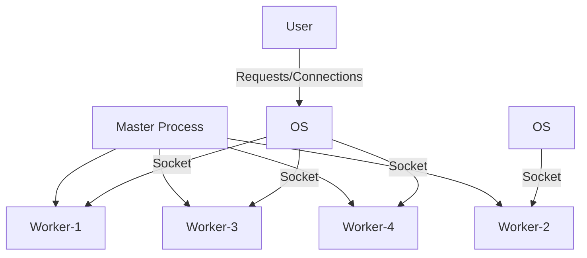

# Nginx
```
 __    _  _______  ___   __    _  __   __ 
|  |  | ||       ||   | |  |  | ||  |_|  |
|   |_| ||    ___||   | |   |_| ||       |
|       ||   | __ |   | |       ||       |
|  _    ||   ||  ||   | |  _    | |     | 
| | |   ||   |_| ||   | | | |   ||   _   |
|_|  |__||_______||___| |_|  |__||__| |__|
```

# Table of Contents

- Theoritical
  - Nginx
  - Components
  - Default Policies
  - Tips & Tricks
- Hands On
  - Directories
  - configs
  - commands
- acknowledgment

# Theoritical

## Nginx
- use cases:
    - Web Server
    - Reverse Proxy
    - Caching
    - Load Balancing
    - Media Streaming

- By default Nginx has 4 worker processes with UID of nginx and 1 master process with UID of root



### Master Process
- Controls:
    - Startup / Shutdown
    - Maintenace
    - Read/Evaluate Confiuration
    - Maintain Worker Processes

### Worker Process
- Controls:
    - Process requests  / Serve connections
    - Defaults 1024 max number of connections per second, per worker process

# Components

# Default Policies
- By default Nginx has 4 worker processes with UID of nginx and 1 master process with UID of root
- Defaults 1024 max number of connections per second, per worker process

# Tips & Tricks
- It is best practice to set `worker_process` number to number of cpu cores

# Hands On

## Directories
- Location of / --> ` /usr/share/nginx/html `
- Location of default configs --> ` /etc/nginx/conf.d/default.conf `
- Location of configs --> ` /etc/nginx/nginx.conf `
- Location of logs --> ` /var/log/nginx/access.log ` + ` /var/log/nginx/error.log`

 

## configs

## commands
### Basic Commands
- Start Service
```
$ nginx start
```

- Stop Service
```
$ nginx stop
```

- Check Configuration is OK
```
$ nginx -t
$ nginx -T      # MORE INFORMATION
```

- Send Signals to process
```
$ nginx -s start/stop/reload
```


# acknowledgment

## Contributors

APA 🖖🏻

## Links
- Course: https://www.udemy.com/course/apache_kafka/?couponCode=2021PM20

```
  aaaaaaaaaaaaa  ppppp   ppppppppp     aaaaaaaaaaaaa
  a::::::::::::a p::::ppp:::::::::p    a::::::::::::a
  aaaaaaaaa:::::ap:::::::::::::::::p   aaaaaaaaa:::::a
           a::::app::::::ppppp::::::p           a::::a
    aaaaaaa:::::a p:::::p     p:::::p    aaaaaaa:::::a
  aa::::::::::::a p:::::p     p:::::p  aa::::::::::::a
 a::::aaaa::::::a p:::::p     p:::::p a::::aaaa::::::a
a::::a    a:::::a p:::::p    p::::::pa::::a    a:::::a
a::::a    a:::::a p:::::ppppp:::::::pa::::a    a:::::a
a:::::aaaa::::::a p::::::::::::::::p a:::::aaaa::::::a
 a::::::::::aa:::ap::::::::::::::pp   a::::::::::aa:::a
  aaaaaaaaaa  aaaap::::::pppppppp      aaaaaaaaaa  aaaa
                  p:::::p
                  p:::::p
                 p:::::::p
                 p:::::::p
                 p:::::::p
                 ppppppppp
```
